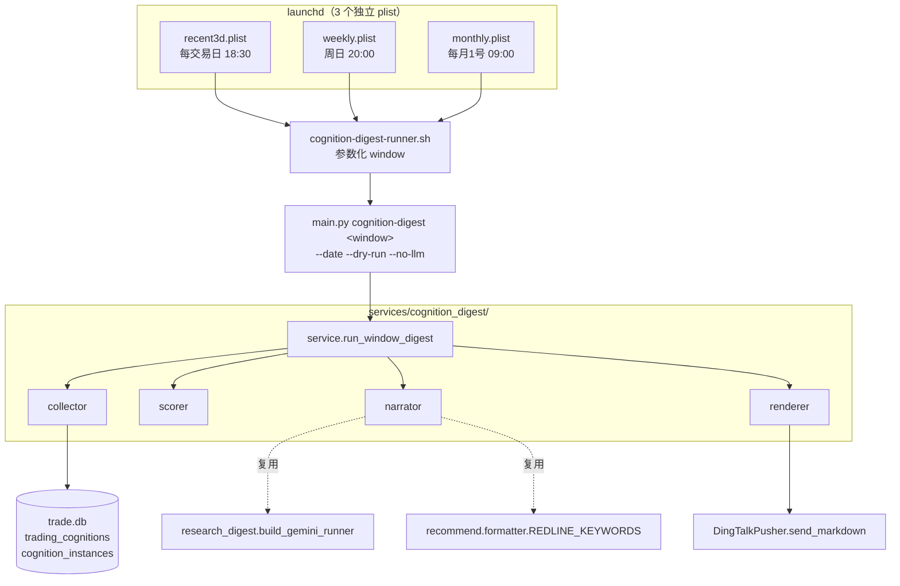
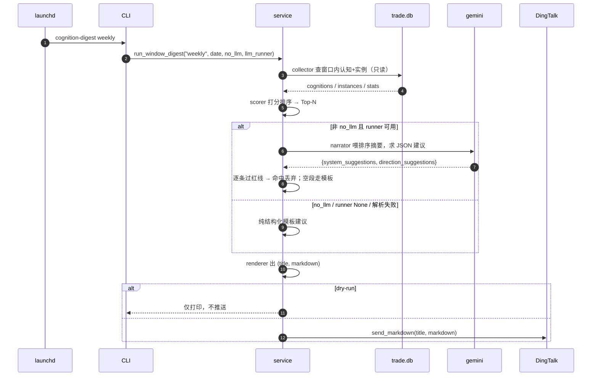

# 交易认知沉淀定时汇总（cognition-digest）设计

> 日期：2026-06-02 ｜ 状态：已确认设计，待写实施计划
> 关联：`cognition-evolution` skill（认知三表手动闭环）、`research_digest`（镜像形态）、`recommend.formatter`（红线扫描）

## 方案结论

新建**只读**服务模块 `scripts/services/cognition_digest/`，镜像 `research_digest` 的成熟分层。三个独立定时窗口（近3日 / 近1周 / 近1月）各自从 `data/trade.db` 的认知三表按窗口聚合 → 按「热度+共识+新增」打分排序 → gemini 合成「交易体系建议 + 下一步方向建议」（红线护栏 + `--no-llm` 降级）→ 渲染 Markdown → 推钉钉。每个窗口一个 launchd plist，共用一个参数化 runner。

**硬约束**：不写 `periodic_reviews`、不改 schema、不接 `main.py schedule` 的 APScheduler（只走 per-task launchd plist，对齐 memory `project_scheduler_dual_source_double_trigger`）。

## 背景与目标

### 数据现状（`data/trade.db`，2026-06-02）

| 维度 | 现状 |
|---|---|
| 认知库 | 88 条 `candidate`、1 条 `deprecated`、**0 条 `active`** |
| 实例 | 近3日 9 / 近7日 22 / 近30日 114；**全部 `pending`，0 条 validated/invalidated** |
| 产出节奏 | 仍在持续新增（最新 2026-06-01） |

**关键推论**：盘后验证步骤基本没在跑 → 没有「验证对错」信号可用 → 排序**不能依赖 outcome**，只能用「热度（被反复印证）+ 共识（多老师）+ 新增 + 置信 + 时近」综合。

### 目标

1. 定时把"值得学习沉淀的交易认知"按三个时间窗口推到钉钉
2. 基于这些认知给出**交易体系建议**与**下一步方向建议**（红线内）
3. 复用现有成熟件（gemini runner / 红线扫描 / DingTalkPusher），零 schema 风险

## 范围与非目标

- **范围**：3 个窗口的认知汇总 + LLM 体系/方向建议 + 钉钉推送 + 部署文件
- **非目标**：
  - 不做认知新建 / 验证 / refine（那是 `cognition-evolution` 手动闭环）
  - 不写任何库（含 `periodic_reviews`）
  - 不出具体买卖点 / 价格目标 / 具体标的操作（红线）
  - 不改前端 / API
  - 不带"待验证 pending 提醒"小节（用户已确认默认不带）
  - 不接交易日历（窗口用日历日回溯，与 `observed_date` 键一致）

## 现状与约束

| 复用件 | 位置 | 用法 |
|---|---|---|
| gemini runner | `research_digest/narrator.py:build_gemini_runner` | 返回 `runner(prompt, payload)->dict|None`，内部 subprocess 调 gemini 并解析 JSON |
| 红线关键词 | `recommend/formatter.py:REDLINE_KEYWORDS` | `("买入","卖出","目标价","必涨","满仓","建仓","止损位","加仓","空仓")`，单一真源，逐条 bullet 扫 |
| 钉钉推送 | `pushers/dingtalk_pusher.py:DingTalkPusher` | `DingTalkPusher(config={})` → `initialize()`（读 env）→ `send_markdown(title, content)` |
| 认知读取 | `data/trade.db` 三表 | `trading_cognitions` / `cognition_instances` / `periodic_reviews`（只读，不写） |

**不需要 `setup_providers`**：纯 DB 读 + LLM，不依赖任何外部行情 provider（比 research-digest 简单一层）。

## 方案设计

### 模块结构

```
scripts/services/cognition_digest/
├── __init__.py        # 导出 run_window_digest, RenderedCognitionDigest, WINDOWS
├── windows.py         # 窗口定义（lookback_days / label / top_n）
├── collector.py       # 只读聚合查询（窗口内认知 + 实例 + 统计）
├── scorer.py          # 热度+共识+新增 打分 → 排序
├── narrator.py        # gemini 建议合成 + 红线护栏（复用 build_gemini_runner + REDLINE_KEYWORDS）
├── renderer.py        # render_md(window, ranked, stats, suggestions) → (title, markdown)
└── service.py         # run_window_digest 编排
```

CLI：`scripts/cli/cognition_digest.py`（顶层 subparser，镜像 `cli/research_digest.py`）。

### 架构图



### 执行时序（单窗口一次）



### 窗口定义（`windows.py`）

| window key | lookback_days | label | top_n | 触发节奏 |
|---|---|---|---|---|
| `recent3d` | 3 | 近3日 | 5 | 每交易日 18:30 |
| `weekly` | 7 | 近1周 | 6 | 周日 20:00 |
| `monthly` | 30 | 近1月 | 8 | 每月1号 09:00 |

窗口区间 = `[anchor - (lookback_days - 1), anchor]`（闭区间，含 anchor 当日）。`anchor` 默认为 CLI 运行当日（`--date` 可覆盖）。`top_n` 为该窗口排序后展示条数上限，均为常量可调。

### 评分模型（`scorer.py`）

候选集 = 窗口内有 ≥1 条实例（`observed_date ∈ 窗口`）**或** `created_at ∈ 窗口` 的认知；`deprecated` 排除出排序，单列"本期弃用 N 条"。

| 因子 | 取数 | 含义 |
|---|---|---|
| `heat` | 窗口内该认知实例条数 | 被反复印证强度 |
| `consensus` | 窗口内实例覆盖的 distinct 老师数（`teacher_id`；无 id 用 `teacher_name_snapshot`） | 多老师共识 |
| `confidence` | `trading_cognitions.confidence`（触发器维护，0~1） | 已有置信 |
| `is_new` | `created_at ∈ 窗口`（bool） | 本期新捕获 🆕 |
| `recency` | 距最近实例天数的衰减项 | 越近越靠前 |

公式（魔法数全部常量化）：

```
recency_decay = max(DECAY_FLOOR, 1 - days_since_last / lookback_days)
score = HEAT_W·heat
      + CONSENSUS_W·consensus
      + CONF_W·confidence
      + NEW_BONUS·(1 if is_new else 0)
      + RECENCY_W·recency_decay
```

常量初值（实现时落 `scorer.py` 顶部，单测锁定）：`HEAT_W=1.0` / `CONSENSUS_W=0.8` / `CONF_W=0.5` / `NEW_BONUS=0.6` / `RECENCY_W=0.4` / `DECAY_FLOOR=0.2`。排序按 `score` 降序，并列时 `heat` → `consensus` → `created_at` 倒序兜底。

## 数据模型

**无 schema 变更、无写库**。仅只读消费以下既有列：

| 表 | 消费字段 |
|---|---|
| `trading_cognitions` | `cognition_id, title, category, sub_category, status, confidence, pattern, created_at, updated_at` |
| `cognition_instances` | `cognition_id, observed_date, teacher_id, teacher_name_snapshot, outcome` |

## API 设计

本次**不新增 HTTP API**。新增 CLI 顶层子命令：

| 项 | 内容 |
|---|---|
| 命令 | `python3 main.py cognition-digest <window>` |
| window | `recent3d` / `weekly` / `monthly`（各为一个 subparser，镜像 `research-digest daily`） |
| 选项 | `--date YYYY-MM-DD`（anchor，默认今天）｜`--dry-run`（仅打印不推送）｜`--no-llm`（纯结构化） |

### 模块函数契约

```python
# service.py
def run_window_digest(
    db_path: str,
    window: str,            # recent3d|weekly|monthly
    anchor_date: str,       # YYYY-MM-DD
    *,
    no_llm: bool = False,
    llm_runner=None,
) -> RenderedCognitionDigest: ...

@dataclass
class RenderedCognitionDigest:
    title: str
    markdown: str
    ranked: list[dict]      # 排序后的认知 + 因子
    stats: dict             # 概览统计
    suggestions: dict       # {system_suggestions:[], direction_suggestions:[], _llm_used: bool}

    @property
    def is_empty(self) -> bool: ...   # 窗口内无任何活跃认知
```

### LLM 建议 JSON 契约（narrator）

LLM 被要求只返回：

```json
{
  "system_suggestions": ["...", "..."],
  "direction_suggestions": ["...", "..."]
}
```

`narrator` 喂给 LLM 的**只有事实素材**（认知标题 / 分类 / pattern / 热度 / 共识 / 新增标记），不喂任何价格、不要求 LLM 产出标的操作。

## 推送内容结构

```
📚 交易认知沉淀·{label}（{start}~{end}）
─ 概览：活跃认知 X 条｜新增 Y｜实例 Z｜覆盖老师 K 位｜本期弃用 W 条
─ 🏆 值得沉淀 Top-N：
    每条 = 标题 · 分类 · 🔥热度(实例数) · 🤝共识(N位老师) · [🆕/置信x.xx] · pattern 一句
─ 🤖 体系与方向建议（LLM｜红线护栏）：
    · 交易体系建议（2-3 条）
    · 下一步方向建议（2-3 条）
─ 页脚：数据源 trade.db ｜ 生成时间 ｜ [--no-llm 时标注「纯结构化」]
```

空窗口（无活跃认知）→ 渲染显式空报告（不崩、概览全 0、无 Top 段、无建议段），由 CLI 决定是否仍推送（默认仍推一条"本窗口无新增认知沉淀"）。

## LLM 红线三级护栏

红线**只扫 LLM 生成内容，不扫认知事实数据**（对齐 memory `feedback_redline_scope_ai_vs_facts`，避免误杀"右肩风险不宜建仓"类审慎表述）。

| 级别 | 触发 | 处置 |
|---|---|---|
| L1 | runner 异常 / 返 None / JSON 解析失败 / 主键不符 | 整段降级为纯结构化模板建议 |
| L2 | 逐条 bullet 命中 `REDLINE_KEYWORDS` | 命中 bullet 丢弃；某 section 全空 → 该 section 走模板兜底 |
| L3 | `--no-llm` | 完全不调 gemini，直接纯结构化 |

模板兜底（无 LLM 时的结构化建议）：从统计指标机械生成，例如"本期热度最高分类为 `{category}`，建议在该方向上加强跟踪与认知验证"——不含任何操作词。

## 实施计划（影响层次）

| 阶段 | 内容 | 主要文件 | 验证 |
|---|---|---|---|
| G1 采集+打分 | `windows` / `collector` / `scorer` | `services/cognition_digest/{windows,collector,scorer}.py` | `test_cognition_digest_{collector,scorer}.py` |
| G2 叙事+渲染 | `narrator`（红线护栏）/ `renderer` | `services/cognition_digest/{narrator,renderer}.py` | `test_cognition_digest_{narrator,renderer}.py` |
| G3 编排+CLI | `service` / CLI 注册 | `services/cognition_digest/service.py`、`cli/cognition_digest.py`、`main.py` | `test_cli_smoke.py` `ARCHITECTURE_COMMANDS` +5；真实库 `--dry-run` |
| G4 部署 | 3 plist + 1 runner | `deploy/launchd/*` | `plutil -lint` + `launchctl start` 真触发 + tail 日志 |
| G5 文档同步 | INDEX / SKILL / CLAUDE / AGENTS | 见下 | `test_cli_smoke.py` / `test_agent_symlinks.py` |

> **阶段级 review 约束**（对齐 `implementation-plan.md` 步骤 3.1）：每个 G 阶段结束 + 阶段 pytest 全绿后，**立即**跑 subagent 审查 + `codex:codex-rescue` review 双门，满足两条规则结束条件才进下一阶段；不把 review 攒到 G5 收尾。

## 测试与验证

| 层 | 文件 | 覆盖场景 |
|---|---|---|
| 采集 | `test_cognition_digest_collector.py` | 窗口闭区间边界、`deprecated` 排除、老师共识 distinct 计数、`created_at ∈ 窗口` 的新增纳入、tmp sqlite seed 隔离 |
| 打分 | `test_cognition_digest_scorer.py` | 五因子公式、常量锁定、排序与并列兜底、recency 衰减地板 |
| 叙事 | `test_cognition_digest_narrator.py` | 红线逐条丢弃、L1（runner None/坏 JSON）降级、L2 section 兜底、`--no-llm` 路径、mock llm_runner |
| 渲染 | `test_cognition_digest_renderer.py` | 各 section 存在、空窗口优雅降级、no-llm 标注、徽章/统计文案 |
| CLI | `test_cli_smoke.py` | `ARCHITECTURE_COMMANDS` +5：`cognition-digest recent3d/weekly/monthly` + `--dry-run`/`--no-llm` 仅 parse |

**验收命令**：

- `make check-scripts` 全绿
- `python3 main.py cognition-digest recent3d --dry-run`（真实 `trade.db` 打印、不推送，肉眼核对 Top 段与统计）
- 部署后 `launchctl start com.alyx.tradesystem.cognition-digest-weekly` + `tail -f /tmp/tradesystem-cognition-digest.log` 确认推送

**完成标准**：上述全绿；`[env] DINGTALK_*=set` 出现在日志；红线测试用例证明含"买入/目标价"的 LLM 输出被丢弃。

## 兼容性与回滚

- **兼容性**：纯新增模块 + CLI + 部署文件，无 schema 变更、无写库、不动现有 `periodic_reviews` 手动复盘流
- **迁移**：无
- **回滚**：`launchctl unload` 3 个 plist + 删 `services/cognition_digest/` + `cli/cognition_digest.py` + `main.py` 注册行；无残留数据

## 文档同步（skills-sync 触发）

新增顶层 subparser → 必做：

- [ ] `.agents/skills/INDEX.md` 加 `cognition-digest recent3d/weekly/monthly` 依赖行
- [ ] `test_cli_smoke.py` `ARCHITECTURE_COMMANDS` 加 5 条参数化用例（先 RED 再注册 subparser）
- [ ] `market-tasks/SKILL.md` 补"认知沉淀定时推送"入口说明
- [ ] `cognition-evolution/SKILL.md` 补"只读定时汇总"关联说明（与手动闭环区分）
- [ ] `CLAUDE.md` + `AGENTS.md` 标准命令组加 `cognition-digest ...` 一行
- [ ] `deploy/launchd/README.md` 补 3 个新 plist 说明

## 待确认问题

设计阶段三点已确认：① 顶层 `cognition-digest <window>`；② 日历日回溯；③ 不带"待验证提醒"小节。实施阶段无遗留待确认项。
