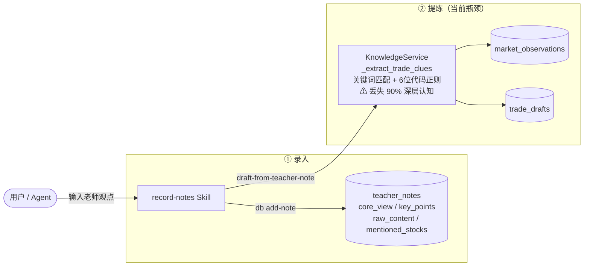
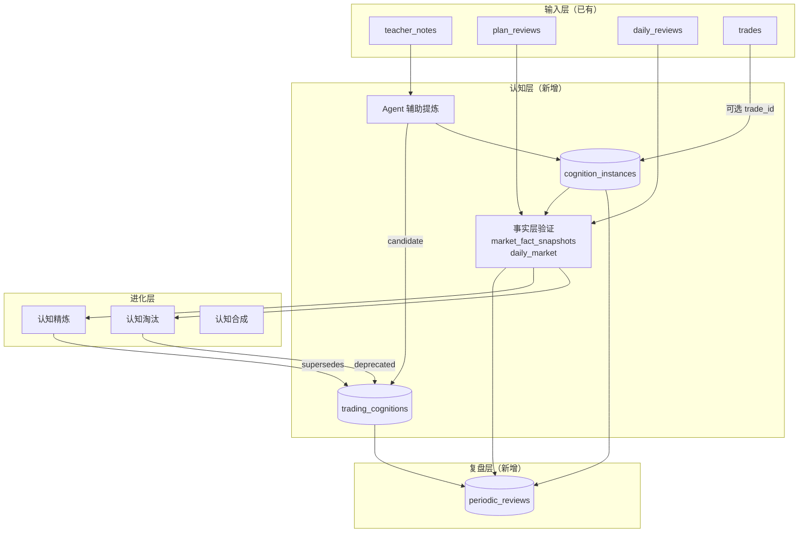
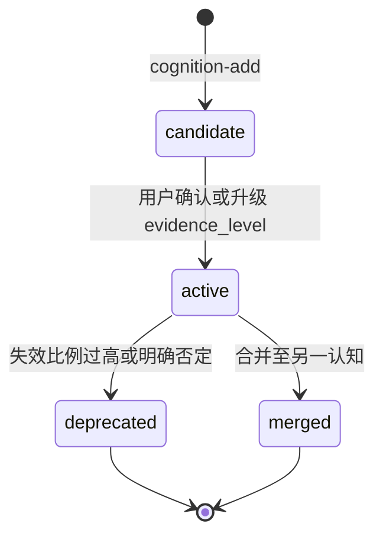
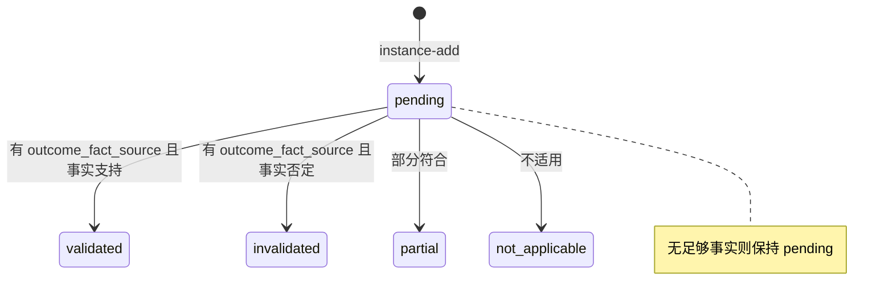
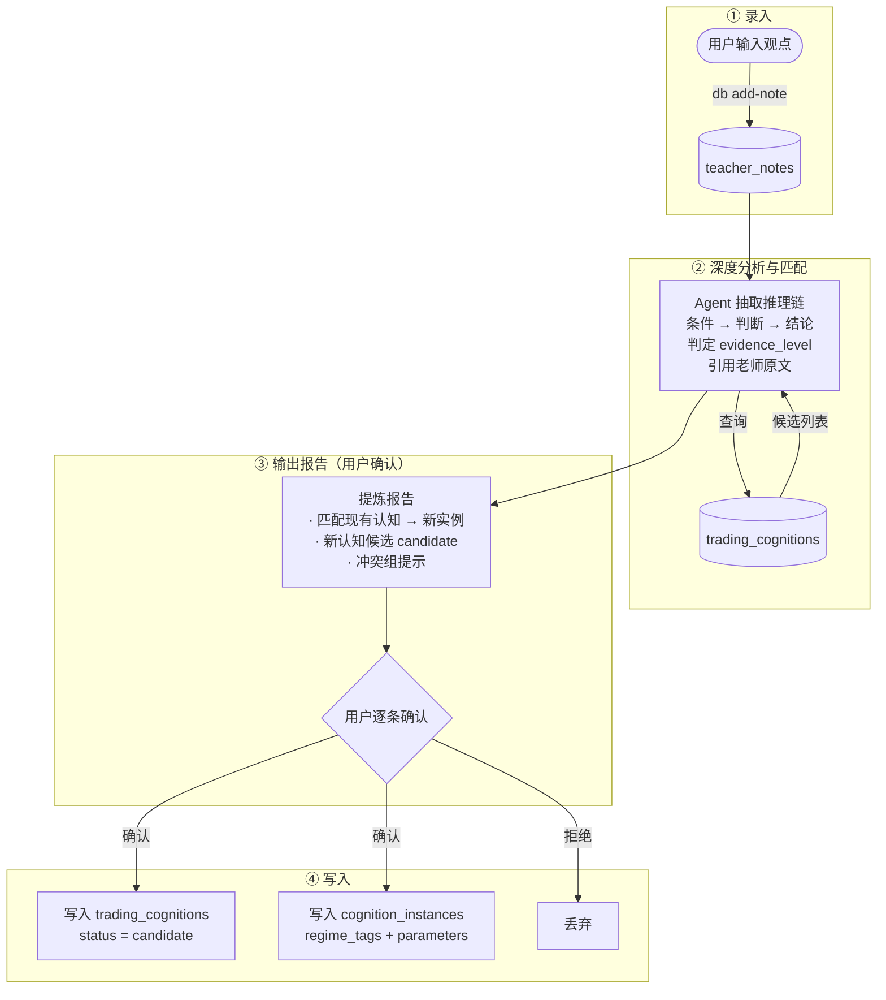
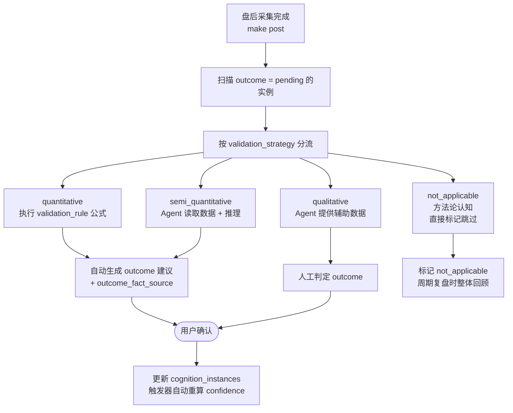
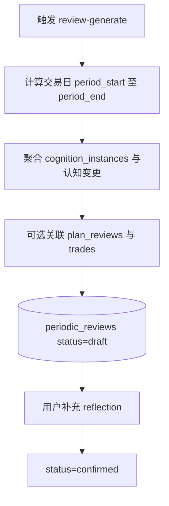
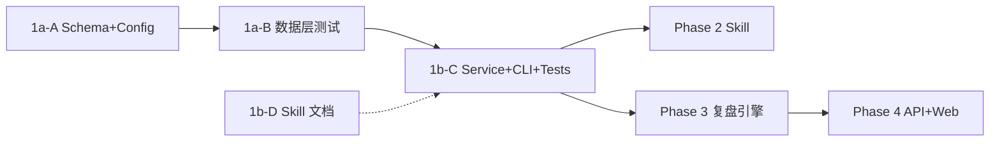

# 交易认知提炼与进化系统 — 技术方案（完整版）

---

## 方案结论

在 `**teacher_notes` 事实源不变**的前提下，新增三张表与 `CognitionService`，将老师观点从「全文检索」升级为「可复用规则 + 可验证实例 + 可周期复盘」。认知分类覆盖**技术交易（signal/sentiment/structure/cycle/position/sizing/synthesis）、价值投资（fundamental/macro/valuation）、微观执行（execution）**三大维度共 11 个一级分类，适配技术派、基本面派、短线执行派不同老师的认知体系。补充维度含 `market_regime`（增量/存量/减量）和 `cross_market_anchor`（跨市场信号锚点），种子认知库 41 条覆盖 40 条近 2 周老师观点中的高频可复用规则。所有图表仅使用 Mermaid；验证 outcome 必须绑定事实层，禁止无数据时假装通过。

---

## 一、背景与目标

### 1.1 现状链路




### 1.2 核心缺失

> **能记「说了什么」，难沉淀「教了什么规则」，更难对规则做跨日验证与周月年复盘。**

- `_extract_trade_clues()` 偏浅层匹配，**无法稳定抽取**条件→判断→结论
- 缺少 `**trading_cognitions` / `cognition_instances`** 级抽象与实例追溯
- 缺少 `**periodic_reviews`** 与交易日边界清晰的聚合复盘

### 1.3 目标架构




---

## 二、范围与非目标

- **范围内**：Schema + 触发器 + `CognitionService` + `knowledge` 子命令 + 周期复盘生成 + Skill +（Phase 4）API/Web
- **非目标**：替代 `teacher_notes` 唯一事实源；不经人工确认自动写入 `confirmed` 级正式计划；用 LLM 主观判涨跌替代事实快照

---

## 三、认知分类（Taxonomy）

存于 `[config/cognition_taxonomy.yaml](config/cognition_taxonomy.yaml)`，含 `plan_mappings` 与 `trade_plans.market_bias` / `focus_style` 的映射。


| 一级分类 | 英文 key        | 含义        | 默认验证策略                         | 示例                   |
| ---- | ------------- | --------- | ------------------------------ | -------------------- |
| 信号模式 | `signal`      | 技术信号规则    | `semi_quantitative`            | 尾盘加速、破底翻、率先企稳        |
| 情绪模型 | `sentiment`   | 情绪与资金行为   | `qualitative`                  | 融资反向、恐慌贪婪、消息面陷阱      |
| 市场结构 | `structure`   | 盘面结构      | `quantitative` 或 `qualitative` | 成交量阈值、板块轮动、冷饭行情      |
| 时间周期 | `cycle`       | 时间与节奏     | `quantitative`                 | 连涨变盘、交割日、月末效应        |
| 位置趋势 | `position`    | 空间与趋势     | `semi_quantitative`            | 均线回踩、筹码结构、阻力区        |
| 仓位管理 | `sizing`      | 仓位与品种     | `not_applicable`               | 分批加仓、组合轮换、涨卖未涨持      |
| 综合决策 | `synthesis`   | 多因子综合     | `qualitative`                  | 多因子共振、概率思维           |
| 基本面  | `fundamental` | 财报与企业质量   | `quantitative`                 | 现金流背离、造血比率、合同负债前瞻    |
| 宏观经济 | `macro`       | 宏观数据与政策传导 | `semi_quantitative`            | M1/M2剪刀差、K型复苏、房地产传导链 |
| 估值定价 | `valuation`   | 估值框架与定价   | `quantitative`                 | 周期股PE锚、价格敏感度、ROE长期回报 |
| 交易执行 | `execution`   | 微观交易规则与纪律 | `semi_quantitative`            | 龙头跟风联动、止盈止损方法、仓位分层   |


### 3.1 建议 `sub_category` 取值

`sub_category` 为可选字段，用于在一级分类内做更细的归类。以下为 `cognition_taxonomy.yaml` 应包含的建议取值：


| 一级分类          | `sub_category`           | 含义       | 示例认知                    |
| ------------- | ------------------------ | -------- | ----------------------- |
| `signal`      | `gap`                    | 缺口相关     | 缺口必补                    |
| `signal`      | `indicator`              | 指标信号     | MACD零轴、买卖点信号            |
| `signal`      | `pattern`                | K线/形态    | 破底翻、尾盘加速 vs 拉尾盘         |
| `signal`      | `momentum`               | 动量/加速    | 加速后回调、率先企稳选股            |
| `sentiment`   | `crowd_behavior`         | 群体行为     | 底部恐惧/顶部激进、融资反向          |
| `sentiment`   | `news_trap`              | 消息陷阱     | 消息面高开陷阱、利好出尽            |
| `sentiment`   | `desensitization`        | 脱敏       | 外部事件反复冲击后市场反应递减         |
| `structure`   | `rotation`               | 轮动       | 板块轮动常态、冷饭行情高抛           |
| `structure`   | `volume`                 | 量能       | 成交量阈值与分化、缩量轮动           |
| `structure`   | `profit_chain`           | 利润链转移    | 利润从下游向上游转移              |
| `structure`   | `late_stage`             | 末段补涨     | 边缘小票补涨=主升末段             |
| `cycle`       | `calendar`               | 日历效应     | 月末效应、假期效应、交割日           |
| `cycle`       | `symmetry`               | 时间对称     | 跌N天涨N天、连涨变盘             |
| `cycle`       | `earnings_season`        | 财报季      | 财报季业绩敏感度极高              |
| `position`    | `ma_support`             | 均线支撑     | 均线回踩、远离均线不追             |
| `position`    | `resistance`             | 阻力区      | 阻力共振、压力区回撤正常            |
| `position`    | `chip_structure`         | 筹码结构     | 无套牢盘弹性>有套牢盘             |
| `position`    | `trend_phase`            | 左右侧      | 右侧每次回踩按买跌处理             |
| `sizing`      | `batch_building`         | 分批建仓     | 超跌满仓 vs 反弹分批            |
| `sizing`      | `position_limit`         | 仓位上限     | 反弹阶段不超七成                |
| `sizing`      | `portfolio_rotation`     | 组合轮换     | 2-3只一组做完再换              |
| `synthesis`   | `multi_factor`           | 多因子共振    | 多信号叠加减仓/加仓              |
| `synthesis`   | `probability`            | 概率思维     | 大概率≠一定、保留余地             |
| `fundamental` | `cash_flow`              | 现金流质量    | 增收增利但不增现金流=危险信号         |
| `fundamental` | `earnings_quality`       | 盈利质量     | 造血比率（经营现金流/净利润）、应收账款膨胀  |
| `fundamental` | `balance_sheet`          | 资产负债表健康度 | 合同负债下降=收入可见性下降、流动比率     |
| `fundamental` | `capex_quality`          | 资本开支质量   | 买矿vs建厂房、研发投入增速vs收入增速    |
| `fundamental` | `business_model`         | 商业模式     | 量价齐升、低成本优势放大利润弹性        |
| `macro`       | `money_supply`           | 货币与信贷    | M1/M2剪刀差、存款>贷款=消费弱      |
| `macro`       | `economic_cycle`         | 经济周期     | K型复苏、大企业强小企业弱           |
| `macro`       | `transmission`           | 传导链      | 房地产持续3月→消费拉动、PPI→CPI传导  |
| `macro`       | `policy`                 | 政策影响     | 并购松绑、新药定价分离、出口限制        |
| `valuation`   | `pe_anchor`              | PE锚定     | 周期股给低PE、成长股看PEG         |
| `valuation`   | `sensitivity`            | 敏感度分析    | 金价波动10%→净利润影响17-18%     |
| `valuation`   | `roe_driven`             | ROE驱动    | ROE长期<5%则投资回报受限         |
| `valuation`   | `margin_of_safety`       | 安全边际     | 静态估值不便宜则不出手             |
| `valuation`   | `ma_premium`             | 并购溢价     | 供应链抓手公司获并购溢价、AH溢价参考     |
| `execution`   | `leader_follower`        | 龙头跟风联动   | 龙头封板→介入龙二龙三，龙头开板→后排卖出   |
| `execution`   | `entry_timing`           | 入场时机     | 做主线做前排做early，不做后排不做late |
| `execution`   | `chase_trap`             | 追高陷阱     | 追后排+追连续涨第四天=追高亏钱根源      |
| `execution`   | `exit_rule`              | 止盈止损     | 零轴止盈/吊灯止盈/30日线无条件生命线    |
| `execution`   | `open_direction`         | 开盘方向决策   | 直接反弹=卖点；惯性低开+普跌=买点      |
| `execution`   | `position_layering`      | 仓位分层     | 中期底仓≥50%不动+短差仓做高抛低吸     |
| `signal`      | `cross_market`           | 跨市场信号    | 离岸汇率、港股强弱、黄金/原油联动       |
| `sentiment`   | `institutional_behavior` | 资金属性识别   | 机构vs游资vs量化主导的行为差异       |
| `sentiment`   | `market_feedback`        | 消息反馈模式   | 利好出尽=负反馈、预期内利空不杀跌=市场强   |
| `structure`   | `theme_lifecycle`        | 题材生命周期   | 启动→主升→扩散→补涨→见顶→切换       |
| `cycle`       | `capex_cycle`            | 资本开支周期   | 投入期→利润兑现期（2-3年），历史类比    |


### 3.2 提炼补充维度与归一规则

过去两周老师观点的高频表达，不只是“方向判断”，还包含 **时间尺度、操作动作、仓位上限、失效条件、老师间共识/分歧**。因此认知层需补充以下标准化维度：


| 维度                             | 存储层次                                         | 示例                                                                                                           | 目的                |
| ------------------------------ | -------------------------------------------- | ------------------------------------------------------------------------------------------------------------ | ----------------- |
| 老师别名归一                         | `config/cognition_taxonomy.yaml` + service 层 | `沈纯` / `沈淳` → 同一 canonical teacher                                                                           | 避免统计分裂、支持老师画像     |
| 板块/主题同义词归一                     | `config/cognition_taxonomy.yaml` + service 层 | `算力` / `AI算力` / `国产算力` / `算力租赁`                                                                              | 聚合主线共识，减少碎片化标签    |
| `time_horizon`                 | `trading_cognitions` + `cognition_instances` | `intraday` / `swing` / `mid_term`                                                                            | 区分“短差”和“中期看多”     |
| `action_bias`                  | `cognition_instances`                        | `low_absorb` / `reduce_on_strength` / `do_t` / `hold_base_position` / `defense_counter` / `embrace_new_high` | 含防守反击、拥抱新高等操作策略   |
| `position_cap`                 | `cognition_instances`                        | `0.5` / `0.6` / `0.7` / `0.8`                                                                                | 把老师的仓位纪律变成可复盘对象   |
| `avoid_action`                 | `cognition_instances`                        | `avoid_chasing_strength` / `avoid_full_position` / `avoid_late_entry`                                        | 抽出明确禁做动作，含不做后排    |
| `market_regime`                | `cognition_instances`                        | `incremental` / `stock` / `decremental`                                                                      | 区分增量/存量/减量市场环境    |
| `cross_market_anchor`          | `cognition_instances`                        | `offshore_rmb` / `crude_oil` / `hk_market` / `us_market`                                                     | 标注认知是否依赖跨市场信号作为前提 |
| `invalidation_conditions_json` | `trading_cognitions` + `cognition_instances` | "若成交额跌破 2.2 万亿则失效"                                                                                           | 保存"若 A 不成立则转向"的边界 |
| `consensus_key`                | `cognition_instances`                        | `market:repair_then_pullback:low_absorb`                                                                     | 聚合同一周期内多老师共识/分歧   |


> **分层原则**：`trading_cognitions` 保存“可复用方法论模板”，`cognition_instances` 保存“某位老师、某个日期、在某个市场阶段下的具体表达”。

---

## 四、数据模型

### 4.1 `trading_cognitions`


| 字段名                            | 类型      | 必填  | 默认值               | 说明                                                                                                                        |
| ------------------------------ | ------- | --- | ----------------- | ------------------------------------------------------------------------------------------------------------------------- |
| `cognition_id`                 | TEXT    | 是   | —                 | 主键 `cog_`*                                                                                                                |
| `category`                     | TEXT    | 是   | —                 | taxonomy 一级                                                                                                               |
| `sub_category`                 | TEXT    | 否   | NULL              | 二级                                                                                                                        |
| `title`                        | TEXT    | 是   | —                 | 标题                                                                                                                        |
| `description`                  | TEXT    | 是   | —                 | 人类可读说明                                                                                                                    |
| `pattern`                      | TEXT    | 否   | NULL              | 短模板槽位，格式 `当{条件}时，{判断}→{结论}`；与 `description` 分工：`pattern` 供实例化填槽，`description` 供人类阅读；各分类至少一个示例存于 `cognition_taxonomy.yaml` |
| `time_horizon`                 | TEXT    | 否   | NULL              | 默认时间尺度：`intraday` / `swing` / `mid_term` / `long_term` / `structural`                                                     |
| `action_template`              | TEXT    | 否   | NULL              | 默认动作模板，如 `low_absorb` / `reduce_on_strength` / `do_t` / `hold_base_position` / `value_hold` / `track_earnings`            |
| `position_template`            | TEXT    | 否   | NULL              | 默认仓位模板，可为文本或 JSON，如 `{"base":0.5,"tactical":0.2}`                                                                         |
| `conditions_json`              | TEXT    | 否   | NULL              | 条件 JSON，含 `regime_tags`；`quantitative` 类认知须含 `validation_rule`（见 §5.2.3）；可覆盖分类默认 `validation_strategy`                    |
| `exceptions_json`              | TEXT    | 否   | NULL              | 例外 JSON                                                                                                                   |
| `invalidation_conditions_json` | TEXT    | 否   | NULL              | 失效条件 JSON，用于保存“若关键锚点失守则该认知不再成立”的边界                                                                                        |
| `evidence_level`               | TEXT    | 是   | `observation`     | `observation` / `hypothesis` / `principle`                                                                                |
| `conflict_group`               | TEXT    | 否   | NULL              | 同组可能冲突；`cognition-add` / `cognition-refine` 时 service 层查同组 active 认知并输出警告（不阻断）                                            |
| `first_source_note_id`         | INTEGER | 否   | NULL              | FK `teacher_notes(id)`                                                                                                    |
| `first_observed_date`          | TEXT    | 否   | NULL              | 首次日期                                                                                                                      |
| `version`                      | INTEGER | 是   | 1                 | 版本                                                                                                                        |
| `supersedes`                   | TEXT    | 否   | NULL              | 新指旧：`cog_v2.supersedes = cog_v1_id`；演化链沿此字段反向遍历；DFS 校验无环                                                                  |
| `instance_count`               | INTEGER | 是   | 0                 | **触发器维护**                                                                                                                 |
| `validated_count`              | INTEGER | 是   | 0                 | **触发器维护**                                                                                                                 |
| `invalidated_count`            | INTEGER | 是   | 0                 | **触发器维护**                                                                                                                 |
| `confidence`                   | REAL    | 是   | 0.5               | **触发器维护**                                                                                                                 |
| `status`                       | TEXT    | 是   | `candidate`       | `candidate` / `active` / `deprecated` / `merged`                                                                          |
| `tags`                         | TEXT    | 否   | NULL              | JSON 数组                                                                                                                   |
| `created_at`                   | TEXT    | 是   | `datetime('now')` | —                                                                                                                         |
| `updated_at`                   | TEXT    | 是   | `datetime('now')` | —                                                                                                                         |


> `**confidence`**：`validated / max(validated+invalidated,1)`；有效样本 `< 3` 时固定 `0.5`。

#### `evidence_level` 层级关系

三个层级不仅是成熟度标签，还具有**决策权重层级**：


| 层级            | 含义                  | 升级条件                           | 决策权重         |
| ------------- | ------------------- | ------------------------------ | ------------ |
| `observation` | 单次观察，尚未形成稳定规则       | 首次从老师观点中提取                     | 最低，仅供记录      |
| `hypothesis`  | 可复用假设，已有多次实例但验证样本不足 | 3+ 实例且 validated > invalidated | 中等，可作为交易参考   |
| `principle`   | 经反复验证的核心原则          | 10+ 实例且 confidence > 0.7       | 最高，应作为决策框架底层 |


**框架级认知**：某些 `principle` 级认知（如「右侧阶段每次回踩按买跌处理」）一旦确认，会**覆盖**同时期内其他 `observation`/`hypothesis` 级认知的权重。例如当「右侧确认」为 `principle` 时，即使某天出现「连涨 5 天变盘」这个 `hypothesis`，也只应做差价而非清仓——因为框架级认知优先。

> Agent 在 Phase 2 Skill 的提炼 prompt 中必须遵循：先识别当前活跃的 `principle` 级认知作为框架约束，再在框架内解读 `hypothesis`/`observation` 级信号。

#### 认知状态（`status`）




> `**merged` 实例归属**：执行合并时，`CognitionService.merge_cognition(src_id, target_id)` 将 `src` 下所有 `cognition_instances.cognition_id` 重写为 `target_id`，触发器自动重算双方计数；合并操作不可逆，执行前须用户确认。

### 4.2 `cognition_instances`


| 字段名                        | 类型      | 必填  | 默认值               | 说明                                                                              |
| -------------------------- | ------- | --- | ----------------- | ------------------------------------------------------------------------------- |
| `instance_id`              | TEXT    | 是   | —                 | 主键 `inst_`*                                                                     |
| `cognition_id`             | TEXT    | 是   | —                 | FK `trading_cognitions`                                                         |
| `observed_date`            | TEXT    | 是   | —                 | 交易日                                                                             |
| `source_type`              | TEXT    | 是   | —                 | `teacher_note` 等                                                                |
| `source_note_id`           | INTEGER | 否   | NULL              | FK `teacher_notes`                                                              |
| `teacher_id`               | INTEGER | 否   | NULL              | 当 `source_type=teacher_note` 时必填；指向 `teachers.id`                               |
| `teacher_name_snapshot`    | TEXT    | 否   | NULL              | 老师名称快照，避免后续更名影响历史复盘                                                             |
| `source_plan_review_id`    | TEXT    | 否   | NULL              | FK `plan_reviews`                                                               |
| `source_daily_review_date` | TEXT    | 否   | NULL              | 对齐 `daily_reviews.date`                                                         |
| `trade_id`                 | INTEGER | 否   | NULL              | 可选关联成交                                                                          |
| `context_summary`          | TEXT    | 否   | NULL              | 背景摘要                                                                            |
| `regime_tags_json`         | TEXT    | 否   | NULL              | 情绪/主线等切片                                                                        |
| `time_horizon`             | TEXT    | 否   | NULL              | 本次实例的实际时间尺度                                                                     |
| `action_bias`              | TEXT    | 否   | NULL              | 本次动作倾向，如 `low_absorb` / `reduce_on_strength` / `do_t`                           |
| `position_cap`             | REAL    | 否   | NULL              | 本次实例提炼出的仓位上限，如 `0.6`                                                            |
| `avoid_action`             | TEXT    | 否   | NULL              | 本次实例明确禁止动作，如 `avoid_chasing_strength` / `avoid_late_entry`                      |
| `market_regime`            | TEXT    | 否   | NULL              | 市场环境：`incremental` / `stock` / `decremental`                                    |
| `cross_market_anchor`      | TEXT    | 否   | NULL              | 跨市场信号锚点 JSON，如 `["offshore_rmb","crude_oil"]`                                   |
| `consensus_key`            | TEXT    | 否   | NULL              | 跨老师聚合键：同主题/同动作/同时间尺度的实例归并键                                                      |
| `parameters_json`          | TEXT    | 否   | NULL              | 实例参数                                                                            |
| `teacher_original_text`    | TEXT    | 否   | NULL              | 原文证据                                                                            |
| `outcome`                  | TEXT    | 是   | `pending`         | 见下状态图                                                                           |
| `outcome_detail`           | TEXT    | 否   | NULL              | 说明                                                                              |
| `outcome_fact_source`      | TEXT    | 否   | NULL              | 如 `daily_market:YYYY-MM-DD`                                                     |
| `outcome_fact_refs_json`   | TEXT    | 否   | NULL              | 多事实源数组，如 `["daily_market:2026-04-15","market_fact_snapshots:index:2026-04-15"]` |
| `outcome_date`             | TEXT    | 否   | NULL              | 确认日                                                                             |
| `lesson`                   | TEXT    | 否   | NULL              | 教训                                                                              |
| `created_at`               | TEXT    | 是   | `datetime('now')` | —                                                                               |


**约束**：`UNIQUE(cognition_id, observed_date, source_type, source_note_id)`；索引 `cognition_id`、`observed_date`、`outcome`。

> **NULL 漏洞处理**：SQLite 中 `NULL != NULL`，当 `source_note_id` 为 NULL 时唯一约束失效。解决方案：`CognitionService.add_instance()` 写入前先执行 existence check（`SELECT 1 WHERE cognition_id=? AND observed_date=? AND source_type=? AND source_note_id IS NULL`），重复则拒绝并返回已有 `instance_id`；Schema 侧不依赖 DB 约束兜底。

> `**outcome_fact_source` 格式**：`{table}:{YYYY-MM-DD}`，如 `daily_market:2026-04-14`。`CognitionService.validate_instance()` 在写入前强制解析该字符串并查表校验记录存在，失败则拒绝 outcome 变更（保持 `pending`）；禁止仅记录字符串而不校验。

> `**outcome_fact_refs_json`**：当一个验证同时依赖成交量、汇率、油价、融资余额、板块快照等多个事实锚点时，必须写入完整事实引用数组；`outcome_fact_source` 仅保留“主引用”，便于 CLI/API 快速展示。

> **老师来源约束**：当 `source_type=teacher_note` 时，service 层必须从 `teacher_notes` 回填 `teacher_id` 与 `teacher_name_snapshot`，并先做老师别名归一；禁止仅依赖自由文本老师名。

#### 验证结果（`outcome`）




### 4.3 `periodic_reviews`


| 字段名                          | 类型      | 必填  | 默认值               | 说明                                                   |
| ---------------------------- | ------- | --- | ----------------- | ---------------------------------------------------- |
| `review_id`                  | TEXT    | 是   | —                 | 主键                                                   |
| `period_type`                | TEXT    | 是   | —                 | `weekly` / `monthly` / `quarterly` / `yearly`        |
| `review_scope`               | TEXT    | 是   | `calendar_period` | `calendar_period` / `event_window` / `regime_window` |
| `regime_label`               | TEXT    | 否   | NULL              | 阶段标签，如 `清明风险窗` / `修复右侧窗` / `等回踩窗`                    |
| `period_start`               | TEXT    | 是   | —                 | 起始交易日                                                |
| `period_end`                 | TEXT    | 是   | —                 | 结束交易日                                                |
| `trading_day_count`          | INTEGER | 否   | NULL              | 交易日数                                                 |
| `active_cognitions_json`     | TEXT    | 否   | NULL              | 快照                                                   |
| `validation_stats_json`      | TEXT    | 否   | NULL              | 快照                                                   |
| `teacher_participation_json` | TEXT    | 否   | NULL              | 本周期参与老师与出现次数                                         |
| `consensus_summary_json`     | TEXT    | 否   | NULL              | 高共识观点，如“短线等回踩，不追高”                                   |
| `disagreement_summary_json`  | TEXT    | 否   | NULL              | 关键分歧，如“医药是主线还是轮动”                                    |
| `new_cognitions_json`        | TEXT    | 否   | NULL              | 快照                                                   |
| `refined_cognitions_json`    | TEXT    | 否   | NULL              | 快照                                                   |
| `deprecated_cognitions_json` | TEXT    | 否   | NULL              | 快照                                                   |
| `key_lessons_json`           | TEXT    | 否   | NULL              | 快照                                                   |
| `evolving_views_json`        | TEXT    | 否   | NULL              | 快照                                                   |
| `performance_notes`          | TEXT    | 否   | NULL              | 文本                                                   |
| `user_reflection`            | TEXT    | 否   | NULL              | 用户反思                                                 |
| `action_items_json`          | TEXT    | 否   | NULL              | 行动项                                                  |
| `status`                     | TEXT    | 是   | `draft`           | `draft` / `confirmed`                                |
| `generated_at`               | TEXT    | 是   | `datetime('now')` | —                                                    |
| `confirmed_at`               | TEXT    | 否   | NULL              | —                                                    |


**约束**：`UNIQUE(period_type, period_start, period_end)`。

### 4.4 触发器

- `AFTER INSERT ON cognition_instances`：重算父表计数与 `confidence`
- `AFTER UPDATE OF outcome`：同上

---

## 五、核心流程

### 5.1 场景 A：从老师观点提炼




#### 5.1.1 提炼前的归一化步骤


| 步骤      | 内容                                    | 输出                                     |
| ------- | ------------------------------------- | -------------------------------------- |
| 老师别名归一  | 如 `沈纯` / `沈淳` 合并到 canonical teacher   | `teacher_id` / `teacher_name_snapshot` |
| 板块同义词归一 | 如 `算力` / `AI算力` / `国产算力` / `算力租赁` 做映射 | `canonical_topic`                      |
| 动作词归一   | 将“低吸/买跌/等回踩接”“逢高减/做T”映射为标准动作          | `action_bias` / `avoid_action`         |
| 仓位词归一   | 抽取“5成/6成/7成/8成/底仓+机动仓”                | `position_cap` / `position_template`   |
| 失效条件抽取  | 抽取“若量能跌破”“若关键位不过”这类边界                 | `invalidation_conditions_json`         |


#### 5.1.2 从老师观点提炼时必须显式输出的结构化项


| 项                              | 必填  | 说明                                                                                                                                                     |
| ------------------------------ | --- | ------------------------------------------------------------------------------------------------------------------------------------------------------ |
| `canonical_topic`              | 是   | 归一后的主题，如“半导体”“算力租赁”“修复后等回踩”                                                                                                                            |
| `time_horizon`                 | 是   | 至少区分 `intraday` / `swing` / `mid_term` / `long_term` / `structural`                                                                                    |
| `action_bias`                  | 是   | 至少落到 `low_absorb` / `reduce_on_strength` / `do_t` / `hold_base_position` / `value_hold` / `track_earnings` / `defense_counter` / `embrace_new_high` 之一 |
| `position_cap`                 | 否   | 老师明确给仓位上限时必须提取                                                                                                                                         |
| `avoid_action`                 | 否   | 如"不追高""不满仓""不碰边角补涨""不做后排"                                                                                                                              |
| `market_regime`                | 否   | 增量/存量/减量市场判断，如"成交>2.5万亿=增量""缩量轮动=存量"                                                                                                                   |
| `cross_market_anchor`          | 否   | 老师引用的跨市场信号锚点，如离岸汇率/原油/港股/纳指                                                                                                                            |
| `invalidation_conditions_json` | 否   | 如"若成交量跌破 2.2 万亿则转空"                                                                                                                                    |
| `consensus_key`                | 是   | 同主题、同动作、同时间尺度的实例必须可跨老师聚合                                                                                                                               |


> **目标不是替老师改写观点，而是把“观点里的可复盘骨架”抽出来。**

### 5.2 场景 B：盘后验证




#### 5.2.1 验证时机分类

不是所有 pending 实例都能在 T+1 盘后验证，不同认知的验证窗口不同：


| 时机类型 | 验证窗口      | 典型认知                | 触发方式                             |
| ---- | --------- | ------------------- | -------------------------------- |
| 次日型  | T+1 盘后    | 尾盘加速→次日冲高、消息面高开陷阱   | 每日盘后自动扫描                         |
| 短窗口型 | T+2 至 T+5 | 缺口必补、连涨变盘、均线回踩      | 每日扫描，窗口到期仍无结论标记 `not_applicable` |
| 结构型  | 人工触发      | 最弱板块修复=市场正轨、获利盘消化完毕 | Agent 提示可验证，人工判定                 |
| 长周期型 | 周/月复盘时    | 月末效应、超跌满仓 vs 反弹分批   | `periodic_reviews` 生成时聚合         |
| 方法论型 | 不逐实例验证    | 组合轮换法、分批加仓原则        | 写入时直接标记 `not_applicable`         |


> **每日扫描入口**：盘后流程（`make post`）采集完成后，执行 `knowledge instance-pending --check-ready`，列出「今日可验证」的实例清单。

#### 5.2.2 验证判定三档策略

在 `cognition_taxonomy.yaml` 中，每个一级分类标注默认 `validation_strategy`；单条认知可在 `conditions_json` 中覆盖默认值。


| 策略                  | 含义                                   | 判定方式                                                 | 适用场景           |
| ------------------- | ------------------------------------ | ---------------------------------------------------- | -------------- |
| `quantitative`      | 可直接用 `daily_market` 字段计算             | `conditions_json.validation_rule` 定义公式，Agent 执行并生成建议 | 成交量阈值、涨跌比、连涨天数 |
| `semi_quantitative` | 需 `market_fact_snapshots` + Agent 解读 | Agent 读取结构化快照数据，结合认知 pattern 推理，输出建议                 | 缺口回补、尾盘加速、均线回踩 |
| `qualitative`       | 只能人工判定                               | Agent 提供辅助数据（近 N 日市场表现），人工做最终判定                      | 市场正轨判断、情绪反转    |
| `not_applicable`    | 方法论认知，不存在单次验证                        | 写入实例时直接标记，周期复盘中做整体回顾                                 | 组合交易法、仓位管理原则   |


> **多事实源原则**：若一个判断同时依赖 `daily_market`、`market_fact_snapshots`、融资数据、汇率/商品价格或业绩数据，验证结果必须落 `outcome_fact_refs_json`，禁止只保留其中一个锚点。

> **基本面/宏观/估值类验证说明**：
>
> - `fundamental` 类认知（如造血比率、合同负债前瞻）默认走 `quantitative`，事实源主要为财报数据（当前系统暂无 `earnings` 表，Phase 4+ 可扩展；初期 Agent 可从 `teacher_notes` 引用的财报数字手工绑定）
> - `macro` 类认知（如 M1/M2 剪刀差、K型复苏）默认走 `semi_quantitative`，需要 Agent 读取宏观数据快照 + 推理传导逻辑
> - `valuation` 类认知（如 PE 锚定、ROE 长期回报）默认走 `quantitative`，但初期数据源不足时可降级为 `semi_quantitative`
> - 三类认知的 `time_horizon` 通常为 `mid_term` / `long_term` / `structural`，验证周期相应拉长（季报/半年报/年报节奏）

#### 5.2.3 `validation_rule` 结构

`quantitative` 类认知须在 `conditions_json` 中包含 `validation_rule`，供 Agent 自动执行：

```json
{
  "regime_tags": ["反弹阶段"],
  "validation_rule": {
    "source": "daily_market",
    "secondary_sources": ["market_fact_snapshots:index", "market_fact_snapshots:fx"],
    "observed_fields": ["total_amount", "advance_count", "decline_count"],
    "check": "当 total_amount < 参数阈值时，advance_count / (advance_count + decline_count) < 0.45",
    "fact_source_template": "daily_market:{observed_date}",
    "fact_refs_template": [
      "daily_market:{observed_date}",
      "market_fact_snapshots:index:{observed_date}",
      "market_fact_snapshots:fx:{observed_date}"
    ],
    "validated_description": "成交量不足，分化确实加剧",
    "invalidated_description": "成交量不足但分化未发生"
  }
}
```

> `validation_rule` 是给 Agent 的**语义提示**而非可执行表达式；Agent 读取后自行查询数据并判断。后续可迭代为可执行 DSL，但 Phase 1 以自然语言描述为主。

> `secondary_sources` 与 `fact_refs_template` 的目的，是显式支持这类老师高频锚点：`汇率`、`油价`、`融资余额`、`板块强弱快照`、`业绩/排产`。若事实层暂无结构化来源，实例保持 `pending`，不允许“脑补验证”。

#### 5.2.4 具体验证示例

**例 1：尾盘加速→次日冲高（`semi_quantitative`，次日型）**


| 项                     | 内容                                                                                                     |
| --------------------- | ------------------------------------------------------------------------------------------------------ |
| 认知                    | 尾盘加速→次日惯性冲高                                                                                            |
| `observed_date`       | 2026-04-14                                                                                             |
| 验证时机                  | T+1，2026-04-15 盘后                                                                                      |
| Agent 读取              | `daily_market:2026-04-15`（`sh_index_change_pct`）+ `market_fact_snapshots` 中 `subject_type=index` 的当日快照 |
| 判定                    | 4/15 高开 0.8%，盘中冲高至 4010 后回落 → 符合「惯性冲高」                                                                 |
| `outcome`             | `validated`                                                                                            |
| `outcome_fact_source` | `daily_market:2026-04-15`                                                                              |
| `outcome_detail`      | 「4/15 高开 +0.8%，盘中最高 4010，符合惯性冲高判断；冲高后回落属正常」                                                            |


**例 2：成交量不足→分化加剧（`quantitative`，次日型 T+0）**


| 项                          | 内容                                                                                |
| -------------------------- | --------------------------------------------------------------------------------- |
| 认知                         | 成交量不足→分化加剧                                                                        |
| `observed_date`            | 2026-04-15                                                                        |
| 验证时机                       | T+0，当日盘后即可                                                                        |
| Agent 执行 `validation_rule` | `total_amount` = 2.4 万亿 < 2.5 万亿阈值；`decline_count` = 3500+，`advance_count` ≈ 1100 |
| 判定                         | 跌家数远超涨家数，分化明显                                                                     |
| `outcome`                  | `validated`                                                                       |
| `outcome_fact_source`      | `daily_market:2026-04-15`                                                         |
| `outcome_detail`           | 「成交额 2.4 万亿 < 2.5 万亿阈值，涨跌比 1100:3500，分化显著」                                        |


**例 3：连涨 5 天变盘（`semi_quantitative`，短窗口型）**


| 项                     | 内容                          |
| --------------------- | --------------------------- |
| 认知                    | 连涨 N 天→变盘                   |
| `observed_date`       | 2026-04-15（创业板第 5 根阳线）      |
| 验证时机                  | T+1 至 T+3，每日扫描              |
| Agent 读取              | 后续交易日 `daily_market` 创业板涨跌幅 |
| 判定（假设 T+1 回调）         | 4/16 创业板下跌 → 第 5 天确实是变盘点    |
| `outcome`             | `validated`                 |
| `outcome_fact_source` | `daily_market:2026-04-16`   |
| 判定（假设 T+3 仍涨）         | 连涨 8 天未变盘 → 「5 天变盘」本次失效     |
| `outcome`             | `invalidated`               |


**例 4：最弱板块修复=市场正轨（`qualitative`，结构型）**


| 项               | 内容                                            |
| --------------- | --------------------------------------------- |
| 认知              | 最弱板块修复反弹→市场重回正轨                               |
| `observed_date` | 2026-04-15                                    |
| 验证时机            | 人工判定，无固定窗口                                    |
| Agent 辅助        | 提供后续 N 日各板块涨跌统计、轮动情况、极端下跌是否消失                 |
| 判定              | 用户根据后续市场表现综合判断「是否真的回归正常轮动」                    |
| `outcome`       | `validated` / `partial` / `invalidated`（人工选择） |


**例 5：分批加仓原则（`not_applicable`，方法论型）**


| 项               | 内容                                                        |
| --------------- | --------------------------------------------------------- |
| 认知              | 反弹阶段应分批加仓                                                 |
| `observed_date` | 2026-04-15                                                |
| 处理              | 写入实例时直接标记 `outcome = not_applicable`                      |
| 复盘              | 在 `periodic_reviews` 的 `key_lessons_json` 中回顾本周期内仓位管理执行情况 |


#### 5.2.5 已知数据限制

`daily_market` 当前仅存指数**收盘价与涨跌幅**，缺少 **OHLC**（开盘价、最高价、最低价）。部分 `semi_quantitative` 验证（如缺口回补需比对最低价与缺口上沿）依赖 `market_fact_snapshots` 中的结构化快照补充。若快照未覆盖，该实例保持 `pending` 直至数据可用或人工判定。

> `daily_market` 已于 v20 迁移（2026-04-16）新增 `sh_index_open` / `sh_index_high` / `sh_index_low` / `sz_index_open` / `sz_index_high` / `sz_index_low` 六列，数据来自 YAML `indices.shanghai/shenzhen.open/high/low`，`dual_write.py` 自动提取写入，降低对 `market_fact_snapshots` 快照的依赖。历史数据需重跑 `sync_daily_market_to_db` 补齐。

### 5.3 周期复盘生成




#### 5.3.1 周期复盘不只支持自然周/月


| `review_scope`    | 含义              | 适用场景                 |
| ----------------- | --------------- | -------------------- |
| `calendar_period` | 自然周 / 月 / 季 / 年 | 常规经营性复盘              |
| `event_window`    | 围绕事件窗切片         | 如清明假期风险窗、财报密集窗、重大政策窗 |
| `regime_window`   | 围绕市场阶段切片        | 如“修复右侧窗”“短线等回踩窗”     |


#### 5.3.2 周期复盘新增输出项


| 字段                           | 内容                  |
| ---------------------------- | ------------------- |
| `teacher_participation_json` | 本周期内各老师发声次数、覆盖主题数   |
| `consensus_summary_json`     | 多老师重复确认的高共识结论       |
| `disagreement_summary_json`  | 方向、节奏、仓位、主线选择上的核心分歧 |
| `key_lessons_json`           | 哪类认知最有效，哪类认知频繁失效    |
| `action_items_json`          | 下周期要保留、修正、淘汰的认知动作清单 |


---

## 六、API 契约（Phase 4）


| Method  | URI                              | 说明     |
| ------- | -------------------------------- | ------ |
| `GET`   | `/api/cognitions`                | 列表与过滤  |
| `GET`   | `/api/cognitions/{id}`           | 详情与演化链 |
| `POST`  | `/api/cognitions`                | 新增     |
| `PATCH` | `/api/cognitions/{id}`           | 更新     |
| `GET`   | `/api/cognition-instances`       | 列表     |
| `POST`  | `/api/cognition-instances`       | 新增实例   |
| `PATCH` | `/api/cognition-instances/{id}`  | 更新验证   |
| `GET`   | `/api/periodic-reviews`          | 列表     |
| `POST`  | `/api/periodic-reviews/generate` | 生成草稿   |
| `GET`   | `/api/periodic-reviews/{id}`     | 详情     |


**请求示例** `POST /api/cognition-instances`：

```json
{
  "cognition_id": "cog_a1b2c3d4",
  "observed_date": "2026-04-14",
  "source_type": "teacher_note",
  "source_note_id": 42,
  "teacher_id": 3,
  "time_horizon": "swing",
  "action_bias": "low_absorb",
  "position_cap": 0.6,
  "consensus_key": "market:repair_then_pullback:low_absorb",
  "parameters_json": {"index": "上证", "level": "60min"},
  "regime_tags_json": {"emotion_phase": "分歧"},
  "teacher_original_text": "原文片段",
  "input_by": "cursor"
}
```

**响应示例** `201`：

```json
{
  "instance_id": "inst_e5f6g7h8",
  "cognition_id": "cog_a1b2c3d4",
  "outcome": "pending",
  "created_at": "2026-04-14T12:00:00Z"
}
```

---

## 七、CLI 与 Makefile

- `python3 main.py knowledge cognition-add|list|refine|deprecate|merge ...`
- `python3 main.py knowledge instance-add|instance-batch-add|validate|list ...`
- `python3 main.py knowledge review-generate|show|confirm ...`
- 须带 `--input-by`：非空字符串，枚举建议值 `cursor` / `claude` / `web` / `manual`，空值或缺省由 service 层拒绝（与现有 `knowledge` 规范一致）

> `**instance-batch-add**`：接受 `--file batch.json`（JSON 数组，每条结构与 `instance-add` 参数一致），单事务写入，输出逐条结果（成功 / 重复跳过 / 失败原因）。对应 API：`POST /api/cognition-instances/batch`。

> **交易日历来源**：`trading_day_count` 及周期边界计算统一使用 `scripts/utils/trade_date.py`（已有），周期复盘生成时从该模块查询日期序列，不允许手工传入日期数组。

> **新增建议参数**：`review-generate` 支持 `--scope calendar_period|event_window|regime_window`、`--label`、`--from`、`--to`；`instance-add` / `instance-batch-add` 支持 `--teacher-id`、`--time-horizon`、`--action-bias`、`--position-cap`、`--consensus-key`。

Makefile 目标示例：`cognition-list`、`review-weekly`、`review-regime LABEL=修复右侧窗`（实现阶段写入 `[Makefile](Makefile)`）。

---

## 八、并行实施分组


| 组    | 内容                                                                                                   | 依赖        |
| ---- | ---------------------------------------------------------------------------------------------------- | --------- |
| 1a-A | Schema + migration（含 NULL existence check 注释）+ `cognition_taxonomy.yaml`（含 pattern 示例）               | —         |
| 1a-B | 数据层测试（FK、触发器、唯一约束、NULL 重复写入）                                                                         | 1a-A      |
| 1b-C | `CognitionService`（含 conflict_group 告警、merged 实例重挂、outcome_fact_source 校验）+ CLI（含 batch-add）+ pytest | 1a-A/1a-B |
| 1b-D | 最小 Skill 文档 + `INDEX.md`                                                                             | 可与 1a 并行  |
| 2    | cognition-evolution Skill 完整版 + record-notes 集成 + 种子认知库 + 提取策略                                       | 1b-C      |
| 3    | 周期复盘引擎（基于 trade_date）                                                                                | 1b-C      |
| 4    | API + Web（CLI 闭环后独立迭代）                                                                               | 3         |





### 8.1 Phase 2 详细要求：种子认知库与提取策略

#### 种子认知库

Phase 2 的 `cognition-evolution` Skill 不应让 Agent 从零开始提取认知。Skill 文档中须内嵌一份**种子认知库**（41 条），作为 Agent 匹配现有认知的锚点。种子认知从近 2 周 40 条老师观点（11 位老师）的高频规律中提炼，覆盖全部 11 个一级分类，每条包含：`category`、`sub_category`、`title`、`pattern`、`evidence_level`、`validation_strategy`。

种子认知示例（部分）：


| #   | `category`    | `sub_category`      | `title`    | `pattern`                                                          | `evidence_level` |
| --- | ------------- | ------------------- | ---------- | ------------------------------------------------------------------ | ---------------- |
| 1   | `signal`      | `gap`               | 缺口必补       | `当{指数留下跳空缺口}时，{短期必然回补}→{今日不补则次日压力加大}`                              | `principle`      |
| 2   | `signal`      | `pattern`           | 尾盘加速→次日冲高  | `当{盘中跌后自然回升并持续加速至收盘}时，{判定为尾盘加速}→{次日惯性冲高}`                          | `hypothesis`     |
| 3   | `signal`      | `momentum`          | 率先企稳选股     | `当{板块整体调整}时，{率先企稳不再创新低的个股}→{板块反弹时涨幅最大}`                            | `hypothesis`     |
| 4   | `sentiment`   | `desensitization`   | 市场脱敏       | `当{外部事件反复冲击但市场反应逐次减弱}时，{判断进入脱敏阶段}→{同类事件影响递减}`                      | `hypothesis`     |
| 5   | `sentiment`   | `crowd_behavior`    | 空头回补行情     | `当{此前看空持币的资金大幅放量进场}时，{判断为空头回补}→{反弹有力但不代表趋势反转}`                     | `observation`    |
| 6   | `structure`   | `late_stage`        | 补涨末段信号     | `当{板块从龙头扩散到边缘小票补涨}时，{判断主升进入末段}→{核心票应开始减仓}`                         | `hypothesis`     |
| 7   | `structure`   | `profit_chain`      | 利润链转移      | `当{产业链上游涨价}时，{利润从下游向上游转移}→{应配置利润正在流入的环节}`                          | `hypothesis`     |
| 8   | `structure`   | `volume`            | 成交量分化阈值    | `当{成交量不足以支撑当前涨幅}时，{市场分化加剧}→{涨跌比恶化}`                                | `hypothesis`     |
| 9   | `structure`   | `rotation`          | 最弱板块修复=正轨  | `当{最弱势板块开始修复反弹}时，{判定市场重回正常运行}→{可按正常交易逻辑执行}`                        | `observation`    |
| 10  | `cycle`       | `calendar`          | 月末假期效应     | `当{月末叠加长假}时，{反弹月份大概率出现回踩}→{越往月末压力越大}`                              | `hypothesis`     |
| 11  | `cycle`       | `earnings_season`   | 财报季敏感度     | `当{财报季}时，{个股对业绩敏感度极高}→{应规避有暴雷风险的个股}`                               | `principle`      |
| 12  | `position`    | `trend_phase`       | 右侧买跌框架     | `当{指数从下降趋势转入上升趋势确认}时，{进入右侧阶段}→{每次回踩按买跌处理}`                         | `principle`      |
| 13  | `position`    | `ma_support`        | 远离均线不追     | `当{股价远离五日均线}时，{不应追买}→{等回踩均线再介入}`                                   | `principle`      |
| 14  | `position`    | `chip_structure`    | 筹码结构决定弹性   | `当{同板块同概念个股比较}时，{上方无套牢盘的标的弹性>有套牢盘的标的}`                             | `hypothesis`     |
| 15  | `sizing`      | `batch_building`    | 超跌满仓vs反弹分批 | `当{完全超跌}时，{可一次性重仓}；当{反弹中途}时，{必须分批}`                                | `principle`      |
| 16  | `fundamental` | `cash_flow`         | 增利不增现金流=危险 | `当{利润增长但经营活动现金流下降}时，{盈利质量存疑}→{警惕应收膨胀和坏账风险}`                        | `principle`      |
| 17  | `fundamental` | `earnings_quality`  | 造血比率       | `当{经营现金流/净利润>1}时，{盈利质量优异}→{可支撑投资+分红}`                              | `hypothesis`     |
| 18  | `fundamental` | `balance_sheet`     | 合同负债前瞻     | `当{合同负债大幅下降}时，{未来收入可见性下降}→{警惕增速放缓}`                                | `hypothesis`     |
| 19  | `fundamental` | `capex_quality`     | 资本开支质量     | `当{同样大额资本开支}时，{投资矿产资源的长期价值>投资厂房设备}→{前者积累资产，后者消耗折旧}`                | `observation`    |
| 20  | `fundamental` | `business_model`    | 量价齐升       | `当{产量增长+价格上涨+成本低于行业}时，{利润弹性成倍放大}→{最优财报评分}`                         | `principle`      |
| 21  | `macro`       | `money_supply`      | M1/M2与消费   | `当{存款增速>贷款增速}时，{消费端复苏仍弱}→{配置偏向出口型和大型企业}`                           | `hypothesis`     |
| 22  | `macro`       | `transmission`      | 房地产消费传导    | `当{一线城市房地产持续复苏超3月}时，{消费拉动开始显现}→{可关注消费板块}`                          | `observation`    |
| 23  | `macro`       | `economic_cycle`    | K型复苏配置     | `当{大企业强、小企业弱、出口强、内需弱}时，{K型复苏}→{配置大市值出口型企业}`                        | `hypothesis`     |
| 24  | `valuation`   | `pe_anchor`         | 周期股低PE     | `当{公司盈利高度依赖商品价格}时，{应给予较低PE}→{不应按成长股估值}`                            | `principle`      |
| 25  | `valuation`   | `sensitivity`       | 价格敏感度      | `当{金属价格每波动10%}时，{净利润波动约17-18%}→{估值须考虑价格弹性风险}`                      | `hypothesis`     |
| 26  | `valuation`   | `roe_driven`        | ROE决定长期回报  | `当{公司ROE长期<5%}时，{即使短期增速亮眼}→{长期投资回报受限}`                             | `principle`      |
| 27  | `sizing`      | `position_limit`    | 波动率匹配仓位    | `当{市场波动率显著升高（阳包阴后阴包阳/外部事件不确定）}时，{仓位上限应下调至5-7成}→{高仓位+高波动=不合理}`      | `principle`      |
| 28  | `macro`       | `economic_cycle`    | 美林时钟通胀象限   | `当{PPI↑CPI↓通胀上升}时，{配重资产/资源/能源/高股息}→{减轻资产/高估值科技}`                   | `hypothesis`     |
| 29  | `fundamental` | `earnings_quality`  | 困境反转+增速扩大  | `当{一季报由负转正且同环比增速扩大}时，{机构中线配置首选}→{持续性优于纯主题炒作}`                      | `hypothesis`     |
| 30  | `signal`      | `indicator`         | 平均股价指数零轴信号 | `当{平均股价指数MACD首次上零轴→回调→再确认上零轴}时，{主升行情展开}→{买点}`                      | `hypothesis`     |
| 31  | `cycle`       | `calendar`          | 衍生品到期效应    | `当{股指期货交割日临近}时，{高位主动回踩概率大}→{高位推期货偏利空、低位推期权偏利好}`                    | `hypothesis`     |
| 32  | `signal`      | `indicator`         | 创新高家数=市场强度 | `当{创新高家数持续增多}时，{做多资金未退场}→{反弹未结束}；骤降=反弹可能终结`                        | `hypothesis`     |
| 33  | `synthesis`   | `multi_factor`      | 反弹结束三信号    | `当{原油上破阈值+指数跌破5日线+核心龙头见顶}三中二时，{反弹结束}→{转为防守}`                       | `hypothesis`     |
| 34  | `signal`      | `pattern`           | 独立走势品种识别   | `当{大跌中某品种能走独立趋势}时，{该品种=下一轮行情先行信号}→{春江水暖鸭先知}`                       | `observation`    |
| 35  | `valuation`   | `pe_anchor`         | PE分层估值法    | `当{高成长}→{50-80xPE}；{稳健制造}→{20-30xPE}；{周期}→{10-15xPE}；{公用事业}→{看PB}` | `principle`      |
| 36  | `fundamental` | `business_model`    | 排产数据→景气前瞻  | `当{头部厂商月度排产环比持续正增长}时，{行业景气度拐点确认}→{可配置}`                            | `hypothesis`     |
| 37  | `sentiment`   | `market_feedback`   | 利好出尽=负反馈   | `当{板块涨一段后利好政策/数据落地}时，{高开低走=负反馈}→{情绪盘涌入是坑人信号}`                      | `principle`      |
| 38  | `cycle`       | `symmetry`          | 跌N天涨N天     | `当{指数连跌N天后反弹}时，{反弹天数≈下跌天数±1-2天}→{到时间窗口附近需警惕}`                      | `hypothesis`     |
| 39  | `execution`   | `position_layering` | 底仓+差价仓分离   | `当{中期看多方向确认}时，{底仓≥50%绝不动}+{短差仓做高抛低吸}→{不因做差价而空仓}`                   | `principle`      |
| 40  | `execution`   | `leader_follower`   | 龙头封板联动规则   | `当{龙头即将封板}时，{介入龙二龙三}；{龙头封板后}→{冲高做T}；{龙头开板}→{后排立即卖出}`               | `hypothesis`     |
| 41  | `signal`      | `cross_market`      | 离岸汇率先行指标   | `当{离岸人民币汇率大幅走弱}时，{外资流出+A股承压}→{最可靠的市场情绪先行指标}`                       | `hypothesis`     |


> 完整种子列表在 Phase 2 实施时填入 `config/seed_cognitions.json`，Skill 文档引用该文件。后续新认知由 Agent 提取、用户确认后自动扩充库。

#### 提取策略：框架优先原则

Agent 从老师观点中提取认知时，必须遵循以下优先级：

1. **先查活跃 `principle`**：读取当前 `status=active` 且 `evidence_level=principle` 的认知列表，作为本次提取的框架约束
2. **在框架内解读信号**：新提取的 `observation`/`hypothesis` 级认知，必须标注与哪个 `principle` 一致或冲突
3. **匹配优先于新建**：Agent 先尝试将老师观点匹配到种子库或已有认知，生成新 `cognition_instances`；只有确认无匹配时才新建 `candidate`
4. **共识检测**：同一 `observed_date` 内，多位老师的观点如果匹配到同一 `cognition_id`，实例的 `consensus_key` 必须一致，周期复盘时自动聚合共识度

#### 多老师共识度计算

`CognitionService` 在周期复盘和 `instance-pending --check-ready` 时，按以下逻辑计算共识度：

```python
consensus_count = SELECT COUNT(DISTINCT tn.teacher_id)
    FROM cognition_instances ci
    JOIN teacher_notes tn ON ci.source_note_id = tn.id
    WHERE ci.cognition_id = ? AND ci.observed_date = ?
```

当 `consensus_count >= 3` 时，该认知实例在复盘报告中标记为「高共识」。`periodic_reviews.consensus_summary_json` 中输出本周期内高共识认知 Top N。

---

## 九、测试与验收


| 层级  | 路径                                        | 要点                             |
| --- | ----------------------------------------- | ------------------------------ |
| 数据  | `scripts/tests/test_cognition_schema.py`  | FK、触发器、唯一约束                    |
| 服务  | `scripts/tests/test_cognition_service.py` | 版本链无环、无 fact_source 不改 outcome |
| CLI | `scripts/tests/test_cognition_cli.py`     | `--json`、`--input-by`          |


**验收命令**：`make check-scripts`（Phase 1–3）；`make check`（含 Phase 4 前端）。

**完成标准**：迁移可重复执行；触发器与父表统计一致；CLI 与 API 契约与文档表一致；无 PlantUML 残留于本方案正文。

---

## 十、风险与回滚


| 风险                       | 缓解                                                                                     |
| ------------------------ | -------------------------------------------------------------------------------------- |
| 触发器与手工 SQL 不一致           | 禁止绕过 `CognitionService` 写统计列；可加对账任务                                                    |
| LLM 误匹配认知                | `candidate` + 人工确认；原文引用必填                                                              |
| 复盘日期边界错误                 | 统一交易日工具函数；`trading_day_count` 校验                                                       |
| `daily_market` 缺少指数 OHLC | `semi_quantitative` 验证依赖 `market_fact_snapshots` 补充；后续可扩展增加 `sh_index_open/high/low` 列 |
| 老师别名 / 板块别名漂移            | taxonomy 配置维护 canonical 映射；service 层统一归一                                               |
| 共识键生成不稳定                 | `consensus_key` 采用“主题 + 时间尺度 + 动作”固定模板，避免自由文本                                          |
| 多事实源未齐导致误判               | 事实源不全时保持 `pending`，禁止降级为主观“已验证”                                                        |


回滚：迁移版本回退 + 三张表 drop（仅在未落生产数据或已备份时）。

---

## 十一、已决问题

1. `**source_daily_review_date` FK**：做应用层校验即可（SQLite 跨表 FK 限制）；`CognitionService` 在写入时 SELECT 校验 `daily_reviews.date` 存在，不存在则拒绝。**已决：应用层校验**。
2. **Phase 4 交付时序**：先 CLI 闭环（Phase 1b + 2 + 3），Phase 4 API/Web 后续独立迭代，不阻塞主线实施。**已决：CLI 优先**。
3. `**market_fact_snapshots` 数据缺失**：`make post` 走旧版 `MarketCollector` 管道，不触发 `IngestService`，导致盘面快照从未写入。**已决：在 `cmd_post()` 末尾集成 `IngestService`，两条管道合并**。

### 11.3 `cmd_post()` 与 `IngestService` 的集成修复

**问题**：`make post`（`cmd_post()`）只调用旧版 `MarketCollector` 采集 `daily_market`，完全不触发 `IngestService`，导致 `market_fact_snapshots`（含融资余额、北向资金、板块资金流、龙虎榜等）从未写入，盘后验证缺少数据源。

**修复位置**：`scripts/main.py` `cmd_post()` 末尾，Obsidian 导出之后。

**已实施（2026-04-16）**：

```python
# IngestService 快照采集：写入 market_fact_snapshots / raw_interface_payloads
try:
    from services.ingest_service import IngestService
    ingest_svc = IngestService(registry=registry)
    for stage in ("post_core", "post_extended"):
        result = ingest_svc.execute_stage(stage, target_date, triggered_by="post_cmd", input_by=None)
        ok = sum(1 for v in result.get("interfaces", {}).values() if v.get("status") == "success")
        total = len(result.get("interfaces", {}))
        logger.info(f"IngestService {stage} 完成：{ok}/{total} 接口成功")
except Exception as e:
    logger.warning(f"IngestService 快照采集失败（不影响主流程）：{e}")
```

**设计决策**：

- `try/except` 包裹整块，失败只写 warning，不中断主流程（推送和报告已完成）
- `registry` 复用 `cmd_post()` 内已初始化的实例，不重复初始化
- `triggered_by="post_cmd"` 与 CLI 手动触发的 `"cli"` 区分，便于 `ingest_runs` 日志溯源
- 执行顺序：Obsidian 导出完成后再跑，确保主流程不受影响

**附带发现的已知接口问题**：


| 接口               | 问题                                                    | 影响         |
| ---------------- | ----------------------------------------------------- | ---------- |
| `moneyflow_hsgt` | akshare `stock_hsgt_north_net_flow_in_em` 不存在（版本兼容问题） | 北向资金数据缺失   |
| `anns_d`         | Tushare 积分不足                                          | 公告数据缺失     |
| `daily_market`   | 2026-03-09~03-31、04-06、04-12 共 21 行核心字段为 NULL         | 旧版采集期间数据丢失 |


1. `**daily_market` 缺少指数 OHLC**：`semi_quantitative` 验证（如缺口回补需最高/最低价）仅能依赖 `market_fact_snapshots`。**已决：schema v20 新增 6 个 OHLC 列，`dual_write.py` 自动提取写入**。

### 11.4 `daily_market` OHLC 扩展（schema v20）

**已实施（2026-04-16）**：


| 改动文件                       | 内容                                                                                                |
| -------------------------- | ------------------------------------------------------------------------------------------------- |
| `scripts/db/schema.py`     | `daily_market` 表定义新增 `sh_index_open/high/low`、`sz_index_open/high/low`                            |
| `scripts/db/migrate.py`    | v20 迁移：对已有数据库执行 `ALTER TABLE ADD COLUMN`，可重复执行                                                    |
| `scripts/db/dual_write.py` | `_extract_market_row()` 扩展为 `_idx_ohlc_pct()`，从 YAML `indices.shanghai/shenzhen` 提取 open/high/low |
| `scripts/db/queries.py`    | `upsert_daily_market()` 的 `cols` 列表新增 6 列                                                         |


数据来源：盘后 YAML 的 `raw_data.indices.shanghai.{open,high,low}` 字段（已由 `MarketCollector` 采集）。

历史数据可重跑 `sync_daily_market_to_db` 补齐：

**历史数据补采命令**（仅能补数据源仍可返回的日期）：

```bash
for d in 2026-04-07 2026-04-08 2026-04-09 2026-04-10 2026-04-11 2026-04-13 2026-04-14 2026-04-15; do
  cd /Users/alyx/tradeSystem/scripts && python3 main.py ingest run --stage post_core --date "$d"
  python3 main.py ingest run --stage post_extended --date "$d"
done
```

---

## 十二、审查结论摘要


| 优先级 | 处置                                                                                                                                                       |
| --- | -------------------------------------------------------------------------------------------------------------------------------------------------------- |
| 高   | 统计列仅触发器维护；验证须 `outcome_fact_source` + `outcome_fact_refs_json`；`candidate` 与人审                                                                           |
| 高   | 引入 `teacher_id` / `teacher_name_snapshot` / `consensus_key`，支持老师共识与分歧复盘                                                                                  |
| 高   | 新增 `execution` 一级分类（龙头跟风/入场时机/追高陷阱/止盈止损/开盘方向/仓位分层），覆盖微观交易执行规则                                                                                            |
| 高   | 新增 5 个 sub_category：`signal/cross_market`、`sentiment/institutional_behavior`、`sentiment/market_feedback`、`structure/theme_lifecycle`、`cycle/capex_cycle` |
| 中   | 引入 `market_regime`（增量/存量/减量）+ `cross_market_anchor`（跨市场信号锚点）补充维度                                                                                         |
| 中   | `action_bias` 扩充 `defense_counter` / `embrace_new_high`；`avoid_action` 扩充 `avoid_late_entry`                                                             |
| 中   | 种子认知库扩充至 41 条（+15），覆盖 40 条近 2 周老师观点中的高频可复用规则                                                                                                             |
| 中   | `periodic_reviews` 支持 `event_window` / `regime_window`，不只自然周月                                                                                            |
| 低   | `pattern` 与 `description` 分工；Phase 1 附最小 Skill                                                                                                           |


---

## 十三、已知限制（Phase 1b 落地后审查结论）

Phase 1b 已交付 `CognitionService` + CLI + Schema + 触发器 + 最小 Skill + 种子配置骨架。以下为落地后审查发现、**文档层已显式标注、留到后续 Phase 解决**的限制项：


| #   | 限制项                               | 当前状态                                                                                                                                                         | 影响                                                                         | 解决阶段                                           |
| --- | --------------------------------- | ------------------------------------------------------------------------------------------------------------------------------------------------------------ | -------------------------------------------------------------------------- | ---------------------------------------------- |
| L1  | ~~**事实源查表校验**~~                   | **✅ 已修复（Fix Agent 1，Phase 1b）**：新增 `_FACT_SOURCE_TABLES` 白名单（`daily_market` / `market_fact_snapshots` / `fact_entities`）+ `_assert_fact_source_record_exists()` 查表；表不在白名单或记录不存在均抛 `ValueError` 且 outcome 保持 `pending` | ——                                                                         | ✅ Phase 1b 已完成                                 |
| L2  | `**conflict_group` 同组冲突告警**       | 字段已落库，`cognition-add` / `cognition-refine` 命中同组 `active` 时 service 层不输出 warning                                                                              | 冲突需手工 `cognition-list --conflict-group <label>` 排查                         | Phase 2                                        |
| L3  | **老师别名 / 板块同义词归一**                | `config/cognition_taxonomy.yaml` 已备 `teacher_aliases` / `topic_aliases`，service 层未调用                                                                         | Agent 必须在提炼阶段完成归一后再传入                                                      | Phase 2                                        |
| L4  | **从 `teacher_notes` 自动回填老师字段**    | `source_type=teacher_note` 时不会自动从 `teacher_notes.id = source_note_id` 回填 `teacher_id` / `teacher_name_snapshot`，调用方需显式传入                                     | 两路径落库可能不一致                                                                 | Phase 2                                        |
| L5  | **交易日历复盘**                        | `generate_review` 把 `--from` / `--to` 直接作为字符串区间落入 `period_start` / `period_end`；**未接 `scripts/utils/trade_date.py`**，`trading_day_count` 暂不填充、周期边界非交易日时不自动对齐 | 复盘边界与交易日不一致，但聚合查询仍按日期字符串比较工作                                               | Phase 3                                        |
| L6  | `**instance-batch-add` 非原子**      | `batch_add_instances` 逐条独立调 `add_instance`，失败进 `failed`，成功项保留落库不回滚；无 SAVEPOINT 与 `--atomic` 开关                                                               | 批量写入不是「全成功或全回滚」，调用方需自行对 `failed` 响应做补偿                                     | Phase 2                                        |
| L7  | **DELETE 触发器缺失**                  | Schema v19 只定义 INSERT / UPDATE 触发器维护父表计数，**没有 `AFTER DELETE ON cognition_instances` 触发器**                                                                    | 直删 `cognition_instances` 行会导致父表 `instance_count` 等字段与实际脱钩                  | Phase 2                                        |
| L8  | **FK ON DELETE 策略未声明**            | `cognition_instances.cognition_id` FK 未声明 `ON DELETE` 级联策略；默认 `NO ACTION` 意味着父认知被删时，子实例会阻断删除                                                                 | 实际使用中不走直删，但硬删时错误不友好                                                        | Phase 2 补 `ON DELETE SET NULL` 或 service 层禁用直删 |
| L9  | **CLI smoke 清单未覆盖 `cognition-*`** | `scripts/tests/test_cli_smoke.py` 的 `ALL_SKILL_COMMANDS` 清单尚未加 `cognition-*` / `instance-*` / `review-*` 子命令                                                 | 子命令签名漂移时 smoke 测试不会兜底                                                      | Phase 2                                        |
| L10 | `**cognition-merge` CLI 命令未实现**   | 方案 §七 列出了 `merge`，但 `main.py` 未注册该 parser；service 层也没有 `merge_cognition` 方法                                                                                  | `merged` 状态当前只能通过直写 SQL 或 `cognition-refine --status merged` 绕过，**应当显式禁止** | Phase 2                                        |
| L11 | `**sub_category` 严格校验**           | `cognition-add` / `cognition-refine` 只对一级 `category` 做 `_allowed_categories()` 校验，`sub_category` 为自由文本                                                       | 可能出现 taxonomy 之外的 sub_category 值                                           | Phase 2                                        |
| L12 | **多老师共识度 / 种子认知库匹配**              | 方案 §8.1 描述的 `consensus_count` 计算、种子库启动匹配都未在 service 层实现                                                                                                      | 周期复盘 `consensus_summary_json` 尚未填充                                         | Phase 2                                        |


> **文档一致性纪律**：以上任一项在后续 Phase 被补上时，须同步回写本节（将状态改为「已修复（Phase X）」或移出表格），并刷新 `.cursor/skills/cognition-evolution/SKILL.md` 中对应的「Phase 1b 已知降级项」表格。

---

## 十四、Phase 2 明细 Backlog

承接十三节的已知限制，Phase 2 必须交付以下工作项，每项带首要改动模块以便并行拆分：


| #   | Backlog 项                                                                                                                                                                                                                                                                                             | 关键改动模块 / 文件                                                                                                                                  | 对应已知限制 |
| --- | ----------------------------------------------------------------------------------------------------------------------------------------------------------------------------------------------------------------------------------------------------------------------------------------------------- | -------------------------------------------------------------------------------------------------------------------------------------------- | ------ |
| ~~B1~~ | ~~`outcome_fact_source` 查表校验~~ **（已在 Phase 1b Fix Agent 1 完成，从 Phase 2 Backlog 移除）**                                                                                                                                                                                                                 | —— | L1 ✅ |
| B2  | `conflict_group` 告警：`add_cognition` / `refine_cognition` 在返回值中携带 `conflict_warnings: [...]`，CLI 层把告警打印到 stderr 但不阻断                                                                                                                                                                                   | `cognition_service.py` + `main.py::knowledge cognition-add/refine`                                                                           | L2     |
| B3  | `teacher_aliases` / `topic_aliases` 归一：服务层加载 taxonomy YAML 对应段，在 `add_instance` / `add_cognition` 前做别名映射；同步补 canonical 映射文档                                                                                                                                                                           | `cognition_service.py` + `config/cognition_taxonomy.yaml`                                                                                    | L3     |
| B4  | `teacher_notes` 自动回填：`source_type=teacher_note` 且 `source_note_id` 非空时，service 层先从 `teacher_notes` 查 `teacher_id` / 最新名称写入快照；调用方传入的值优先级更高                                                                                                                                                             | `cognition_service.py::add_instance`                                                                                                         | L4     |
| B5  | 交易日历接入：`generate_review` 调用 `scripts/utils/trade_date.py` 把 `--from` / `--to` 对齐到最近交易日，并计算 `trading_day_count`；字符串区间以外的起止视作非法                                                                                                                                                                         | `cognition_service.py::generate_review` + `scripts/tests/test_cognition_service.py`                                                          | L5     |
| B6  | 批量原子写入：新增 `--atomic` 开关或新增 `batch_add_instances_atomic(...)`，在一个 `conn.execute("BEGIN")` 内逐条写，任一失败回滚；保留非原子行为兼容老调用                                                                                                                                                                                     | `cognition_service.py` + `main.py::knowledge instance-batch-add`                                                                             | L6     |
| B7  | DELETE 触发器：schema 新增 `AFTER DELETE ON cognition_instances` 触发器，减分父表计数；或 service 层禁用直删（只允许软删 + outcome 改为 `not_applicable`）                                                                                                                                                                            | `scripts/db/schema.py` + `scripts/db/migrate.py` 新 migration 版本                                                                              | L7     |
| B8  | FK ON DELETE 策略：`cognition_instances.cognition_id` FK 声明 `ON DELETE SET NULL` 或 `CASCADE`；与 B7 联动决定策略                                                                                                                                                                                                 | `scripts/db/schema.py` + 新 migration                                                                                                         | L8     |
| B9  | CLI smoke 扩展：`test_cli_smoke.py` 的 `ALL_SKILL_COMMANDS` 加入 `cognition-add/list/show/refine/deprecate`、`instance-add/batch-add/pending/validate/list`、`review-generate/show/confirm` 全部子命令 + 必需参数                                                                                                      | `scripts/tests/test_cli_smoke.py`                                                                                                            | L9     |
| B10 | `cognition-merge` CLI：`main.py` 注册 `cognition-merge --src-id --target-id --input-by` parser；service 层实现 `merge_cognition(src_id, target_id)`：将 `src` 下所有 `cognition_instances.cognition_id` 改写为 `target_id`，`src.status='merged'`、`src.supersedes=target_id`；禁止 `cognition-refine --status merged` 绕过 | `cognition_service.py` + `main.py` + `scripts/tests/test_cognition_cli.py`                                                                   | L10    |
| B11 | `sub_category` 严格校验：`add_cognition` / `refine_cognition` 从 `cognition_taxonomy.yaml` 读 `categories.<category>.sub_categories` 白名单，不在列则拒绝；增加 `--strict-sub-category` 回退开关以便手工探索                                                                                                                        | `cognition_service.py`                                                                                                                       | L11    |
| B12 | 共识度 + 种子匹配：`generate_review` 读 `teacher_notes` 回填老师并 `COUNT(DISTINCT teacher_id)` 写入 `consensus_summary_json`；新增种子库加载与匹配辅助                                                                                                                                                                            | `cognition_service.py` + `config/seed_cognitions.json`                                                                                       | L12    |


**执行建议**：

- B1 / B2 / B4 / B11 是服务层内聚改动，适合单个 agent 顺序完成
- B7 / B8 需 schema migration，优先独立 PR，避免与服务层并改冲突
- B5 / B12 依赖 `scripts/utils/trade_date.py` 与 `teacher_notes` 访问，建议同一个 agent 做以减少测试搭建开销
- B9 是所有 Phase 2 完成后的最终守护网，必须在合并前跑 `make check-scripts`
- B10 涉及 CLI + service + tests，按 `implementation-plan.mdc` 走并行分组时作为单独一组

