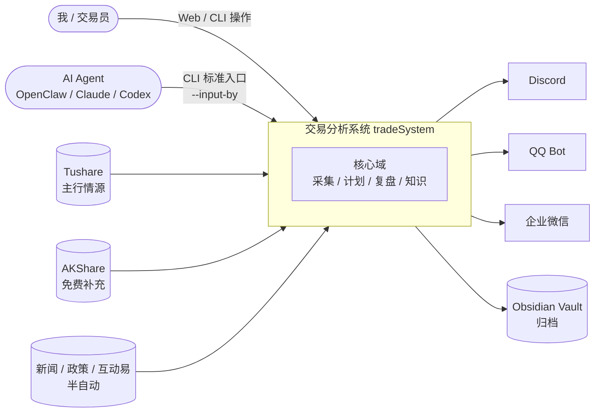
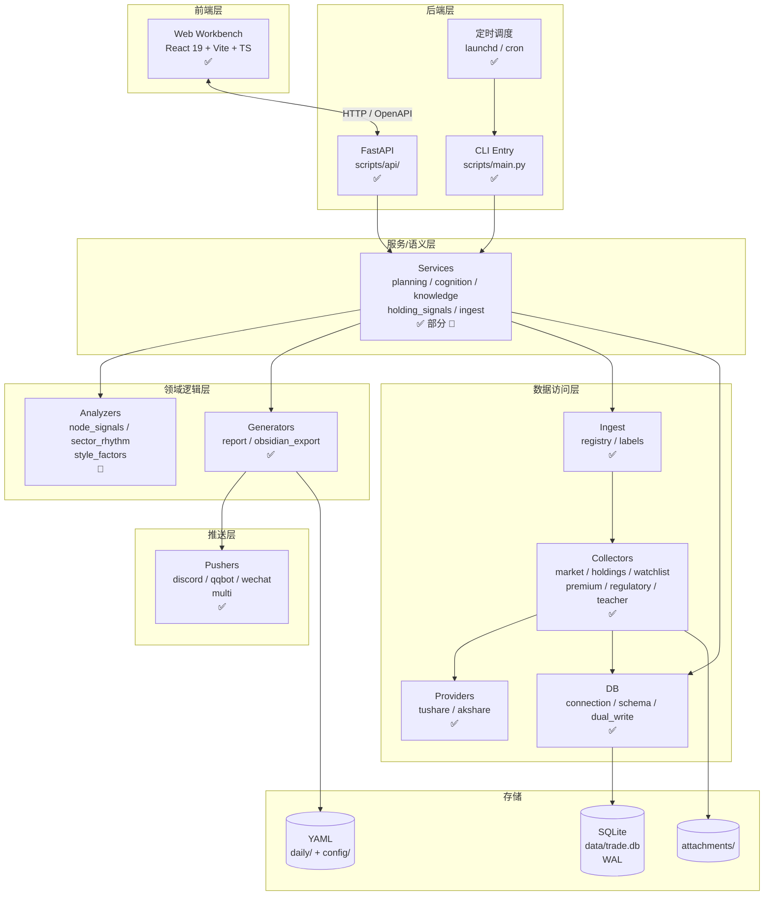
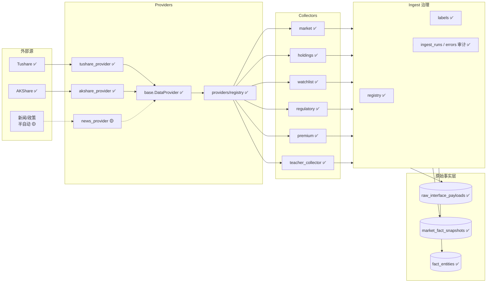
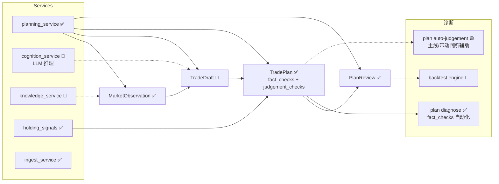
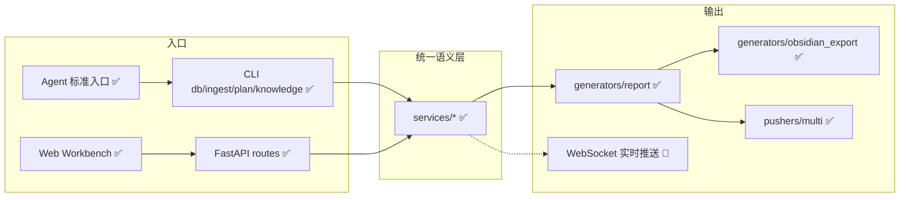

# 系统蓝图（System Blueprint）

> 本文档是 **总览级** 架构图，回答「系统由哪些层、哪些容器、哪些组件构成；它们之间如何联系；当前在迭代到哪个位置」。
>
> - **细颗粒（模块清单与依赖）** → 见 [02-module-map.md](./02-module-map.md)
> - **时间轴与迭代计划** → 见 [03-roadmap.md](./03-roadmap.md)
> - **数据语义与计划状态流** → 见 [.cursor/agent-context/20-architecture-and-data.md](../../.cursor/agent-context/20-architecture-and-data.md)
>
> 本图采用 **C4 风格分层**：Context（系统边界） → Container（部署单元） → Component（代码包）。
> 每个模块标注 **状态徽章**，新增/迭代模块只需改徽章，无需重画。

## 状态徽章约定

| 徽章 | 含义 | 判定标准 |
|---|---|---|
| ✅ | 已建成 | 代码合入主干，主路径可运行 |
| 🚧 | 在建 | 已有骨架/部分实现，未达可用 |
| 🟡 | 中期（1–2 月） | 已立项，未启动；优先级中 |
| 🔵 | 长期（季度+） | 已规划，未排期；优先级低/待研究 |
| ⚪ | 占位 | 仅命名预留，不一定会做 |

每个模块的徽章在 [02-module-map.md](./02-module-map.md) 中维护，本图与之保持同步。

---

## L1 · System Context（系统边界）

**边界判定**：
- 系统**只**输出复盘、分析、整理与执行辅助；**不**做买卖建议、不预测价格目标（参见 `CLAUDE.md` 红线）。
- Agent **必须**走 CLI 标准入口写入，禁止直连 SQLite / YAML。

---

## L2 · Container View（部署/运行容器）

**关键约束**：
- **统一语义层**：CLI / API / Web **必须**共享同一 service、同一默认值、同一校验、同一状态流转。新增写入逻辑只在 services 层落地。
- **Provider 可插拔**：`scripts/providers/base.py` 是稳定接口；新数据源继承 `DataProvider` 注册即可。
- **双写**：Collector 先写 YAML 再写 SQLite，DB 失败不影响 YAML，失败可重试（`db sync`）。

---

## L3 · Component View（按领域分组）

下面按领域而非目录分组，因为同一领域常跨多个 scripts 子包。

### L3.1 数据采集与事实层

### L3.2 计划与复盘语义层

> **红线**（来自 `CLAUDE.md`）：
> - Agent 不得绕过确认直接写 `confirmed` 的 `TradePlan`
> - `[判断]` 不得伪装成 `[事实]`
> - `fact_checks` 仅保存**确认后**的客观条件

### L3.3 协作与分发层

---

## 模块状态总览（与 `02-module-map.md` 同步）

| 领域 | ✅ 已建 | 🚧 在建 | 🟡 中期 | 🔵 长期 |
|---|---|---|---|---|
| **采集 / Provider** | tushare、akshare、6 类 collector | — | news_provider、互动易 provider | 港股专用 provider、L2 行情 |
| **事实层** | raw / snapshot / entities / audit | — | 半自动事实链路（新闻/政策） | 跨日特征仓 / 因子库 |
| **计划语义** | Observation / Plan / Review、plan diagnose | TradeDraft 语义、cognition_service | auto-judgement 辅助、知识资产沉淀 | 历史模式匹配、回测引擎 |
| **协作入口** | Web 17 工作台、CLI、API、Agent CLI | — | Agent 协作 Plan 生成（agent_assisted） | WebSocket 实时推送、移动端 |
| **分发** | Discord / QQ / 企业微信、Obsidian 归档 | — | 推送模板系统、失败重试 | 推送效果分析、交互式回复 |
| **可观测** | 采集审计、推送日志 | — | 服务级 metrics、SLO 看板 | 全链路追踪 |

---

## 维护规则

1. **新增模块**：在 `02-module-map.md` 增加一行（含模块 ID、徽章），然后回到本文相应 L3 子图加节点；不必每次重画整图。
2. **状态升级**：徽章变更 **同时**改本文与 `02-module-map.md`，避免漂移。
3. **路线图同步**：`03-roadmap.md` 中每个条目**必须引用**模块 ID（如 `M-SVC-COG`），否则 PR 不予合入。
4. **与数据语义文档分工**：本文画**结构**，`20-architecture-and-data.md` 写**语义/状态流细节**。两边相互引用，但不复制内容。
