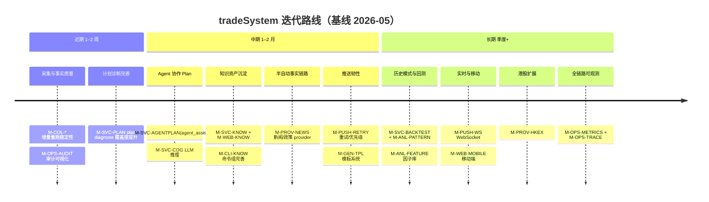
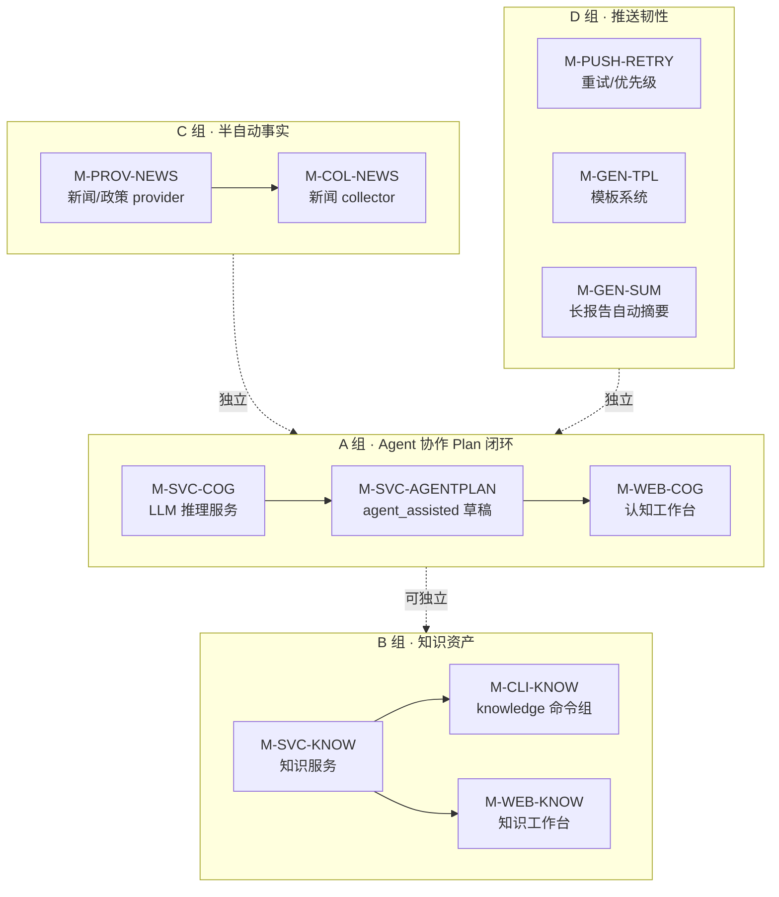

# 迭代路线图（Roadmap）

> 本文档是**时间维度**的视图，回答「接下来做什么、按什么顺序、依赖关系是什么」。
>
> - **结构与拓扑** → 见 [01-system-blueprint.md](./01-system-blueprint.md)
> - **模块定义与状态** → 见 [02-module-map.md](./02-module-map.md)
>
> **强约束**：每个路线图条目**必须引用模块 ID**（如 `M-SVC-COG`）；纯口号、未对应到具体模块的条目不予立项。
>
> **节奏**：
> - **近期** = 1–2 周内可完成
> - **中期** = 1–2 月排期
> - **长期** = 季度+，需立项研究

---

## 路线图总览（时间轴）

---

## 近期（1–2 周）

聚焦**夯实主路径**，不做新模块。

| # | 条目 | 涉及模块 | 验收标准 | 备注 |
|---|---|---|---|---|
| N1 | 采集失败重跑稳定性 | M-COL-MARKET、M-DB-DW、M-OPS-SYNC | `db sync` 在断网/超时下幂等通过 | 已有骨架，补边界 |
| N2 | `plan diagnose` 覆盖度 | M-SVC-PLAN | 覆盖均线/涨跌幅/公告 + 板块扩展字段，缺数据时返回 `missing_data` 而非伪通过 | 已部分实现 |
| N3 | 采集审计可视化 | M-OPS-AUDIT、M-WEB-MARKET | Web 可查 `ingest_runs` / `ingest_errors` | 表已存在，缺前端 |
| N4 | 推送内容质量回归 | M-PUSH-DC、M-PUSH-QQ、M-GEN-REPORT | 表格在 Discord/QQ 渲染正确，超长自动分段 | 已实现，加自动化 e2e |

**完成度判断**：每周 Friday 检查徽章是否变更；条目完成后从本节移除并写入 CHANGELOG（如有）。

---

## 中期（1–2 月）

聚焦**补语义层与 Agent 协作能力**。

| # | 条目 | 涉及模块 | 立项前提 | 验收标准 |
|---|---|---|---|---|
| M1 | LLM 推理服务上线 | M-SVC-COG | 选定 LLM provider（Claude / OpenAI / 本地）+ 缓存策略 | `cognition_service.infer()` 可同步/异步调用，写入审计 |
| M2 | Agent 协作生成草稿 | M-SVC-AGENTPLAN（基于 M-SVC-COG） | M1 完成 | `MarketObservation.source = agent_assisted` 链路打通；不得跨过人工确认 |
| M3 | 认知工作台前端 | M-WEB-COG | M2 草稿 API 就绪 | 可触发 LLM、查看草稿、人工确认提升为 Plan |
| M4 | 知识服务定型 | M-SVC-KNOW | 资料数据模型确定（teacher_notes 已有） | 可由资料 → `MarketObservation.source = knowledge_asset` |
| M5 | `knowledge` CLI 命令组 | M-CLI-KNOW | M4 完成 | `python3 main.py knowledge ...` 通过 `test_cli_smoke` |
| M6 | 知识工作台前端 | M-WEB-KNOW | M4 完成 | 资料库浏览/检索可用 |
| M7 | 新闻/政策 provider | M-PROV-NEWS | 选定数据源（含合规） | 接入 Provider 注册表，可被 collector 引用 |
| M8 | 推送失败重试 + 优先级 | M-PUSH-RETRY | — | 主渠道失败自动切备用，重试上限可配置 |
| M9 | 推送模板系统 | M-GEN-TPL | — | 用户可在 `config/` 自定义模板 |
| M10 | 长报告自动摘要 | M-GEN-SUM | M-SVC-COG（M1）就绪可复用 | 推送内容超阈值时生成摘要 |

**风险与权衡**：
- **M1 LLM 选型** 是中期最大不确定性。建议**先做接口抽象**（`CognitionProvider`），再接具体后端，避免锁定。
- **M2 红线**：Agent 写入 `agent_assisted` 草稿不得自动 confirm 为 `TradePlan`，必须保留人工确认门。

---

## 长期（季度+）

聚焦**能力扩展与系统化沉淀**，需要专门立项。

| # | 条目 | 涉及模块 | 关键问题 |
|---|---|---|---|
| L1 | 历史模式匹配 | M-ANL-PATTERN | 形态特征定义；相似度度量 |
| L2 | 因子库 | M-ANL-FEATURE | 特征仓 schema；增量计算策略 |
| L3 | 回测引擎 | M-SVC-BACKTEST | 回测语义边界（不做买卖建议，但允许统计命中率） |
| L4 | 港股专用 provider | M-PROV-HKEX | 数据源选型与成本 |
| L5 | WebSocket 实时推送 | M-PUSH-WS | 与现有定时推送的边界 |
| L6 | 移动端 / PWA | M-WEB-MOBILE | 信息密度重排；离线策略 |
| L7 | 服务级 metrics + SLO | M-OPS-METRICS | 指标定义；存储后端 |
| L8 | 全链路追踪 | M-OPS-TRACE | trace ID 贯通 CLI/API/采集/推送 |
| L9 | 推送效果分析 | M-PUSH-METRICS | 打开率/阅读率统计需要交互闭环 |

---

## 路线图维护规则

1. **新增条目**：先在 `02-module-map.md` 登记模块（拿到 ID），再在本文写条目。
2. **完成条目**：把模块徽章升级（🟡→🚧→✅），从本文当前节移除，旧条目放进“归档/CHANGELOG”而不是直接删除（保留可追溯）。
3. **跨期搬迁**：长期 → 中期 → 近期 时，必须在条目里写明立项前提与验收标准，不允许只搬名字。
4. **每月回顾**：检查近期/中期未推进的条目，决定继续、降优先级或撤销，避免“僵尸 roadmap”。

---

## 归档（已完成）

> 完成的条目从上方移到这里，并保留完成日期，便于历史追溯。

_本文档基线创建于 2026-05-02，归档区初始为空。_
