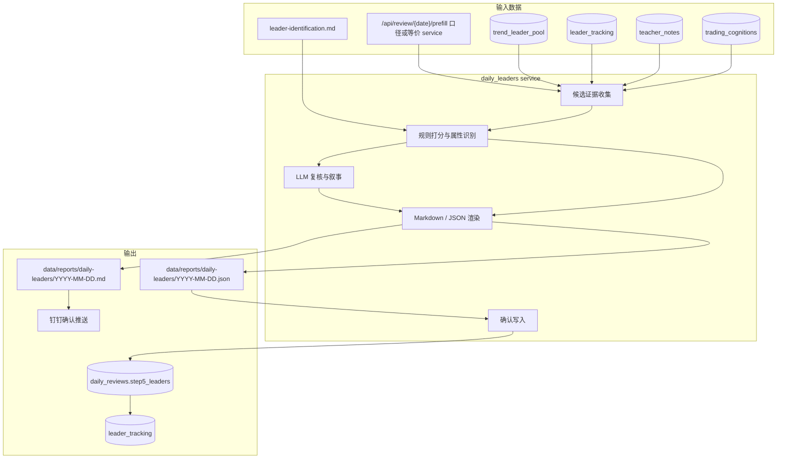
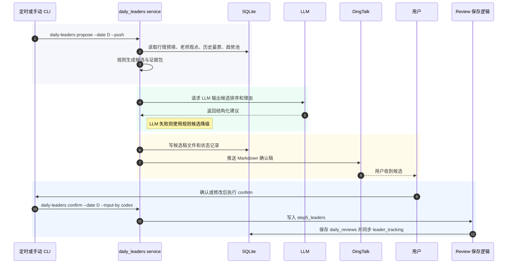
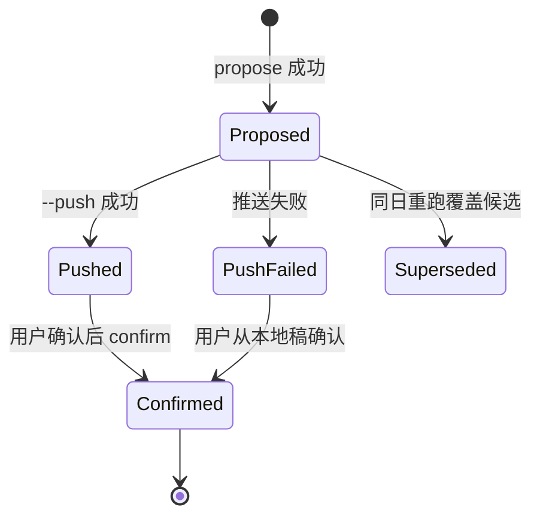

# 每日最票候选确认流水线技术方案

## 方案结论

新增 `daily-leaders` 标准 CLI，采用“先生成候选、推送确认、再人工确认写入”的两段式闭环。系统自动读取当日行情、板块候选、趋势主升池、历史最票、老师观点和底层认知，经规则与 LLM 生成 `[判断]` 候选稿；用户确认后才写入八步复盘第 5 步 `step5_leaders`，并复用现有保存逻辑同步到 `leader_tracking`。

本方案不直接写交易计划、不写关注池、不把候选最票当已确认事实。

## 背景与目标

### 背景

- 当前 `/api/review/{date}/prefill` 已能从候选板块中提取 `emotion_leader` / `capacity_leader` 并预填到 `step5_leaders.top_leaders`。
- 当前 `PUT /api/review/{date}` 保存复盘后，会把第 5 步最票同步到 `leader_tracking`。
- 当前 `trend-leader daily` 已能生成趋势主升观察池，但它只覆盖趋势漏斗，不等于“当日全市场和不同板块的最票确认稿”。
- 用户需要每个交易日系统主动识别当日最票、不同板块最票，并结合老师观点后推送给用户确认，便于复盘时确认当日最票。

### 目标

1. 每个交易日生成一份“待确认最票候选稿”。
2. 候选稿覆盖全市场最票、不同板块最票、属性分类、清晰度、历史对照、老师观点对照。
3. 通过钉钉推送给用户确认。
4. 用户确认后写入 `daily_reviews.step5_leaders`，并同步进入 `leader_tracking`。
5. 所有 AI 判断显式标注 `[判断]`，客观行情证据标注 `[事实]`。

## 范围与非目标

| 类别 | 内容 |
| ---- | ---- |
| 本次范围 | 新增 `daily-leaders propose` 与 `daily-leaders confirm`；新增 service、renderer、候选文件、测试与技能索引 |
| 非目标 | 不新增交易计划；不写关注池；不替用户确认最票；不改变 `trend-leader` 既有语义；不把 LLM 放入复盘预填 API 的同步路径 |
| 成功标准 | 交易日可一键生成并推送候选稿；确认后复盘第 5 步可见；`leader_tracking` 同步成功；缺 LLM 或缺老师观点时能降级输出 |

## 现状与约束

| 约束项 | 当前情况 | 影响 |
| ---- | ---- | ---- |
| Agent 写入 | Agent 标准入口必须走 CLI，写入必须显式 `--input-by` | `confirm` 必须要求 `--input-by` |
| 复盘落点 | `daily_reviews.step5_leaders` 是第 5 步结构化字段 | 确认结果写这里，不新建重复业务表 |
| 历史跟踪 | `_sync_leader_tracking` 已从 `step5_leaders.top_leaders` 同步 `leader_tracking` | 优先复用或下沉公共函数，避免重复 SQL |
| 老师观点 | `teacher_notes` 是老师观点唯一事实源 | 只读引用 `teacher_notes`，不写老师观点 |
| LLM | 仓库已有 `utils.llm_cli` 与 Antigravity CLI 调用习惯 | LLM 失败时必须降级为规则候选 |
| 推送 | 已有 `DingTalkPusher` | `propose --push` 复用现有钉钉推送 |

## 方案设计

### 架构设计



### 核心流程



### 状态流转



### 命令设计

```bash
python3 scripts/main.py daily-leaders propose --date YYYY-MM-DD [--push] [--no-llm]
python3 scripts/main.py daily-leaders confirm --date YYYY-MM-DD --input-by codex [--leaders-file PATH]
python3 scripts/main.py daily-leaders show --date YYYY-MM-DD [--json]
```

| 命令 | 写入行为 | 说明 |
| ---- | ---- | ---- |
| `propose` | 写本地候选稿，不写业务结论 | 生成候选 JSON/Markdown，可选推送 |
| `confirm` | 写 `daily_reviews.step5_leaders` | 需要 `--input-by`，确认结果进入复盘和 `leader_tracking` |
| `show` | 只读 | 查看最近候选稿，便于用户修改前核对 |

### 定时策略

每日最票候选任务放在交易日 `22:30` 触发，晚于 `trend-leader`、`ma-breakout`、`market-timing` 和研报速读等盘后派生任务，确保候选生成时能读取更完整的当日派生信号与老师观点。

### 确认方式

第一版采用“钉钉通知 + Codex 自然语言确认”的半自动方式：

1. `22:30` 定时任务执行 `daily-leaders propose --push`，钉钉只发送 Markdown 候选稿和本地候选稿路径。
2. 用户在当前 Codex/聊天线程回复自然语言确认，例如：
   - `确认，全部录入`
   - `确认录入半导体和算力，剔除机器人`
   - `半导体最票改成 A，容量中军保留 B`
3. Agent 根据用户回复生成确认 payload，展示最终写入摘要。
4. 用户确认后，Agent 执行 `daily-leaders confirm --date YYYY-MM-DD --input-by codex --leaders-file <payload>` 写入复盘第 5 步。

不要求用户手工编辑 JSON/Markdown。`--leaders-file` 只是 Agent 内部用于把用户确认结果传给 CLI 的结构化文件。

钉钉交互按钮作为 v2 能力：现有自定义机器人可发送带跳转按钮的 `actionCard` 类消息，但按钮点击本身不等于业务确认回调；若要“一点按钮就写入系统”，需要额外部署可公网访问或钉钉可访问的确认页面/API，并处理鉴权、幂等、误触撤销和审计。因此第一版不做真正的钉钉按钮回写。

### 候选生成规则

| 来源 | 用途 | 证据标签 |
| ---- | ---- | ---- |
| `review_signals.sectors.projection_candidates` | 板块候选、情绪龙头、容量中军 | `[事实]` + `[判断]` 混合，按原字段拆分 |
| `trend_leader_pool` | 趋势主升候选、连续性、入池触发 | `[判断]` |
| `leader_tracking` | 是否老龙头、是否新最、历史延续 | `[事实]` |
| `teacher_notes` | 老师观点支持、冲突、未提及 | `[观点]` |
| `cognitions_by_step.step5_leaders` | 执行类认知约束 | `[判断]` |
| `leader-identification.md` | 最票属性和阶段适配方法论 | 方法论 |

### 输出字段

确认稿中的每个候选项使用统一结构：

| 字段名 | 类型 | 必填 | 默认值 | 说明 |
| ------ | ---- | ---- | ------ | ---- |
| `stock` | `string` | 是 | 无 | 展示用股票名或代码加名称 |
| `code` | `string|null` | 否 | `null` | 可解析到代码时填 |
| `sector` | `string` | 是 | 无 | 所属板块或主题 |
| `attribute_type` | `string` | 是 | 无 | `走势引领` / `最先板` / `最高标` / `容量最大` / `基本面最正宗` / `风格化最强` |
| `attribute` | `string` | 否 | `""` | 补充说明 |
| `clarity` | `string` | 是 | `中` | `高` / `中` / `低` |
| `position` | `string` | 否 | `""` | 板块阶段或当前状态 |
| `is_new` | `boolean` | 是 | `false` | 是否为新最 |
| `evidence` | `array` | 是 | `[]` | 事实和判断证据 |
| `teacher_alignment` | `string` | 是 | `未提及` | `支持` / `冲突` / `未提及` |
| `llm_reason` | `string` | 否 | `""` | LLM 生成理由，需红线过滤 |

写入 `daily_reviews.step5_leaders.top_leaders` 时保留页面兼容字段：`stock`、`sector`、`attribute_type`、`attribute`、`clarity`、`position`、`is_new`。

## API 设计

本次默认不新增 Web API。确认写入通过 CLI 调用现有复盘保存语义；钉钉按钮回写或 Web 页面确认属于 v2，届时再补：

| 项 | 内容 |
| -- | ---- |
| Method | `POST` |
| URI | `/api/review/{date}/leaders/confirm` |
| 说明 | 从候选稿确认写入复盘第 5 步 |

请求示例：

```json
{
  "input_by": "web",
  "top_leaders": [
    {
      "stock": "示例股票",
      "sector": "半导体",
      "attribute_type": "走势引领",
      "attribute": "启动日主动带动板块",
      "clarity": "高",
      "position": "主升初期",
      "is_new": true
    }
  ]
}
```

响应示例：

```json
{
  "ok": true,
  "date": "2026-07-05",
  "synced_leader_tracking": 1
}
```

## 兼容性与迁移

| 项 | 策略 |
| -- | ---- |
| 兼容旧逻辑 | 不改 `trend-leader`、不改复盘页保存字段；只新增候选生成入口 |
| 数据迁移 | 不新增业务表；候选稿先落 `data/reports/daily-leaders/` 文件 |
| 默认值处理 | `propose` 默认不推送，定时任务显式 `--push`；`confirm` 必须显式 `--input-by`；用户无需手工编辑 JSON/Markdown |
| 回滚方式 | 删除新增 CLI/service/test/docs；已确认写入的复盘最票可通过复盘页或 `PUT /api/review/{date}` 修改 |

## 实施计划

1. 新增 `scripts/services/daily_leaders/`：证据收集、规则排序、LLM narrator、renderer、confirm writer。
2. 新增 `scripts/cli/daily_leaders.py` 并在 `scripts/main.py` 注册 `daily-leaders`。
3. 将复盘保存里的 `leader_tracking` 同步逻辑下沉为可复用 service，避免 CLI 复制私有 route 函数。
4. 增加钉钉推送和本地候选稿路径：`data/reports/daily-leaders/YYYY-MM-DD.{json,md}`。
5. 增加单元测试和 CLI smoke 测试。
6. 同步 `.agents/skills/INDEX.md`、`.agents/skills/daily-review/SKILL.md`、`.agents/skills/market-tasks/SKILL.md` 或新增专门 skill 说明。

## 测试与验证

### 分层验证

| 层级 | 验证内容 | 命令 |
| ---- | -------- | ---- |
| 单元测试 | 候选合并、老师观点对照、历史新最判定、LLM 降级 | `python3 -m pytest scripts/tests/test_daily_leaders_service.py -v` |
| CLI 测试 | `propose/show/confirm` 参数校验与输出 | `python3 -m pytest scripts/tests/test_daily_leaders_cli.py -v` |
| 复盘同步 | `confirm` 后 `daily_reviews.step5_leaders` 与 `leader_tracking` 同步 | `python3 -m pytest scripts/tests/test_daily_leaders_confirm.py -v` |
| 冒烟验证 | CLI/API 技能索引未漂移 | `python3 -m pytest scripts/tests/test_cli_smoke.py -v` |
| 命令索引 | commands 文档同步 | `make commands-doc && make commands-check` |

### 完成标准

- `propose --no-llm` 在无 LLM 情况下仍能产出候选稿。
- `propose --push` 在钉钉配置存在时可推送，缺配置时保留本地稿并清晰提示。
- `confirm --input-by codex` 可写入复盘第 5 步并同步 `leader_tracking`。
- 输出中 `[事实]`、`[判断]`、`[观点]` 清晰分离。
- 所有新增命令在 `test_cli_smoke` 中覆盖。

## 风险与回滚

| 风险 | 触发条件 | 缓解方案 | 回滚动作 |
| ---- | -------- | -------- | -------- |
| LLM 把判断写得像事实 | LLM 叙事过强 | renderer 强制按证据标签分段，红线词过滤 | 使用 `--no-llm` 规则稿 |
| 老师观点匹配过度 | 板块自由文本误匹配 | 只做“支持/冲突/未提及”弱对照，并保留原文引用摘要 | 移除 teacher alignment 字段，不影响候选 |
| 重复写入最票 | 同日多次 confirm | 复用复盘 upsert，按日期覆盖第 5 步；`leader_tracking` upsert | 重新 confirm 修正版 |
| 推送失败 | 钉钉环境变量缺失或网络失败 | 本地 Markdown/JSON 始终落盘 | 手动查看 `show` 或重跑 `--push` |
| 与复盘本地草稿冲突 | Web 页面已有 localStorage 草稿 | confirm 后提示用户以服务端为准检查页面 | 从候选 JSON 重新 confirm |
| 钉钉按钮误触或鉴权不足 | v2 做按钮回写时 | v1 不做按钮回写；v2 必须加签名、过期时间、二次确认和幂等键 | 禁用按钮入口，回到 Codex 确认 |

## 已确认决策

1. v1 按“钉钉 Markdown 通知 + Codex 自然语言确认 + CLI 写入”实现。
2. 钉钉按钮回写作为 v2 单独设计和实现，不进入 v1。
