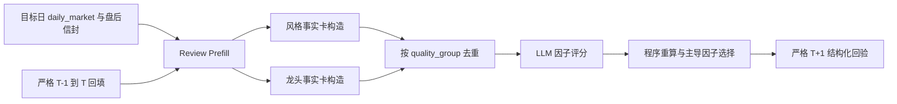

# 三位一体风格与龙头独立事实源设计

## 1. 目标与结论

在现有双层 LLM 评分闭环中，补齐 `style_regime` 与 `leader_signal` 的客观证据，使四类因子都能在相同硬门下竞争。

首版复用已经落入 `daily_market`、盘后信封和 `style_factors` 的事实，不新增 Provider、数据库表或正式交易计划写入。改动集中在证据卡拆分、数据血缘去重、缺失状态、T+1 比较和验证。

预期正常数据日：

- `style_regime` 具备 3 个独立质量组，`evidence_quality=4`。
- `leader_signal` 具备 2 个独立质量组，`evidence_quality=3`。
- 两者获得主导因子参选资格，但 LLM 仍必须满足支配性、节奏、反证和分差硬门。

## 2. 边界

### 纳入

- 目标日收盘可得的 CSI300/CSI1000 相对强弱。
- 目标日非 ST 的 10/20/30cm 首板结构与连板梯队。
- 严格 T-1 宇宙到 T 日实现的溢价、晋级和核心反馈。
- 证据来源状态与数据血缘。
- 新旧 score run 的 T+1 兼容。
- 临时数据库上的 20 交易日真实 LLM 回放。

### 不纳入

- 新增分钟级“新最”识别。
- 把 `step5_leaders`、`leader_tracking`、`daily-leaders` 或 `trend_leader_pool` 升为客观事实。
- 修复或启用封板率、炸板率作为质量来源；当前炸板采集失败可能被折成 0。
- 修改 `review/to-draft`、关注池、交易计划或任何买卖动作。
- 自动调整评分权重和阈值。

## 3. 数据流



`build_review_prefill` 已按精确目标日期读取 `daily_market`，并包含精确前一交易日 `prev_market`。证据构造只消费这份快照，不额外查询未来状态。

## 4. 证据契约

### 4.1 公共字段

每张客观证据卡保留：

| 字段 | 含义 |
|---|---|
| `evidence_id` | `{trade_date}:{factor_code}:{semantic_source}` |
| `source` | LLM 可理解的语义来源名 |
| `quality_group` | 程序用于独立血缘去重的分组，不展示给 LLM |
| `source_status` | `ok/source_ok_empty/rule_filtered_empty/missing/source_failed` |
| `layer` | `market/style/stock` |
| `kind` | 客观项固定为 `fact` |
| `polarity` | `support/counter/context` |
| `content` | 紧凑、稳定、可审计的 JSON 内容 |

`evidence_quality` 与 `objective_source_count` 都按有效 `quality_group` 去重，而不是直接数 `source` 字符串。只有 `source_status=ok` 且内容满足最小字段要求的事实卡计入质量。

### 4.2 `style_regime`

| ID 后缀 | `source` | `quality_group` | 内容 |
|---|---|---|---|
| `cap_relative_strength` | `cap_relative_strength` | `index_relative_strength` | CSI300/CSI1000 涨幅、spread、大小盘标签 |
| `board_preference` | `board_preference` | `limit_board_mix` | 10/20/30cm 首板占比与主导类型 |
| `premium_regime` | `premium_regime` | `premium_realization` | 首板、10/20/30cm、二板、三板+、容量票的样本数和溢价；近 5 日方向作为同卡派生字段，不另计来源 |

约束：

- 不把 `switch_signals` 作为新事实源；它只是已有事实的规则化文案。
- 不把顶层 `premium_*` 与 `style_factors.premium_snapshot` 重复计数。
- “趋势”目前只可由容量票实现结果作为代理，必须在字段名或说明中标明 `capacity_proxy`，不能宣称为全市场趋势票统计。
- `promotion_backfill` 可作为补充内容，但归入已有涨停/实现血缘，不新增质量组。

### 4.3 `leader_signal`

| ID 后缀 | `source` | `quality_group` | 内容 |
|---|---|---|---|
| `ladder_structure` | `ladder_structure` | `limit_event` | 非 ST 最高板、连板总数、各梯队数量和最高梯队名称；`daily_market` 与 `limit_step` 只算同一血缘 |
| `promotion_realization` | `promotion_realization` | `leader_outcome` | 首板进二板、二板进三板的 base/promoted/rate，日期必须等于目标日 |
| `prior_core_feedback` | `prior_core_feedback` | `leader_outcome` | 前一交易日最高梯队或连板核心在目标日的样本数、涨停/跌停数、开盘溢价和收盘涨跌中位数 |

`promotion_realization` 和 `prior_core_feedback` 是两张可引用证据卡，但同属 `leader_outcome`，只贡献一个质量组，避免同一 T-1/T 数据被重复计分。

约束：

- `leader_detection` 保持 `objective=False`。
- 自动预填或人工确认的 Step 5 只作为 `judgement/context`。
- `limit_cpt_list`、板块涨幅和资金流仍归 `sector_rhythm`。
- 封板率和炸板率不进入上述证据卡，直到采集层能区分真实 0 与源失败。

## 5. 状态与降级

| 状态 | 处理 |
|---|---|
| `ok` | 可进入 LLM 正向白名单并计质量 |
| `source_ok_empty` | 保留审计，不计正向质量；必要时可形成明确空样本反证 |
| `rule_filtered_empty` | 原始数据存在但非 ST 等规则过滤后为空；不计正向质量 |
| `missing` | 没有有效块且无明确失败信号；不计质量 |
| `source_failed` | 存在显式失败；不计质量，不用 0 代替 |

不能从现有数据确认 `source_failed` 时，诚实使用 `missing`，不猜测失败原因。

质量档沿用现有规则：

- 1 个质量组：2。
- 2 个质量组：3。
- 3 个质量组：4。
- 4 个以上且跨至少 2 层：5。

## 6. LLM 输入、缓存与版本

- `quality_group`、质量分、规则排序和 caps 只保留在审计快照，不展示给 LLM。
- LLM 仍只能引用输入白名单中的稳定 `evidence_id`。
- `RULESET_VERSION` 升为 `trinity_ruleset_v2`。
- `SERVICE_SCHEMA_VERSION` 升为 `trinity_dual_score_run_v2`。
- Prompt 输出结构不变；若提示词文本不改，Prompt 版本保持 v1。
- 新证据快照会改变 `input_digest`，旧缓存自然失效；旧 run 保留且不覆盖。

## 7. T+1 回验

### 风格

优先读取三张新卡，提取：

- 大小盘标签。
- 10/20/30cm 主导板型。
- 溢价方向或容量/情绪相对结果。

新旧日共同可比维度全部一致为 `hit`，部分一致为 `partial`，全部相反为 `miss`；无共同有效维度为 `missing_data`。旧 run 继续回退读取整包 `style_factors`。

### 龙头

不再比较整块 JSON 是否完全相等。新 comparator 使用：

- 最高梯队身份留存或晋级。
- 最高板高度是否维持/增强。
- 晋级与核心反馈是否继续印证。

维度全部印证为 `hit`，部分印证为 `partial`，有充分事实但均未印证为 `miss`；关键源缺失为 `missing_data`。旧 run 继续支持旧 `limit_ladder` 快照。

T+1 程序只消费客观 prefill，不消费当日人工 Step 5，也不调用 LLM 自评。

## 8. 测试与真实验证

### TDD 单元与集成测试

- 风格三组稳定 ID、紧凑内容和正常 `quality=4`。
- 龙头三卡、两个质量组和正常 `quality=3`。
- 同一 `quality_group` 多卡只计一次。
- 无效状态不进入质量和正向白名单。
- 缺一组时按 q2/q3 降级，不硬升。
- LLM 输入不含 `quality_group`、完整 `failed_names` 或未裁剪 popularity 列表。
- `daily_market -> build_review_prefill -> evidence_snapshot` 集成链路。
- 新旧 style/leader run 的 T+1 hit/partial/miss/missing_data。
- 缓存因 ruleset、证据或状态变化而失效。
- 原有因子/板块严格 JSON、红线、部分降级测试不回归。

### 回归命令

```bash
python3 -m pytest scripts/tests/test_trinity_factor_service.py \
  scripts/tests/test_trinity_factor_llm.py \
  scripts/tests/test_trinity_factor_orchestration.py \
  scripts/tests/test_trinity_factor_cycle.py \
  scripts/tests/test_api.py \
  scripts/tests/test_cli_smoke.py -q
make check-web
git diff --check
```

### 真实 20 日回放

- 来源生产库只读复制到临时数据库。
- 日期：2026-06-12 至 2026-07-10，共 20 个开市日。
- 使用显式 `LLM_MODEL`，每个日期创建新 run，不复用旧 ruleset 缓存。
- 汇总调用状态、非法输出率、降级率、四因子质量覆盖、主导/辅助分布、`undetermined` 分布和第二层板块结果。
- 对比上一轮分布，重点复核 2026-07-02。
- 不把无人工确认和严格 T+1 样本的回放描述为胜率验证。
- 不写生产数据库，不自动确认复盘结论。

## 9. 验收标准

1. 生产事实能稳定生成约定证据卡，缺数不伪装为 0。
2. 质量分按血缘去重；普通完整日 style 为 4、leader 为 3。
3. 两类因子可以通过 `evidence_quality >= 3` 硬门，但不会绕过其他主导因子条件。
4. API、CLI、缓存、审计和旧 run T+1 语义兼容。
5. 相关测试、Web 检查和 diff 检查通过。
6. 真实 20 日回放仅写临时库，并提供可复核汇总。
