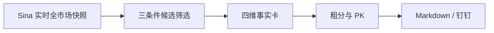
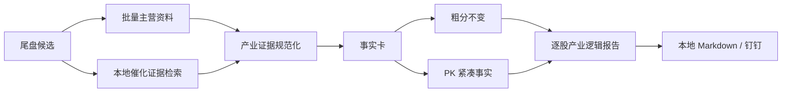

# 尾盘实时筛选：个股主营与产业催化增强设计

## 方案结论

在现有 `tail-scan` 四维事实卡中新增一组**可溯源的产业逻辑字段**，让每只候选同时展示：

1. `[事实·主营]`：公司主营业务与核心产品。
2. `[判断·产业链位置]`：仅基于主营、产品、申万行业和有效证据做受控归纳。
3. `[事实·个股催化]` / `[事实·行业催化]` / `[老师观点]`：最近 30 个自然日内、带日期与来源的近期证据。

实现采用“**官方主营资料 + 本地催化证据融合**”方案。主营资料优先走 Tushare `stock_company`，失败时降级到 AkShare `stock_zyjs_ths`；催化只读取仓库已有的 `teacher_notes`、`industry_info` 和慧博研报 summary，不在 14:40 任务中临时搜索互联网，不允许 LLM 补造事实。

本次不改变候选筛选阈值、粗分权重、PK 状态机、推送时点，也不新增数据库写入。

## 背景与目标

当前 `tail-scan` 把“逻辑”实现为三个标签：

- 是否属于 T-1 主线申万二级行业；
- 是否命中 T-1 热门同花顺概念；
- 是否命中近期老师观点。

`scorer.build_fact_cards()` 没有保留主营、核心产品、申万二级名称和具体催化文本；`renderer.render_daily()` 只渲染“主线/概念”标签。因此标签可能说明“被归到什么题材”，却不能回答：

- 公司实际做什么；
- 位于产业链哪一环；
- 近期有什么可核验催化；
- 催化是个股直接证据，还是行业层证据。

目标是在保持尾盘任务稳定、快速、只读的前提下，为每个候选补齐这些信息，并明确事实、老师观点和程序归纳的边界。

## 范围与非目标

### 范围

- 新增批量主营资料 capability 及 Tushare/AkShare 实现。
- 新增 `tail_scan` 产业证据采集与规范化组件。
- 在事实卡中加入主营、产品、行业、产业链位置和近期催化字段。
- 在 Markdown/钉钉报告中逐股展示产业逻辑。
- 将紧凑后的产业事实传入 PK，但不加入粗分权重。
- 为数据成功、真实无证据和数据源失败分别提供可见状态。

### 非目标

- 不判断某条产业逻辑是否会导致股价上涨。
- 不声称找到了“当日上涨唯一原因”。
- 不临时调用搜索引擎、新闻网页或自由浏览。
- 不新增价格目标、胜率、买卖建议或仓位建议。
- 不写入 `TradeDraft`、`TradePlan`、关注池或任何 SQLite 表。
- 不修订 `tail-scan` 的涨幅、ST、成交额阈值和调度时间。

## 现状与约束

### 现有数据流



### 主要约束

- 实时行情属于 T 日 14:40 快照；主线、概念、历史行情继续严格绑定 T-1。
- 主营资料是公司静态事实，不参与 T-1 看未来约束，但必须记录来源。
- 催化证据必须满足 `evidence_date <= scan_date`。
- 行业级催化不能伪装成个股直接催化。
- 同花顺概念成分只能称为“市场标签”，不能直接冒充主营或产业链位置。
- 任何增强维度失败都只能降级该维度，不能拖垮实时筛选和推送。

## 方案比较

| 方案 | 主营覆盖 | 催化时效 | 稳定性 | 结论 |
|---|---:|---:|---:|---|
| 14:40 临时外网搜索并让 LLM 归纳 | 高 | 高 | 低 | 不采用：慢、不可复现、易混入传闻 |
| 仅复用本地 `teacher_notes` / `industry_info` / 慧博 | 中 | 中高 | 高 | 不单独采用：部分股票缺主营基线 |
| 官方主营资料 + 本地催化证据融合 | 高 | 中高 | 高 | **采用** |

## 方案设计

### 总体数据流



### 1. 主营资料 capability

新增 `get_stock_business_profiles(ts_codes: list[str])`，返回以标准 `ts_code` 为键的资料映射。

#### Tushare 主源

- 使用 `pro.stock_company`。
- 请求字段至少包含 `ts_code,introduction,main_business,business_scope`。
- 按候选代码过滤，避免把全市场结果继续传给下游。
- 来源标记为 `tushare:stock_company`。

Tushare 官方文档：<https://tushare.pro/document/2?doc_id=112>。

#### AkShare 降级源

- 使用 `stock_zyjs_ths(symbol=bare_code)`。
- 映射 `主营业务`、`产品类型`、`产品名称`、`经营范围`。
- 来源标记为 `akshare:stock_zyjs_ths`。
- 单票失败不影响其它候选；调用需设置受控并发与总耗时上限。

降级编排由 `tail_scan.industry_logic` 完成：先通过 registry 调用 Tushare 主源；如果主源整体失败，直接调用 AkShare；如果主源成功但只返回部分候选，则仅对缺失代码使用 `registry.call_specific("akshare", ...)` 补齐。这样不修改 `ProviderRegistry` 的全局“首个成功即返回”语义，也不会让部分成功静默吞掉缺失票。

AkShare 官方文档：<https://akshare.akfamily.xyz/data/stock/stock.html>。

### 2. 催化证据检索

新增 `services.tail_scan.industry_logic`，只读聚合三类本地证据。

#### 证据优先级

| 优先级 | 命中方式 | 展示标签 | 说明 |
|---:|---|---|---|
| 1 | `teacher_notes.mentioned_stocks` 精确代码命中 | `[老师观点·个股]` | 保留笔记日期、标题和原始 reason；无 reason 时仅表明被直接提及 |
| 2 | 慧博 summary 的 `mentioned_stocks.name` 精确名称命中 | `[事实·个股催化]` | 使用 `viewpoint`；若仅存在 `source` 关系则按原始关系展示，不扩写 |
| 3 | `industry_info.sector_name` 与申万行业/主营产品/有效概念标签匹配 | `[事实·行业催化]` | 明确这是行业证据，不声称公司已兑现 |
| 4 | 仅存在热门概念成分关系 | `[事实·市场标签]` | 不作为催化正文，只保留标签 |

#### 时间窗口

- 默认回看最近 30 个自然日，闭区间 `[scan_date - 30 days, scan_date]`。
- 所有证据必须带 `date`；慧博证据日期固定按 `pdf_report_date > huibo_list_time > summary 文件日期` 依次降级，三者都缺失时不进入近期催化。
- 同一候选最多展示 2 条催化：优先个股直接证据，其次最新行业证据。
- 同类证据按“直接命中优先、日期倒序、来源稳定顺序”去重。

#### 行业证据匹配边界

- `industry_info.sector_name` 先按 `/`、`、`、中英文逗号拆成长度至少 2 个汉字的受控词元。
- 词元只允许与 `sw_l2`、主营、产品名或已验证概念标签做精确或双向包含匹配。
- “科技”“行业”“概念”“设备”“材料”等宽泛词进入停用表，不能单独触发行业催化。
- 命中后仍只标 `[事实·行业催化]`；匹配关系本身不升级成公司直接受益事实。

### 3. 产业链位置归纳

产业链位置不是原始字段，统一标 `[判断]`。

首版采用受控规则，不新增逐股 LLM 调用：

1. 优先组合 `main_business + product_names + sw_l2`。
2. 从已存在的行业/产品词中生成短句，例如“半导体制造上游电子特气供应商”。
3. 不允许加入输入证据中没有出现的客户、份额、国产替代、涨价或供需结论。
4. 无法安全归纳时退化为“`<申万二级>`相关企业”或“产业链位置暂无可核验归纳”。

规则产物只用于展示和 PK 事实卡，不改变粗分。

### 4. 事实卡与 PK

事实卡新增以下字段；现有字段保持兼容。

| 字段名 | 类型 | 必填 | 默认值 | 说明 |
|---|---|---:|---|---|
| `sw_l2` | `str` | 否 | `""` | 申万二级行业名称 |
| `business_summary` | `str` | 否 | `""` | 主营业务短句 |
| `product_names` | `list[str]` | 否 | `[]` | 核心产品，限制数量与长度 |
| `business_source` | `str` | 否 | `""` | 主营资料来源 |
| `business_status` | `str` | 是 | `missing` | `ok/missing/source_failed` |
| `industry_position` | `str` | 否 | `""` | `[判断]` 产业链位置归纳 |
| `catalyst_evidence` | `list[dict]` | 否 | `[]` | 最多 2 条带类型、日期、来源的证据 |
| `catalyst_status` | `str` | 是 | `none` | `exact/sector/none/source_failed` |

PK 仅接收长度受控的 `business_summary`、`industry_position` 和 `catalyst_evidence` 摘要。粗分函数 `_coarse_score()` 不读取这些新增字段，避免悄然改变排序规则。

### 5. 报告格式

每只候选由单行改为紧凑的三行块：

```text
- 金宏气体（688106.SH）涨8.14% · 成交25.74亿 · 近5日0.8%
  - [事实·主营] 气体研发、生产、销售和服务；产品含超纯氨、高纯氧化亚氮等。（AkShare 主营介绍）
  - [判断·产业链位置] 半导体制造上游电子特气供应商。
  - [事实·个股催化] AI算力集群拉动相关高纯材料及氦气需求，研报直接提及金宏气体。（2026-06-25，慧博研报）
```

无资料时仍保留结构：

```text
  - [事实·主营] 数据源失败，本次未取得。
  - [判断·产业链位置] 暂无可核验归纳。
  - [事实·近期催化] 最近30日暂无可核验产业催化。
```

报告脚注追加主营/催化维度降级状态，但不把“真实没有催化”写成“数据源失败”。

## 数据模型

本次只扩展进程内事实卡，不新增或修改 SQLite 表、YAML、JSON 持久化格式。

`data/reports/tail-scan/YYYY-MM-DD.md` 仍是唯一报告产物；历史报告不自动回写。

## API 设计

本次不新增 Web/API 接口。

Provider 内部契约新增 `get_stock_business_profiles`，它是 registry capability，不是对外 HTTP API。

## 错误处理与降级

| 场景 | 行为 | 状态 |
|---|---|---|
| Tushare 主营成功 | 使用主源资料 | `business_status=ok` |
| Tushare 失败、AkShare 成功 | 使用降级资料并保留来源 | `business_status=ok` |
| 两个主营源均失败 | 报告显示取数失败，继续处理其它维度 | `business_status=source_failed` |
| 主营源成功但没有该股票 | 显示暂无主营资料 | `business_status=missing` |
| 本地证据读取成功但无命中 | 显示最近30日暂无可核验催化 | `catalyst_status=none` |
| 某类本地证据读取失败 | 使用其它成功来源；全部失败才标失败 | `catalyst_status=source_failed` |
| 只有行业证据 | 明示行业催化，不写成个股催化 | `catalyst_status=sector` |
| 有个股直接证据 | 优先展示个股证据 | `catalyst_status=exact` |

## 实施计划概览

详细实施计划在规格确认后另行编写。预计影响：

1. Provider 基类、Tushare、AkShare capability 与测试。
2. 新增 `tail_scan.industry_logic` 纯逻辑/只读聚合模块与测试。
3. 扩展 `scorer`、`pk`、`renderer` 及对应测试。
4. 同步 `AGENTS.md`、`CLAUDE.md`、`.agents/skills/market-tasks/SKILL.md`、`.agents/skills/INDEX.md`、`.agents/rules/skills-sync.md`。
5. 执行 tail-scan 单测、provider 测试、CLI smoke、`make check-scripts` 和真实 `--dry-run` 校验。

## 测试与验证

### 单元测试

- Provider capability 声明和字段标准化。
- Tushare 主源成功、AkShare 降级、部分缺失、全失败。
- 个股代码精确命中优先于名称和行业命中。
- 慧博关系项 `viewpoint` 为空时不被扩写成个股观点。
- 行业证据只标行业，不伪装个股催化。
- 未来日期证据被拒绝。
- 30 日窗口边界和稳定去重。
- 无证据与数据源失败状态分离。
- 渲染包含三类标签、来源和日期。
- 新增字段进入 PK payload，但不改变 `_coarse_score()`。

### 集成与回归

```bash
python3 -m pytest scripts/tests/test_tail_scan_*.py -v
python3 -m pytest scripts/tests/test_tushare_p0_interfaces.py scripts/tests/test_akshare_free_backends.py -v
python3 -m pytest scripts/tests/test_cli_smoke.py -v
make check-scripts
```

真实校验使用 `--dry-run`，不落盘、不推送：

```bash
cd scripts
python3 main.py tail-scan daily --date 2026-07-13 --dry-run --no-llm
```

完成标准：

- 每只候选都出现主营、产业链位置和近期催化三个位置。
- 真实无催化与取数失败文案可区分。
- 每条具体催化都带日期和来源。
- 概念标签不再被渲染成主营事实。
- 尾盘筛选、粗分和调度语义无回归。
- 相关测试、CLI smoke 和 `make check-scripts` 通过。

## 风险与回滚

| 风险 | 缓解 |
|---|---|
| AkShare 单票接口慢或限流 | Tushare 主源优先；只补缺失票；受控并发和总超时 |
| 本地行业证据误匹配 | 精确命中优先；行业命中必须标“行业催化”；限制为最新 1 条 |
| 报告过长影响钉钉阅读 | 每票固定三行，产品和证据均限长、限条数 |
| PK payload 变长导致超时 | 只传紧凑摘要，不传经营范围全文；粗分不依赖新字段 |
| 老资料混入近期判断 | 固定 30 日窗口，证据日期必须不晚于扫描日 |

回滚只需移除事实卡新增字段及渲染块；provider capability 可独立保留，不涉及 schema 回滚或数据迁移。

## 待确认问题

设计阶段问题已确认：主营与近期催化均展示。默认采用 30 个自然日回看窗口；实现阶段不再引入其它业务口径。
