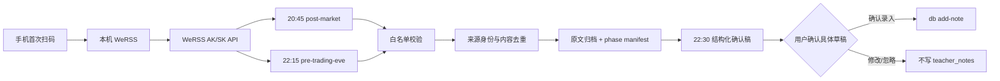

# 微信公众号老师观点白名单采集设计

## 方案结论

在 `tradeSystem` 新增 `wechat-teacher-feed` 采集工作流，以本机自托管的 WeRSS 作为唯一微信公众号数据适配层。首次部署由用户使用手机扫码授权 WeRSS；日常任务只调用本机 WeRSS JSON API，不打开、不控制微信 Mac 客户端，也不以搜索引擎结果代替公众号原文。

任务保留两个独立时点：

1. 20:45 `post-market`：仅当运行日明确为 A 股交易日时采集。
2. 22:15 `pre-trading-eve`：仅当下一自然日明确为 A 股交易日时采集。

两个批次把新增文章归档为原文事实材料，22:30 复用现有 tradeNote 自动化生成一份老师观点确认稿。只有用户对具体确认稿回复“确认录入”后，才通过 `db add-note --input-by codex_automation` 写入 `teacher_notes`；默认不写关注池。

## 目标与非目标

### 目标

- 严格限定三个公众号白名单：安静拆主线、股痴流沙河、爱在冰川。
- 自动获得标题、公众号、永久链接、文章发布时间和全文。
- 双时点增量采集，任务重跑和双批次重叠均不产生重复笔记。
- 保留原文、抓取时间、内容哈希和来源身份，便于审计与复盘。
- 将“真实没有新文章”与授权过期、源失败、正文缺失严格区分。
- 自动生成结构化确认稿，但保持 `teacher_notes` 人工确认写入红线。

### 非目标

- 不使用微信 Mac 客户端或 Computer Use 操作微信。
- 不绕过 WeRSS 直接抓取用户提供的 `mp.weixin.qq.com` 页面。
- 不采集白名单以外公众号，不因文章转发或关联推荐扩大范围。
- 不自动确认老师观点，不自动加入关注池。
- 不生成具体买卖建议、价格目标或胜率判断。
- 不把 WeRSS 本地数据库当作 `tradeSystem` 事实源直接读取。

## 白名单

白名单作为版本化代码常量保存，运行时只允许精确匹配的公众号名称进入候选：

| 老师 | 种子文章 |
|---|---|
| 安静拆主线 | `https://mp.weixin.qq.com/s/6RCwiTm4z85BVSMqsFEJRA` |
| 股痴流沙河 | `https://mp.weixin.qq.com/s/uEuR9LOFufNF0LC1eOlpQw` |
| 爱在冰川 | `https://mp.weixin.qq.com/s/6205pCZ6Y3Num0gTzGdLjQ` |

种子文章只在首次 WeRSS 管理界面中用于识别并添加公众号。采集器不会请求这些种子 URL；它先从 WeRSS 列出已订阅公众号，再按 `mp_name` 精确匹配白名单。公众号不存在、停用或名称错位时标记 `source_missing`，不得猜测映射。

## 总体架构



### 信任边界

- WeRSS 负责微信授权、公众号订阅、上游更新和文章正文获取。
- `tradeSystem` 只信任 WeRSS API 返回的原始字段，不读取 WeRSS SQLite。
- Codex 自动化只对已归档原文做结构化总结；不得补造原文没有的观点。
- `teacher_notes` 仍是老师观点唯一事实源；采集归档不是已确认老师观点。

## WeRSS 适配契约

当前官方项目提供以下稳定能力：

- `GET /api/v1/wx/mps`：列出已订阅公众号。
- `GET /api/v1/wx/mps/update/{mp_id}`：请求更新指定公众号文章。
- `GET /api/v1/wx/articles?mp_id=...&has_content=true`：分页读取文章元数据。
- `GET /api/v1/wx/articles/{article_id}?content=true`：读取文章详情和全文。
- `Authorization: AK-SK <access_key>:<secret_key>`：自动化长期凭据。

官方来源：

- <https://github.com/rachelos/we-mp-rss>
- <https://werss.csol.store/>

运行时配置仅从环境读取：

- `WERSS_BASE_URL`，默认 `http://127.0.0.1:8001`。
- `WERSS_ACCESS_KEY`。
- `WERSS_SECRET_KEY`。

任何日志、manifest、测试快照和最终回复均不得输出 AK、SK 或完整 Authorization 头。

### 标准化文章

适配器把 WeRSS 文章转换成以下内部结构：

```python
WechatTeacherArticle(
    teacher_name="安静拆主线",
    source_platform="wechat_mp",
    source_account_id="<WeRSS mp_id>",
    source_article_id="<WeRSS global article id>",
    source_url="https://mp.weixin.qq.com/s/...",
    title="文章标题",
    published_at="2026-07-13T20:18:00+08:00",
    fetched_at="2026-07-13T22:15:05+08:00",
    raw_content="规范化纯文本全文\n",
    raw_html="<section>...</section>",
    content_sha256="<lowercase sha256>",
)
```

`source_article_id` 使用 WeRSS `Article.id`，并与 `source_platform=wechat_mp` 组成全局身份。公众号名称必须来自当前白名单映射，不能信任文章内署名替换老师名。

## 调度与交易日语义

### 独立 phase 门禁

| phase | 触发时间 | 精确条件 | `target_trade_date` |
|---|---:|---|---|
| `post-market` | 20:45 | `trade_calendar[run_date].is_open == 1` | `run_date` |
| `pre-trading-eve` | 22:15 | `trade_calendar[run_date + 1自然日].is_open == 1` | `run_date + 1自然日` |

不得用 `today_open OR next_open` 合并两个 phase，也不得用“下一个交易日”代替“下一自然日”：前者会吞掉周一至周四的晚间批次，后者会把周五错误视为周一交易日前一天。

日历行、数据库或表缺失时返回 `blocked/calendar_unavailable` 并非零退出；生产任务不做 weekday fallback。手工历史校准可显式使用 `collect --force`，但仍必须提供合法日期和 `--input-by`。

### CLI

```text
python3 main.py wechat-teacher-feed should-run \
  --phase post-market|pre-trading-eve --date YYYY-MM-DD --json

python3 main.py wechat-teacher-feed collect \
  --phase post-market|pre-trading-eve --date YYYY-MM-DD \
  --input-by codex_automation [--dry-run] [--force] [--json]

python3 main.py wechat-teacher-feed show \
  --date YYYY-MM-DD [--phase ...] [--json]

python3 main.py wechat-teacher-feed doctor [--json]
```

`should-run` 和 `show` 只读；`collect` 会写运行归档，因此 `--input-by` 必填。`--dry-run` 不写归档、不写数据库、不更新任何确认状态。

## 采集、归档与双批次去重

### 更新顺序

每个 phase 执行：

1. 严格交易日门禁。
2. 校验 WeRSS 服务与 AK/SK。
3. 获取启用公众号列表并与白名单精确匹配。
4. 为每个匹配公众号请求一次更新；频率限制视为 `refresh_throttled`，继续读取已有最新文章。
5. 拉取元数据，只为尚未见过且正文存在的文章请求详情。
6. 规范链接、时间、纯文本和哈希。
7. 原子写入原文归档、全局 index 和 phase manifest。

### 路径

```text
data/runs/wechat-teacher-feed/
├── index.json
└── YYYY-MM-DD/
    ├── post-market/
    │   ├── manifest.json
    │   └── articles/<safe-id>.{html,md,json}
    └── pre-trading-eve/
        ├── manifest.json
        └── articles/<safe-id>.{html,md,json}
```

JSON 由工作流使用标准序列化器原子生成，不由 Agent 手工拼接。`index.json` 使用文件锁和临时文件替换，防止任务重试或相邻 phase 并发破坏状态。

### 去重优先级

1. `(source_platform, source_article_id)`。
2. 规范化 `source_url`。
3. `(teacher_name, publication_date, title, content_sha256)`。

规范化 URL 仅保留永久文章身份所需部分，移除 `scene` 等跟踪参数。内容哈希基于统一换行、首尾清理后并以单个换行结尾的 UTF-8 纯文本。

两个 phase 抓到同一文章时，第二个 manifest 可记录 `seen`，但不得再次生成新候选或复制正文。已在 `teacher_notes` 命中的来源身份也不得再次进入确认稿。

## teacher_notes 来源追溯与幂等写入

数据库从 v39 升级到 v40，为 `teacher_notes` 增加六个可空字段：

| 字段 | 说明 |
|---|---|
| `source_platform` | 自动采集固定为 `wechat_mp` |
| `source_url` | 规范化公众号原文链接 |
| `source_article_id` | 外部稳定文章 ID |
| `published_at` | 带时区的文章发布时间 |
| `fetched_at` | 带时区的抓取时间 |
| `content_sha256` | 规范化全文哈希 |

历史人工笔记六列均为 `NULL`，保持原有可重复录入语义。新增三个 partial unique index：

1. `(source_platform, source_article_id)`。
2. `source_url`。
3. `(teacher_id, date, title, content_sha256)`。

CLI 与 API 统一调用 `create_teacher_note_idempotent()`：

- 来源身份未命中：插入并返回 `created=true`。
- 同一身份且哈希相同：返回已有 ID，`created=false`，不复制附件、不产生关注池副作用。
- 同一 ID 或 URL 但哈希变化：阻断为 `source_content_changed`，不静默覆盖已确认观点。
- ID 和 URL 分别命中不同笔记：阻断为 `ambiguous_provenance`。
- 并发竞争：数据库唯一索引兜底，捕获后重新定位已有记录。

来源字段是不可变审计字段，不允许通过 `db update-note` 或 API PUT 修改。

`db add-note` 新增可选参数：

```text
--source-platform --source-url --source-article-id
--published-at --fetched-at --content-sha256
```

自动化录入必须传完整来源包、`--raw-content-file` 和 `--input-by codex_automation`。`teacher_notes.date` 必须等于 `published_at` 转换为 Asia/Shanghai 后的日期，包括周末或节假日发布日期。

## 22:30 确认流程

不新增第三个 22:30 定时任务，扩展现有 `22-30-tradenote` 自动化：

1. 保留原有 `/Users/alyx/tradeNote/YYYY-MM-DD` 处理。
2. 同时读取当日 `wechat-teacher-feed show --date ... --json`。
3. 白名单公众号材料固定归为老师观点，不重新分流成行业信息。
4. 每篇生成老师、发布日期、标题、核心观点、2～8 条要点、板块、标签、股票、原文路径、来源 URL、关注池区块。
5. 对长文执行要点密度 QA 和独立对抗校验。
6. 只展示确认稿，不自动调用 `db add-note`。
7. 用户确认具体草稿后，按原文路径和来源包逐篇调用 CLI 并回查验证。

若预期 phase 缺少成功 manifest，22:30 先幂等补跑该 phase；补跑失败必须展示阻断状态，不能生成“当天无文章”的空结论。

## 状态与失败语义

| 状态 | 含义 | 是否可生成候选 |
|---|---|---:|
| `success` | 所有白名单源成功且存在新增全文 | 是 |
| `empty` | 所有白名单源成功但没有新增文章 | 否 |
| `partial` | 部分源成功，部分失败/缺失 | 仅成功源 |
| `auth_expired` | WeRSS 返回 401/403 或明确认证失败 | 否 |
| `source_failed` | 连接、超时、5xx、非法响应 | 否 |
| `source_missing` | 白名单公众号未在 WeRSS 启用订阅中 | 否 |
| `content_missing` | 元数据存在但全文为空 | 否，保留待补抓证据 |
| `blocked` | 交易日历或运行配置不足 | 否 |

只有所有应采源都成功时，零新增才可称为 `empty`。任何失败都必须在 manifest 与任务回执中列出老师和机器可读 reason。

## 安全与部署

- WeRSS 容器只绑定 `127.0.0.1:8001`，不暴露局域网或公网。
- 使用随机管理员密码、随机 `SECRET_KEY` 和单独的只读/最小权限 AK/SK。
- WeRSS 数据卷放在用户本机持久目录；凭据只写 `scripts/.env`，不进入 Git。
- 当前机器没有 Docker/Colima，优先安装 Homebrew `colima` + Docker CLI 后运行官方镜像。
- 首次部署在本机 WeRSS 页面完成手机扫码、添加三个订阅、创建 AK/SK。
- WeRSS 授权过期提醒保持开启；tradeSystem 同时对 API 认证失败告警。

部署、安装运行时和创建 Codex 自动化在代码验证完成后执行；任何具体公众号文章仍须另行确认，不因本设计确认而写入。

## 测试与验收

### 单元测试

- 两个 phase 在周一、周五、周日、长假最后一天和跨年缺日历场景下的严格门禁。
- 缺数据库、表或日期行均为 `blocked`，不做 weekday fallback。
- AK/SK 请求头存在但不会进入日志或异常文本。
- 白名单精确匹配、缺源、同名之外账号忽略。
- WeRSS 成功、401、403、5xx、超时、非法 JSON、刷新限频、正文缺失。
- Unix 发布时间转换为 Asia/Shanghai，并以文章日期写笔记。
- URL 规范化、全文规范化、三层去重和并发原子状态写。
- v39→v40 迁移、三类 unique index、健康库事务不被迁移提交。
- CLI/API 幂等、内容变化冲突、重复请求无附件和关注池副作用。
- manifest 的 `empty`、`partial`、`auth_expired`、`source_failed` 严格区分。

### 集成测试

- 使用本地 fake WeRSS HTTP 服务覆盖公众号列表、刷新、文章列表和详情。
- 同一文章在两个 phase 出现，最终只有一个确认候选。
- `show` 合并成功 manifest，且不读取失败源为正常空结果。
- 22:30 提示词包含来源包、文章实际日期和默认不入池约束。

### 真实验收

1. 启动本机 WeRSS 并完成手机扫码。
2. 用三个种子链接添加白名单订阅并校验公众号名称。
3. 创建 AK/SK，运行 `doctor` 确认三源齐全。
4. 分别 `--force` 执行两个 phase，生成真实 manifest 和原文归档。
5. 生成确认稿，但不写 `teacher_notes`。
6. 用户确认一批具体文章后执行 `db add-note` 并回查。
7. 重跑两个 phase，验证没有重复候选和重复笔记。
8. 模拟无效 AK/SK，验证结果为 `auth_expired` 而非 `empty`。

## 回滚

- 停用两个 Codex 自动化即可停止采集。
- WeRSS 容器和数据卷与 `tradeSystem` 数据库隔离，可独立停机。
- v40 新列均可空，停用新工作流后旧 CLI/API 继续使用；不做破坏性降级迁移。
- 已确认写入的老师观点保留来源字段，不自动删除。
