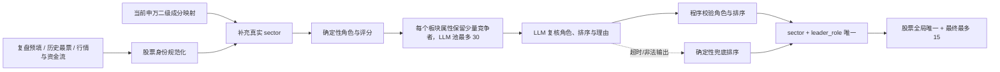

# Daily Leaders 板块属性收敛设计

## 方案结论

`daily-leaders propose` 改为“确定性预收敛 → LLM 复核 → 程序硬约束”的三段式流水线。最终确认稿最多 15 只；同一申万二级板块、同一最票属性只保留综合排序最好的 1 只。LLM 超时、异常或输出不完整时，程序仍按相同分组约束生成不超过 15 只的兜底稿，并明确标记降级原因。

最票属性与涨跌停板型拆为两个维度：

| 维度 | 固定值 | 用途 |
| --- | --- | --- |
| `leader_role` / `attribute_type` | `趋势中军`、`连板核心`、`前排活跃`、`弹性前排` | 表达个股在板块内的角色，作为去重分组键 |
| `board_type` | `10cm`、`20cm`、`30cm`、`非涨停` | 表达交易制度与当日涨幅形态，只作事实证据，不再充当角色 |

## 根因

2026-07-14 生产运行中，LLM 进程从 22:30:13 持续到接近 180 秒超时，未返回可解析 JSON。`subprocess.TimeoutExpired` 被外层宽泛异常捕获压成 `llm_status.reason=exception`。之后系统只做股票去重并截取前 30 条，因此 96 条原始候选去重为 56 条后仍展示 30 条。

现有日内强势候选还把 `sector` 固定写成 `日内强势`，而非真实行业；这使“同板块 + 同属性”分组在数据结构上无法成立。历史候选的展示字符串也可能出现同一名称重复拼接，现有股票键仅去空格，不能稳定合并此类脏值。

## 目标与非目标

### 目标

1. 最终 `top_leaders` 数量始终为 `0..15`。
2. 同一 `sector + leader_role` 最多一只股票；同一股票全局最多出现一次。
3. 日内强势候选优先使用申万二级行业，资金流概念保留为辅助证据。
4. LLM 只处理受控候选池，输出角色、排序与理由；程序验证并执行最终约束。
5. LLM 失败时仍输出结构化、按板块属性收敛的兜底稿，并显示 `timeout`、`nonzero_exit` 等可诊断原因。
6. `confirm` 继续只在用户确认后写 `daily_reviews.step5_leaders` 并同步 `leader_tracking`。

### 非目标

- 不改变 `confirm` 的人工确认边界。
- 不写交易计划、关注池或老师观点。
- 不新增数据库表或迁移。
- 不让 LLM 生成事实、股票或板块映射。
- 不把同花顺概念直接当作统一行业口径；概念只保留为 `source_sector` / 证据。

## 数据流



## 板块与股票身份

### 板块口径

`attach_market_quotes` 在现有 `get_stock_basic_list` 之外调用一次 `get_stock_sw_industry_map`，按完整代码和裸码建立映射：

- 命中时：`sector=sw_l2`，`sector_source=tushare:index_member_all`。
- 未命中时：保留原预填/历史板块；纯行情候选使用 `未分类`，不得伪造行业。
- 资金流候选原有的行业/概念名保存在 `source_sector`，作为证据展示；若能按股票名称或代码匹配申万二级，则统一用申万二级作为 `sector`，否则 `sector=未分类`，不得把概念名伪装成统一行业口径。
- 申万成员映射是扫描时当前快照，不伪装成历史 as-of 数据。

### 股票身份

统一生成 `stock_key`：优先规范化代码，其次规范化名称。展示文本会折叠连续重复的相同 token，例如 `协创数据 协创数据 协创数据` 规范为 `协创数据`。候选去重、分组竞争和最终写稿均使用规范键，不再直接依赖展示字符串。

## 角色判定与排序

### 确定性兜底角色

每只候选只有一个主角色，按以下优先级判定：

1. `连板核心`：当日 `limit_step.nums >= 2`。
2. `趋势中军`：同板块候选中成交额最高且成交额可验证；若同板块只有一只，仍可成为中军，但排序不会因此获得额外事实权重。
3. `弹性前排`：`board_type` 为 `20cm` 或 `30cm`，且进入日内强势候选。
4. `前排活跃`：其余涨停、日内强势或资金流领涨候选。

LLM 可以在这四类之间调整角色，但不能新增枚举。程序对缺失或非法角色回退到确定性角色。

### 排序

确定性排序只使用已有事实字段：

1. 连板高度；
2. 涨停/涨幅强度档位；
3. 成交额；
4. 当日板块强度与资金流排名；
5. 老师观点和历史最票只作辅助证据与稳定破平，不伪装成事实强度。

LLM 成功时，以合法的 `llm_rank` 为组内第一排序，确定性分数负责破平；LLM 失败时完全使用确定性排序。

## 两级上限

| 阶段 | 上限 | 规则 |
| --- | ---: | --- |
| LLM 复核池 | 30 | 每个 `sector + fallback_role` 先保留最多 2 只，再按确定性分数取全局前 30 |
| 最终确认稿 | 15 | 每个 `sector + final_role` 只留 1 只，再做股票全局去重并截取前 15 |

CLI `--max-candidates` 默认改为 15，允许用户传入 `1..15` 的更小值；大于 15 或非正数直接报错，避免绕过业务硬上限。

## LLM 契约与失败语义

Prompt 只发送受控复核池，要求输出：

```json
{
  "股票|申万二级": {
    "rank": 1,
    "role": "趋势中军|连板核心|前排活跃|弹性前排|备选|剔除",
    "reason": "只基于输入证据的中文理由",
    "risk_flags": ["风险标签"]
  }
}
```

程序要求映射完整覆盖受控候选池且不得出现池外股票，并拒绝非法角色、红线词、不安全 Markdown/证据伪装文本和无效排序；任一候选非法或缺失时整批确定性降级。异常分类至少包含 `timeout`、`nonzero_exit`、`auth_required`、`quota_exhausted`、`empty_output`、`invalid_json`；`llm_status` 保存简短诊断和日志路径，不暴露长日志正文。

失败时报告改为：`LLM 复核未完成：[判断] timeout；已按确定性板块/属性规则兜底收敛，仍需人工确认。` 不再声称当前只是未整理的原始数据层。

## 输出与兼容性

每个候选新增或规范以下字段：

| 字段 | 说明 |
| --- | --- |
| `sector` | 统一分组板块，优先申万二级 |
| `sector_source` | 板块来源与时效 |
| `source_sector` | 原资金流行业/概念名，可能为空 |
| `leader_role` | 最终合法角色 |
| `attribute_type` | 与 `leader_role` 同值，保持复盘第 5 步兼容 |
| `board_type` | `10cm/20cm/30cm/非涨停` |
| `selection_basis` | `llm` 或 `deterministic_fallback` |

`confirm` 仍写原有兼容字段；若 `leader_role` 合法，优先写入 `attribute_type`。旧候选稿仍可由 `show` 读取，旧 `llm_role` 只在属于新角色枚举时才参与确认。

## 测试设计

| 层级 | 覆盖内容 | 隔离方式 | 完成标准 |
| --- | --- | --- | --- |
| 纯函数/候选层 | 股票规范化、板块映射、板型、兜底角色、分组唯一、15 只硬上限 | 字典 fixture，无 DB/外网 | 新增边界场景全部通过 |
| LLM 适配层 | 新角色 prompt、合法/非法输出、timeout 分类、LLM/兜底排序 | 注入 runner 或 mock `subprocess.run` | 不调用真实 Antigravity |
| service/CLI 层 | 申万映射注入、默认 15、拒绝 `>15`、confirm 兼容 | fake registry、临时目录/内存 DB | 产物与写回字段符合契约 |
| renderer | 收敛统计、角色/板型、降级原因 | 纯 proposal fixture | Markdown 文案无错误状态伪装 |
| 仓库回归 | CLI smoke 与后端全量检查 | 本地测试环境 | `make check-scripts` 全绿 |

验收命令：

```bash
python3 -m pytest scripts/tests/test_daily_leaders_candidates.py scripts/tests/test_daily_leaders_service.py scripts/tests/test_daily_leaders_renderer_store.py scripts/tests/test_daily_leaders_cli.py -v
python3 -m pytest scripts/tests/test_cli_smoke.py -v
make check-scripts
```

完成后再用 `2026-07-14` 做一次本地 `propose` 回放：不推送、不确认写回，核对数量不超过 15、分组键唯一、真实行业覆盖率和 LLM 状态。

## 风险与回滚

| 风险 | 缓解 | 回滚 |
| --- | --- | --- |
| 当前申万快照用于历史回放 | 显式记录 `sector_source` 与当前快照语义 | 回退到原候选板块但保留 `未分类`，不猜行业 |
| LLM 改错角色 | 固定枚举、程序校验、确定性 fallback | `--no-llm` 仍产出相同硬约束稿 |
| 中军定义过宽 | 仅表示板块内候选成交额第一，不等于买卖建议或基本面结论 | 调整角色阈值不影响分组/写回协议 |
| 新角色影响历史页面 | `attribute_type` 保持字符串兼容，旧稿可读 | confirm 回退读取旧 `attribute_type` |

## 已确认决策

1. 采用混合方案：确定性规则负责事实与硬约束，LLM 负责受控复核。
2. 最终硬上限为 15。
3. 同一板块、同一属性只保留最好的 1 只。
4. 最票角色与 `10cm/20cm/30cm` 板型拆为两个维度。
5. LLM 失败时仍必须按相同约束收敛，不能退回 30 条原始候选。
