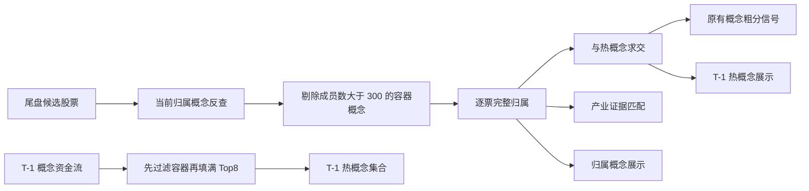

# 尾盘实时筛选：归属概念与 T-1 热概念分层设计

## 方案结论

`tail-scan` 的概念信息拆成两个语义明确、来源不同的字段并同时展示：

1. `归属概念`：扫描时点的同花顺 `type=N` 当前概念快照，按候选股票代码反向查询；剔除成员数大于 300 的容器概念后，保留完整列表，报告展示前 5 个并标总数。
2. `T-1 热概念命中`：上一交易日同花顺概念资金流按净流入排序，先剔除 `company_num>300` 的容器概念，再向后补足 Top8；与该股完整归属概念求交，继续作为原有粗分中的概念信号。

新增 stock-centric provider capability `get_stock_concept_memberships(ts_codes)`。它一次读取 `ths_index(type="N")` 的概念目录和成员数，再逐候选调用 `ths_member(con_code=...)`。现有 `get_ths_member(date, concept_names)` 保持不变，避免影响 `trend-leader`、`string-yang`、`volume-watch` 和 ingest。

本次不改筛选阈值、粗分权重、PK 状态机、CLI 参数、DB、API、调度和计划层。

## 背景与目标

当前报告中的 `概念:` 实际是“T-1 资金流 Top8 概念命中”，并非个股完整归属；渲染还只展示前 2 个。因此：

- 未命中 Top8 的股票显示为无概念，即使它实际有十余个同花顺概念；
- `DeepSeek概念`、`AI智能体` 等数百只股票的容器概念可能占据 Top8；
- 产业证据匹配只收到热概念交集，也会漏掉非 Top8 但与主营相关的概念。

目标是让用户同时看到“这家公司通常被归到哪些概念”和“昨日资金流热概念里命中了哪些”，并保持两者的时点与用途不混淆。

## 范围与非目标

### 范围

- 新增按股票反查同花顺概念的 provider capability。
- 新增 `tail_scan.concept_context`，集中负责完整归属、容器过滤、T-1 热概念选择和逐票状态。
- `scorer` 保留现有热概念兼容字段，并新增完整归属字段。
- `industry_logic` 改用完整归属概念匹配行业证据。
- `renderer` 分两行展示完整归属和 T-1 热概念命中。
- 同步 Agent/Skill/索引文档。

### 非目标

- 不建立历史概念成分 as-of 库；历史 `--date` 回放仍明确标注归属概念为运行时当前快照。
- 不把完整归属概念加入粗分或 PK prompt。
- 不为概念生成买卖建议、价格目标或胜率判断。
- 不在 14:40 扫描全部同花顺概念成分。

## 方案比较

| 方案 | 时效 | 性能 | 状态表达 | 结论 |
|---|---:|---:|---:|---|
| 读取本地最近一次全量 `ths_member` 快照 | 可能滞后数月 | 快 | 可表达 | 不采用：当前仓库最新快照可能明显滞后 |
| 运行时逐个扫描全部 `type=N` 概念 | 当前 | 慢，约 400+ 次请求 | 可表达 | 不采用：不适合 14:40 实时任务 |
| 按候选股票 `con_code` 反向查询 | 当前 | 1 次目录 + N 次候选查询 | 可逐票表达 | **采用** |

## 方案设计

### 数据流



### 1. Provider capability

新增：

```python
get_stock_concept_memberships(ts_codes: list[str]) -> DataResult
```

成功返回：

```python
{
    "stocks": {
        "605090.SH": {
            "status": "ok",
            "concepts": [
                {
                    "concept_code": "885372.TI",
                    "name": "页岩气",
                    "member_count": 40,
                }
            ],
        },
        "600001.SH": {"status": "missing", "concepts": []},
        "600002.SH": {
            "status": "source_failed",
            "concepts": [],
            "error": "member request failed",
        },
    }
}
```

规则：

- 输入代码去空、标准化、去重，保持首次出现顺序。
- 非空输入先过 provider 初始化守卫；清洗后全空概念目录是批次失败，不得把所有股票伪装为 `missing`。
- `ths_index(type="N")` 每批只调用一次，建立 `concept_code -> name/count` 目录。
- 每只股票只调用一次 `ths_member(con_code=<标准代码>)`。
- 只保留目录中存在的 `type=N` 概念；地域、行业、风格等其它类型不能混入。
- 单票异常只把该票标 `source_failed`，不丢弃其它成功票。
- 单票异常保留经清洗的 `error`；`member_df is None` 视为失败，成功返回真空 DataFrame 才视为 `missing`。
- 概念目录失败时整个 `DataResult` 失败，因为裸概念代码无法安全展示。
- `count` 只接受有限正数；`None` / 空串 / `NaN` / 无穷大 / 负数归一为 `0`，上下文后续 fail-closed 过滤。
- `DataResult.fetched_at` 作为当前快照时点；不接收 `date`，避免伪装历史 as-of。

### 2. 两层概念上下文

新增 `scripts/services/tail_scan/concept_context.py`，输出逐票结构：

```python
{
    "600001.SH": {
        "stock_concept_names": ["AI眼镜", "无线耳机", "智能穿戴"],
        "stock_concept_total": 7,
        "stock_concept_status": "ok",
        "stock_concept_source": "tushare:ths_member:by_stock",
        "stock_concept_snapshot_at": "2026-07-14T14:40:00",
        "concept_names": ["AI眼镜"],
        "concept_status": "ok",
        "in_hot_concept": True,
    }
}
```

状态语义：

| 字段 | 状态 | 说明 |
|---|---|---|
| `stock_concept_status` | `ok` | 反查成功且存在过滤后的概念 |
|  | `missing` | 请求成功，但无可用窄概念 |
|  | `source_failed` | 该股票反查失败或概念目录失败 |
| `concept_status` | `ok` | T-1 热概念和该票归属均可判定 |
|  | `source_failed` | T-1 资金流失败或为空 |
|  | `member_failed` | 该票归属失败，无法判断是否命中热概念 |
|  | `coverage_failed` | 热概念宽度字段缺失，不能安全完成容器过滤 |

`build_concept_context` 无论 T-1 日期是否可解析，都调用一次当前归属反查；
T-1 失败只把热概念标 `source_failed`，不抹掉当前归属。上下文可在内部暂存
`stock_concept_memberships` 供主营返回后重排，但该元数据不得进入最终事实卡或 PK payload。

热概念必须按以下顺序选择：

1. 解析 `net_amount_yi` / `net_amount` 为有限浮点数（负数合法，非法值跳过），按净流入降序稳定排序。
2. 按排名扫描；只在 Top8 尚未填满时遇到无效 `company_num` 才整体 `coverage_failed`，已填满后的脏尾部不影响结果。
3. 剔除 `company_num>300` 的容器概念。
4. 对概念名去重后向后补足 Top8。
5. 每只股票的 `concept_names` 按资金流名次排序，不按概念母表顺序。

原始资金流空列表是 `source_failed`；非空源最终仍不足 Top8 是 `coverage_failed`。

完整归属概念保留所有 `0<member_count<=CONTAINER_MAX_MEMBERS` 的 `type=N` 名称，
上限直接复用 `services.concept_tags.CONTAINER_MAX_MEMBERS`。展示顺序优先：T-1 热命中、
与 `sw_l2/business_summary/product_names/industry_position` 的受控文本重合度、成员数更少、名称稳定顺序；
匹配至少 2 个中文字符或 3 个字母数字，并过滤宽泛停用词。完整列表保留在事实卡，渲染只截前 5 个并显示总数。

状态优先级为：全局 `source_failed/coverage_failed` 优先；全局 `ok` 时单票归属失败映射为
`member_failed`，单票 `missing` 或确定无交集均是 `concept_status=ok`。原始归属为 `ok`
但所有概念均被容器上限过滤后，`stock_concept_status` 收敛为 `missing`。

### 3. Scorer 与产业逻辑

兼容字段保持原语义：

- `concept_names`：仍是 T-1 热概念交集。
- `concept_status`：仍描述热概念判定状态。
- `in_hot_concept`：仍只由 `concept_names` 决定。

新增字段：

| 字段名 | 类型 | 默认值 | 说明 |
|---|---|---|---|
| `stock_concept_names` | `list[str]` | `[]` | 过滤并排序后的完整归属概念 |
| `stock_concept_total` | `int` | `0` | 完整归属概念数量 |
| `stock_concept_status` | `str` | `source_failed` | 当前快照归属状态 |
| `stock_concept_source` | `str` | `""` | 数据源 |
| `stock_concept_snapshot_at` | `str` | `""` | 当前快照抓取时间 |

`_coarse_score()` 不读取任何 `stock_concept_*` 字段。`industry_logic.build_industry_logic_map()` 接收完整归属概念映射，以减少行业催化漏匹配；PK 继续只接收兼容的热概念字段和产业逻辑摘要。

### 4. 报告格式

候选块新增两行：

```text
  - [事实·归属概念] 天然气 / 航运概念 / 煤化工概念 / 页岩气（当前快照，共7个）
  - [事实·T-1热概念命中] 未命中上一交易日资金流前8窄概念
```

命中时：

```text
  - [事实·T-1热概念命中] 区块链 / 百度概念
```

失败与真实空值分开：

- `[来源状态·归属概念] 概念归属源失败，本次未取得。`
- `[来源状态·归属概念] 当前快照暂无可用窄概念。`
- `[来源状态·T-1热概念命中] T-1概念资金流或归属数据失败，本次无法判断。`

候选头行不再使用含糊的 `概念:`。免责声明明确“归属概念是扫描时当前快照；热概念是 T-1 资金流口径”。推送仍只按完整候选块截断，不按字符截断。

## 错误处理与降级

| 场景 | 行为 |
|---|---|
| 概念目录失败 | 全部归属概念降级，扫描其它维度继续 |
| 单票反查失败 | 只标该票 `source_failed`，其它票正常 |
| 单票成功但无窄概念 | 标 `missing`，不写成源失败 |
| T-1 资金流为空/失败 | `concept_status=source_failed`，不把无命中伪装成确定事实 |
| `company_num` 缺失 | `coverage_failed`，不把未过滤结果当 Top8 |
| 归属概念成功但无热交集 | `concept_status=ok` 且 `in_hot_concept=False` |

## 测试与验证

### 单元测试

- Provider：一次目录请求、N 次 `con_code` 请求、代码规范化、类型过滤、概念元数据、单票失败隔离、空输入、旧 `get_ths_member` 回归。
- Concept context：容器先过滤再补足 Top8、资金流顺序、完整归属与热命中分离、宽度缺失、资金流失败、单票归属失败、成员数边界 300/301。
- Scorer：完整归属传给产业逻辑、兼容热字段保持、完整归属不改变粗分。
- Renderer：两层同时展示、最多 5 个及总数、两类失败与真实空值、免责声明、推送字节预算。

### 验收命令

```bash
python3 -m pytest scripts/tests/test_stock_concept_memberships.py -v
python3 -m pytest scripts/tests/test_tail_scan_concept_context.py -v
python3 -m pytest scripts/tests/test_tail_scan_scorer.py scripts/tests/test_tail_scan_renderer.py -v
python3 -m pytest scripts/tests/test_tail_scan_*.py scripts/tests/test_tushare_p0_interfaces.py -v
python3 -m pytest scripts/tests/test_cli_smoke.py scripts/tests/test_agent_symlinks.py -v
make check-scripts
```

真实抽检先用 `--dry-run --no-llm`，确认结构与数据后再按用户已给出的外发授权覆盖推送。

## 风险与回滚

| 风险 | 防护 | 回滚 |
|---|---|---|
| 候选较多导致逐票反查变慢 | 只按候选反查，不扫描全概念；provider 复用单批目录 | 关闭完整归属增强，保留原 T-1 热概念 |
| 当前概念被误当历史概念 | 字段名、免责声明和快照时间均明确 current snapshot | 报告隐藏完整归属行 |
| 容器宽度缺失导致噪声 | fail-closed 为 `coverage_failed` | 仅展示未过滤状态，不参与热概念判断 |
| 完整归属改变排序 | 粗分只读兼容热概念字段并加回归测试 | 移除 `stock_concept_*` 消费 |

本次无 schema、API、CLI 或调度变更，回滚不涉及数据迁移。

## 待确认问题

用户已在对话中确认继续执行“两层概念同时展示”。展示上限固定为归属概念 5 个、T-1 热命中 2 个；完整归属数量同时显示，避免截断被误解为只有 5 个。
