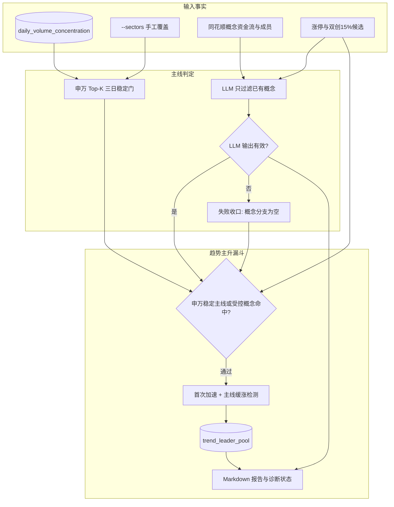
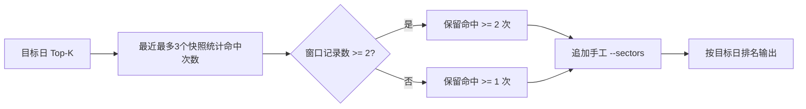

# 趋势主升主线判定收紧技术方案

## 方案结论

`trend-leader` 的默认 `hybrid` 主线门改为“**申万二级三日稳定门 + LLM 受控概念分支**”：自动申万二级必须在最近最多 3 个有效集中度快照的 Top-K 中至少出现 2 次，手工 `--sectors` 仍可显式覆盖；LLM 概念过滤调用失败或输出非法时，概念分支 fail-closed，不再把机械 Top-M 全量升格为主线。

同时修正 launchd 的 `PATH`，确保定时任务能找到 `/Users/alyx/.local/bin/agy`，并在报告中显示可诊断的 LLM 状态与失败原因。本次不自动删除既有 `trend_leader_pool` 记录，不改数据库 schema，不改交易计划或关注池。

## 背景与目标

### 背景

- 2026-07-14 的生产日志显示 `agy` 启动失败：`[Errno 2] No such file or directory: 'agy'`。实际二进制位于 `/Users/alyx/.local/bin/agy`，而 `deploy/launchd/trend-leader-runner.sh` 的 `PATH` 未包含 `$HOME/.local/bin`。
- 当前 `hybrid` 在 LLM 失败时回退到完整机械概念集合，导致“同花顺漂亮100”“高股息精选”等宽篮子继续作为主线分支参与入池。
- 当前自动申万主线等于单日成交额集中度 Top-K，LLM 明确不得否决。2026-07-14 的 `IT服务Ⅱ` 仅有 1 只 Top20 成分、占 Top20 成交额约 4.03%，仍与占比约 51.48% 的 `半导体` 等同进入主线门。
- 本地老师观点把近期核心集中在半导体、AI 硬件、国产算力等方向，并明确提到软件的单日放量修复仍需持续性确认。单日 Top-K 直通不符合“市场一段时间内形成共识”的主线定义。

### 目标

1. 消除 launchd 环境导致的伪 `fallback`，让默认 `hybrid` 能实际调用 LLM。
2. 自动申万主线增加跨日持续性约束，避免单日 Top-K 尾部板块直接升格。
3. LLM 失败时优先防止误纳入，保留申万稳定主线、关闭概念分支。
4. 保留显式机械模式和手工覆盖能力，方便历史校准与人工判断。
5. 报告能区分“LLM 正常裁决为空”“调用失败收口”“人工禁用 LLM”。

## 范围与非目标

| 类别 | 内容 |
| --- | --- |
| 本次范围 | `trend-leader` 申万稳定门、LLM 失败收口、launchd PATH、报告可观测性、单元测试和文档同步 |
| 非目标 | 不预测主线；不新增价格或买卖建议；不修改 `trend_leader_pool` schema；不自动删除或回写历史活跃池；不重构所有任务为统一主线服务 |
| 成功标准 | 7 月 14 日同口径下 `IT服务Ⅱ` 因最近 3 个快照 Top-K 仅命中 1 次而不进入自动主线；LLM 失败时 `main_concepts=[]`；显式机械模式保持可用；定时环境可解析 `agy` |

## 现状与约束

| 约束项 | 当前情况 | 设计影响 |
| --- | --- | --- |
| 主线事实源 | `daily_volume_concentration.sector_summary_json` | 只读最近快照，不新增存储 |
| 手工覆盖 | `--sectors` 与自动板块取并集 | 手工板块不经过三日稳定门，继续显式优先 |
| 概念模式 | `hybrid`、`l2`、`l2+concept` 三种口径 | 只收紧默认 `hybrid` 的失败路径；显式机械口径不变 |
| 池状态机 | 主线只作为入池门，入池后按趋势破坏退池 | 本次不追溯改变既有活跃记录 |
| Agent 写入 | 禁止直接写 SQLite / YAML | 验证使用内存库、mock 与只读查询 |
| 工作区 | 已存在其他未提交改动 | 实现只修改本方案列出的相关区域，保留用户现有改动 |

## 方案设计

### 架构设计



### 申万三日稳定门

1. 先确定目标日有效集中度快照：优先精确日期；缺失时沿用现有逻辑，回退到 `<= date` 的最近快照并标记 `degraded_main=true`。
2. 读取截至该有效快照日期最近最多 3 条集中度记录。
3. 每条记录只取前 `top_k` 个非“未分类”的申万二级，统计目标日 Top-K 各板块在窗口中的命中次数。
4. 窗口有 2～3 条记录时，自动板块必须命中至少 2 次；仅有 1 条记录时要求命中 1 次，避免历史不足时全空。
5. 结果顺序保持目标日成交额排名；`--sectors` 中未重复的手工板块按输入顺序追加，不经过稳定门。



#### 2026-07-14 示例

| 申万二级 | 当日 Top20 成交额占比 | 当日 Top20 成分数 | 最近 3 个快照 Top5 命中 | 自动主线结果 |
| --- | ---: | ---: | ---: | --- |
| `半导体` | 51.48% | 11 | 3 | 保留 |
| `通信设备` | 26.58% | 4 | 3 | 保留 |
| `元件` | 5.75% | 1 | 3 | 保留 |
| `光学光电子` | 4.89% | 1 | 3 | 保留 |
| `IT服务Ⅱ` | 4.03% | 1 | 1 | 排除 |

因此 `300532 今天国际` 不再仅因 `IT服务Ⅱ` 单日进入 Top5 而通过自动主线门；若用户明确认为它属于主线，可用 `--sectors '["IT服务Ⅱ"]'` 做人工覆盖。

### LLM 概念失败收口

| 场景 | `main_concepts` | 状态 | 是否记录 `source_errors` |
| --- | --- | --- | --- |
| `hybrid` 且 LLM 返回合法子集 | 合法 `accepted_concepts` | `ok` | 否 |
| `hybrid` 且 LLM 正常返回空集合 | `[]` | `ok` | 否 |
| `hybrid` 且调用异常、返回空、超时、非法 JSON、越界概念或红线命中 | `[]` | `fallback_l2` | `mainline_llm` |
| `hybrid --no-llm` | 机械 Top-M 概念 | `disabled` | 否 |
| `--main-line l2+concept` | 机械 Top-M 概念 | `not_applicable` | 否 |
| `--main-line l2` | `[]` | `not_applicable` | 否 |

`fallback_l2` 的 `reason` 优先读取 runner 的 `last_diagnostics.reason`；无法获取时使用 `runner_exception` 或 `invalid_output`。CLI 构造 runner 失败时返回一个带 `startup_failed` 诊断的不可用 runner，避免被误判为用户显式 `--no-llm`。

### launchd 环境

`deploy/launchd/trend-leader-runner.sh` 的 PATH 改为：

```bash
export PATH="$HOME/.local/bin:/opt/homebrew/bin:/usr/local/bin:/usr/bin:/bin"
```

验证只检查同一最小环境下 `command -v agy` 能解析到 `/Users/alyx/.local/bin/agy`，不把私有老师观点或数据库 payload 发送到外部服务。

### 报告可观测性

- “主线板块”文案改为“申万二级近 3 日 Top-K 至少 2 次∪手工”。
- 保持成交额排名顺序，不再对板块名做字典序排序。
- `fallback_l2` 显示为“LLM调用失败，概念分支已关闭（原因：...）”。
- `disabled` 显示为“人工禁用 LLM，使用机械概念分支”。
- `ok` 保持显示 LLM 过滤成功；合法空集合显示“LLM 未确认概念分支”，不作为故障。

## 模块影响面

| 模块 | 是否影响 | 变更内容 | 风险等级 |
| --- | --- | --- | --- |
| `scripts/services/trend_leader/scanner.py` | 是 | 三日稳定门、顺序保持、主线元数据 | 中 |
| `scripts/services/trend_leader/mainline_llm.py` | 是 | LLM 失败时概念 fail-closed、诊断原因 | 中 |
| `scripts/services/trend_leader/renderer.py` | 是 | 新口径与状态文案 | 低 |
| `scripts/cli/trend_leader.py` | 是 | runner 初始化失败语义；清理重复 helper 定义 | 低 |
| `deploy/launchd/trend-leader-runner.sh` | 是 | 增加 `$HOME/.local/bin` | 低 |
| `scripts/tests/` | 是 | 纯函数、scanner、renderer、CLI/launchd 回归 | 低 |
| `.agents/skills/`、`AGENTS.md` | 是 | 同步默认主线和降级语义 | 低 |
| SQLite schema / API / Web | 否 | 本次不适用 | 无 |

## 数据模型

本次不修改数据库 schema。`summary` 运行时结构补充或规范以下字段：

| 字段名 | 类型 | 必填 | 默认值 | 说明 |
| --- | --- | --- | --- | --- |
| `main_sectors` | `list[str]` | 是 | `[]` | 按目标日成交额排名输出的稳定申万主线与手工覆盖 |
| `main_sector_window` | `int` | 是 | `3` | 稳定门最大快照窗口 |
| `main_sector_required_hits` | `int` | 是 | `2` | 当前窗口实际要求命中次数，历史不足时为 `1` |
| `mainline_llm.status` | `str` | 是 | `not_applicable` | `ok / fallback_l2 / disabled / skipped_empty_concepts / not_applicable` |
| `mainline_llm.reason` | `str|null` | 否 | `null` | 调用失败或输出非法的诊断原因 |
| `mainline_llm.accepted_concepts` | `list[str]` | 是 | `[]` | 最终允许参与主线门的概念 |

## API 设计

本次不适用：不新增或修改 API。

## 兼容性与迁移

| 项 | 策略 |
| --- | --- |
| `--main-line l2` | 保持仅申万口径，但自动申万集合改走三日稳定门 |
| `--main-line l2+concept` | 保持机械概念并集，用于显式校准 |
| `hybrid --no-llm` | 保持显式机械概念语义 |
| `--sectors` | 保持人工覆盖，绕过自动稳定门 |
| 既有池记录 | 不自动删除、不回写；主线只约束新入池，既有记录继续按趋势破坏规则维护 |
| 数据迁移 | 无 schema 迁移、无历史回填 |
| 回滚方式 | 回退相关代码和 runner PATH；数据库无需回滚 |

## 实施计划

1. 先补三日稳定门与 LLM fail-closed 的失败测试，并分别确认 RED。
2. 实现稳定门、顺序保持和运行时元数据，使定向测试转绿。
3. 实现 LLM 诊断状态、报告文案与 CLI runner 初始化失败语义，使定向测试转绿。
4. 修改 launchd PATH，增加静态/最小环境测试。
5. 同步 `AGENTS.md`、`.agents/skills/market-tasks/SKILL.md`、`.agents/skills/INDEX.md` 与 `.agents/rules/skills-sync.md`，保留当前工作区已有改动。
6. 执行定向测试、CLI smoke、`make check-scripts`，再按仓库门禁完成 simplify、代码审查和独立 adversarial review。

## 测试与验证

### 分层验证

| 层级 | 验证内容 | 命令 |
| --- | --- | --- |
| 业务单元测试 | 三日命中、历史不足、手工覆盖、排名顺序、LLM 合法空/失败/越界输出 | `python3 -m pytest scripts/tests/test_trend_leader_concept_main.py -v` |
| 渲染测试 | `fallback_l2`、`disabled`、稳定门口径文案 | `python3 -m pytest scripts/tests/test_trend_leader_renderer.py -v` |
| CLI / launchd 测试 | 参数兼容、runner 初始化失败、runner PATH 可解析 `agy` | `python3 -m pytest scripts/tests/test_trend_leader_cli.py scripts/tests/test_trend_leader_launchd.py -v` |
| CLI smoke | 命令注册和帮助参数无漂移 | `python3 -m pytest scripts/tests/test_cli_smoke.py -v` |
| 后端回归 | 仓库后端测试与静态检查 | `make check-scripts` |

所有 provider、数据库和 LLM 测试均使用内存库或 mock；不依赖真实 Tushare、Antigravity、钉钉或用户凭据。

### 完成标准

- 新增测试均完成明确 RED → GREEN 证据。
- 2026-07-14 fixture 中 `IT服务Ⅱ` 被自动稳定门排除，`半导体 / 通信设备 / 元件 / 光学光电子` 保留。
- LLM 调用失败时没有任何概念分支进入候选，报告能看到原因。
- 显式 `l2+concept` 与 `hybrid --no-llm` 仍保留机械概念行为。
- `command -v agy` 在 runner 同等 PATH 下解析到用户本地二进制。
- 定向测试、CLI smoke 和 `make check-scripts` 全绿，无新增 Warning/Error。
- 文档与技能索引同步，未覆盖用户现有无关改动。

## 风险与回滚

| 风险 | 触发条件 | 缓解方案 | 回滚动作 |
| --- | --- | --- | --- |
| 新主线首日被漏掉 | 板块第一次进入 Top-K，尚未满足 2 次命中 | `--sectors` 人工覆盖；第二次确认后自动纳入 | 回退到单日 Top-K 规则 |
| 历史快照不足 | 数据库只有 1 条集中度记录 | 动态把 required hits 降为 1 | 无数据迁移，直接回退代码 |
| LLM 故障造成概念漏报 | `agy` 超时、鉴权或解析失败 | fail-closed 并显式提示，可用 `l2+concept` 人工校准 | 恢复旧机械 fallback，但不推荐 |
| 旧活跃池含宽分支票 | 历史 fallback 已经入池 | 输出只读复核清单，不自动删除 | 维持现有池状态机 |
| 与当前未提交文档改动冲突 | 同步同一行的技能说明 | 逐块最小 patch，提交前检查 `git diff` | 放弃冲突文档改动并报告 |

## 已确认决策

1. 自动申万主线采用“最近最多 3 个有效快照 Top-K 至少命中 2 次”；只有 1 条历史时降为命中 1 次。
2. LLM 调用或输出失败时关闭概念分支，仅保留稳定申万主线和手工板块。
3. 显式 `l2+concept` 与 `hybrid --no-llm` 保留机械概念语义。
4. 本次不自动删除或修改历史活跃池。
5. 不发送私有数据库或老师观点到额外的外部验证流程；实现验证使用 mock。

## 待确认问题

无。用户已确认按推荐方案实施。
