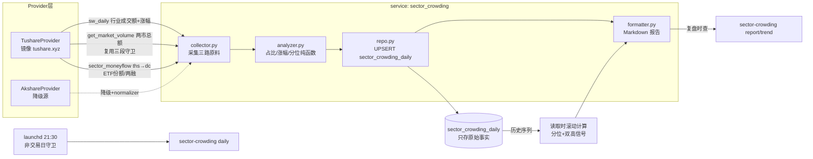

# 板块拥挤度每日采集（sector-crowding）设计

- 日期：2026-07-18（v2，含 codex 方案审查修订）
- 状态：已与用户确认方案 A；codex review 4严重/4中等/2轻微已处置（见文末「方案审查结论」）
- 认知来源：卞老师"拥挤度三维度"框架（交易拥挤度 / 持仓拥挤度 / 斜率拥挤度）

## 方案结论

新建独立盘后任务 **`sector-crowding`**：每交易日 21:30 用申万行业成交额、行业指数涨幅、行业资金流/ETF 份额三路数据，计算「交易拥挤度 / 斜率拥挤度 / 资金流代理」三部分快照，落库 `sector_crowding_daily`（一天一行 JSON 快照，UPSERT 幂等），复盘时用 `sector-crowding report` 查当日全景与历史分位。公募季报真值（持仓拥挤度的锚点）作为 **v2 独立任务**，不与每日任务耦合。

## 背景与目标

- 视频框架给出三个拥挤度维度与历史极值基准：
  - 交易拥挤度：单行业成交额占全市场比重，历史极值约 40%（2020-21 白酒 ~42、2015 互联网 40+），本轮电子/TMT 到过 47%。
  - 持仓拥挤度：公募基金单行业配置比例，12-14% 即高位，本轮 TMT 到过 14-15%。
  - 斜率拥挤度：上涨速度（"一个月涨 70%"级别为极端）。
- 目标：每日自动采集，复盘时一条命令看全景 + 历史分位，辅助判断市场情绪极值。**只做事实呈现与 `[判断]` 标注，不给买卖建议、不预测价位（业务红线）。**

## 范围与非目标

| 项 | 范围 |
|---|---|
| v1 | 交易拥挤度 + 斜率拥挤度（每日真值）+ 资金流代理（每日，强制标注非持仓真值） |
| v2（另立任务，不在本 spec 实施范围） | 公募基金季报行业配置真值（需新增 `fund_portfolio` 类 provider capability） |
| 非目标 | 不写入计划层/关注池；不推送为默认行为；不做个股级拥挤度 |

## 用户已确认的关键决策

1. 持仓维度：季度真值 + 每日资金代理（ETF 份额 / 两融 / ths 行业资金流；北向已被用户裁定为无效维度，不用）。
2. 板块口径：申万一级全量 + 申万二级（采集落库全量，报告二级只展示 TOP10）。
3. 斜率口径：5/20/60 日多窗口累计涨幅 + 板块自身历史分位（不用主观"角度"）。
4. 消费方式：盘后定时采集落库，复盘时 CLI 查询；**默认不推送**，`--push` 显式开。
5. 回填起点：2019-01-01（覆盖白酒极值基准）。
6. v2 季报真值另立任务。

## 与 volume-watch 的口径边界（防混用）

两个任务都涉及"成交额集中"，命名与文档必须严格区分：

| 任务 | 口径 | 报告命名 |
|---|---|---|
| `volume-watch`（既有） | 成交额 Top20 个股按申万二级聚合，share = 占 Top20 内部比重 | 「Top20 主线集中度」 |
| `sector-crowding`（本设计） | 申万行业指数成交额 ÷ 全市场总成交额 | 「全行业交易拥挤度」 |

`market-tasks/references/market-observability.md` 同步写明此边界。

## 架构与数据流

**关键设计 1：表内只存原始事实，派生指标读取时计算。** `sectors_json` 只存 raw（close/amount）与仅依赖当日的 `share_pct`；历史分位、双高信号一律在读取时从自身历史序列滚动计算，**不持久化**——避免回填/修正历史后已落库的派生值过期（自举污染）。现算成本低（单表内序列查询）。

**关键设计 2：历史序列自给自足。** 回填一次后，分位计算不依赖每次现拉数据源。

代码结构对齐 `sector_correlation` 四层模式：

- `scripts/cli/sector_crowding.py`：`register_subparser` + `handle_command`，在 `scripts/main.py` 挂载与分发。
- `scripts/services/sector_crowding/`：`service.py`（编排）/ `collector.py` / `analyzer.py` / `formatter.py` / `repo.py`。
- 非交易日守卫：`utils.trade_date.is_non_trading_day` + 采集结果日期一致性校验。

## 三个部分的计算口径

| 部分 | 公式 | 数据源 | 输出 |
|---|---|---|---|
| 交易拥挤度 | `行业当日成交额 ÷ 全市场总成交额` | `sw_daily` amount + `get_market_volume`（**复用 volume_concentration 的三段合理性守卫**；总额缺失/异常时 share 置空 + meta 标 `missing_data`，不落假值） | 占比% + 行业自身历史分位 + 绝对参考线（≥30% 提示、≥40% 历史极值区） |
| 斜率拥挤度 | 交易日 close 序列 `close[-1]/close[-1-n] - 1`，n∈{5,20,60}；**末根 close 日期必须等于目标交易日**，否则该窗口置空（防节假日/陈旧数据冒充当日） | `sw_daily` close / 自身表内序列 | 三窗口涨幅 + 各自历史分位；20 日分位 ≥90% 标记「高斜率」 |
| 资金流代理（v1） | 行业主力资金流连续 N 日净流入累计 + 重点行业 ETF 份额 5 日变化 + 全市场两融余额变化 | capability 顺序：`get_sector_moneyflow_ths` → `get_sector_moneyflow_dc` → akshare `get_sector_fund_flow`，collector 内做**统一 normalizer**（归一 `net_amount_yi` / `net_inflow_billion` 等字段形态差异）+ `get_etf_flow` + `pro.margin` | 代理信号列表；**报告每行强制显示「非公募持仓真值」**；不参与双高评分；ETF 份额异常跳变（单次变动超存量 30%，疑拆分）标注「勿直读」；v1 ETF 直用 `get_etf_flow` 现有 watchlist 输出（仅 4 只，不另建行业映射——映射价值低于维护成本，v2 季报真值落地时再评估） |
| 持仓真值（v2） | 公募季报行业配置比例（极值基准 13-15%） | 需新增 provider capability | 季度锚点，复盘时与每日代理并排展示 |

**综合信号（双高拥挤）**：交易拥挤度分位与 20 日斜率分位同时 ≥90% 的板块，report 顶部单列清单（读取时计算，`--push` 时现算后推送），属 `[判断]` 层。资金流代理不参与该评分。

**板块范围**：采集/落库 = 申万一级 31 个 + 申万二级全量；L1 与 L2 在 `sectors_json` 内以 `level` 字段区分，**报告与分位计算严格按 level 隔离，禁止混排双计**。报告展示 = 一级全量排序 + 二级按拥挤度 TOP10。

## 数据模型

表 `sector_crowding_daily`（对齐 `sector_correlation_daily` 的"一天一行 JSON 快照"风格；`schema.py` 表清单同步注册）：

| 字段名 | 类型 | 必填 | 默认值 | 说明 |
|--------|------|------|--------|------|
| `date` | TEXT | 是 | — | 主键，交易日 `YYYY-MM-DD` |
| `market_total_billion` | REAL | 否 | NULL | 两市总成交额（亿）；**nullable，与既有 `daily_volume_concentration` 一致**——守卫失败落 NULL 不落假值 |
| `sectors_json` | TEXT | 是 | — | 每行业原始事实：`code/name/level(L1|L2)/close/amount_billion/share_pct`；**不存分位等历史派生值** |
| `proxy_json` | TEXT | 否 | NULL | 资金流代理原始值：行业资金流 / ETF 份额变化 / 两融余额 |
| `meta_json` | TEXT | 否 | NULL | 数据源、降级记录、`missing_data` 标记、L1 缺失标记 |
| `created_at` | TEXT | 是 | now | UPSERT 保留 |
| `updated_at` | TEXT | 是 | now | UPSERT 刷新 |

写入语义：`ON CONFLICT(date) DO UPDATE`，幂等可重跑。分位/信号不设列（读取时计算，见关键设计 1）。

## API 设计

本次不新增 API 路由（消费方式为 CLI 查询）。若后续复盘 HTML 固定结构要接入，仿 `crud.py` 加只读 `GET /market/crowding/{date}`，届时另行同步 skills。

## CLI 设计

| 命令 | 用途 |
|---|---|
| `sector-crowding daily [--date] [--dry-run] [--push]` | 盘后采集落库；默认不推送，`--push` 才推钉钉 |
| `sector-crowding report [--date]` | 复盘时查：三部分全景 + 分位 + 双高清单（现算） |
| `sector-crowding trend [--sector] [--days]` | 单板块拥挤度时间序列 |
| `sector-crowding backfill --start 2019-01-01 [--end]` | 一次性历史回填 |

## 调度与部署

- `deploy/launchd/com.alyx.tradesystem.sector-crowding.plist`（per-task plist 的既定落点；`scripts/launchd/` 下仅存废弃的旧集中式 schedule plist，不用）：工作日（Weekday 1-5 逐个 dict）21:30，错开 volume-watch(21:00) / sector-correlation(21:15)；`RunAtLoad=false`；日志 `/tmp/tradesystem-sector-crowding.log`。
- `sector-crowding-runner.sh`：按 launchd 五段规范；凭据 `${VAR:+set}` 诊断保留占位（推送默认关）。
- Sleep policy 注释：复盘辅助数据，错过可接受。
- 调度唯一入口：仅 launchd per-task，不进 `main.py schedule`（防双触发）。

## 历史回填

- 默认回填至 2019-01-01（约 7.5 年，覆盖 2020-21 白酒 42% 极值；2015 不追）。
- **两阶段流程（防同日互相覆盖）**：
  1. 采集阶段：按行业代码 × 4 年窗口分片拉 `sw_daily(ts_code, start, end)`，**在内存按日期聚合**（7.5 年 ≈ 1820 行/码，贴着镜像 2000 行静默截断上限，必须分片）；
  2. 写入阶段：每个日期聚合完整后**一次性 UPSERT 整日快照**——表主键是 `date`、`sectors_json` 是整日结构，禁止按码逐次 UPSERT（会互相覆盖）。
- **硬校验**：每片返回行数对照交易日历应到行数；单片返回恰为 2000 行视为疑似截断，直接报错不落库。
- 断点重跑单位 = 日期批次（UPSERT 幂等）。
- 全市场总额历史同步回填；缺失日落 NULL + meta 标记。

## 风险与待验证

1. **[待真机验证，落地第一步]** 镜像 `sw_daily` 是否含申万一级（801 开头 L1）——现有代码只验证过 L2（`_ensure_sw_l2_codes` 只取 `level="L2"`）。降级路径分两档：
   - `get_index_classify`（已有 capability，src=SW2021）返回的 `parent_code` 映射**真机验证通过**后，才允许用 L2 成交额归并合成 L1，且 meta 标 `l1_synthesized`；
   - 映射验证不通过则 **L1 显式标 missing，禁止合成**，报告只出 L2。
2. 行业资金流 capability 错配已知：tushare 侧是 `get_sector_moneyflow_ths/dc`，akshare 侧才是 `get_sector_fund_flow`，registry 按 capability 跳过不支持者——collector 显式按顺序调用并 normalizer 归一，降级源数据带 NaN/脏值校验。
3. 公募季报数据量/积分要求未查，明确排除在 v1 之外。
4. 非交易日陈旧数据：`is_non_trading_day` 守卫 + 采集结果与请求日期一致性校验。

## 回滚策略

- 新表新任务，零侵入存量流程；回滚 = 卸载 launchd plist + 不再调用 CLI，表可保留。
- schema 仅新增表，不动既有表结构。

## 测试与验证

- 分层（金字塔）：
  1. analyzer 纯函数：占比/分位/多窗口涨幅；边界：全市场总额 NULL 时 share 置空、历史长度不足分位窗口、行业停牌缺样、**末根 close 日期 ≠ 目标日时窗口置空**。
  2. repo：tmp_path SQLite，UPSERT 幂等、created_at 保留、**回填整日快照写入不被后续分片覆盖**。
  3. collector：mock provider，含降级路径、moneyflow 三源 normalizer、非交易日守卫、**单片 2000 行截断报错**。
  4. formatter：断言 Markdown 关键片段：双高清单、参考线标注、**资金流代理行强制含「非公募持仓真值」**、**L1 缺失时报告不出现合成 L1**、**L1/L2 不混排双计**、ETF 份额异常跳变标注。
  5. CLI smoke：`ARCHITECTURE_COMMANDS` 加 daily/report/trend/backfill 参数化（先加用例跑 RED，再注册 subparser）。
- 验收命令：`make check-scripts` 全绿 + 真实库 `sector-crowding daily --dry-run` 跑一次真实输出肉眼核对（内存库 ≠ 真实库原则）。
- 文档同步（skills-sync）：`INDEX.md` 依赖表 + `market-tasks/references/market-observability.md`（含口径边界表）+ launchd README + 本 spec。

## 方案审查结论（codex freeform review，2026-07-18）

| # | 级别 | codex 意见 | 处置 |
|---|---|---|---|
| 1 | 严重 | L1 缺失时用 index_classify 合成 L1 的降级方案未经验证 | **已修**：合成改为条件启用（parent_code 真机验证通过才开，且标 `l1_synthesized`）；验证不过则 L1 标 missing 禁止合成 |
| 2 | 严重 | 按码逐个 UPSERT 与 date 主键整日快照冲突，同日互相覆盖 | **已修**：回填改两阶段（按码分片采集→内存按日期聚合→整日一次性 UPSERT）+ 行数硬校验 + 2000 行截断报错 |
| 3 | 严重 | `market_total_billion` 必填会迫使坏源日落假值 | **已修**：改 nullable，复用 volume_concentration 三段守卫，缺失落 NULL + meta 标记 |
| 4 | 严重 | 资金代理易被误读为真实持仓 | **已修**：更名「资金流代理」、不参与双高评分、报告行强制「非公募持仓真值」、ETF 拆分跳变剔除 |
| 5 | 中等 | 分位持久化会自举污染（回填后过期） | **已修**：派生指标一律读取时计算，删除 signals_json 列，sectors_json 只存原始事实 |
| 6 | 中等 | 与 volume-watch 口径边界不清 | **已修**：新增「口径边界」章节，报告命名区分「Top20 主线集中度」vs「全行业交易拥挤度」 |
| 7 | 中等 | provider capability 命名/字段形态错配 | **已修**：collector 按 ths→dc→akshare 顺序显式调用 + 统一 normalizer |
| 8 | 中等 | 测试清单缺事故级用例 | **已修**：补 L1 禁合成、L1/L2 防双计、回填防覆盖、截断报错、代理强制标注、ETF 跳变 6 类用例 |
| 9 | 轻微 | 斜率口径未写死 close 序列与末根日期校验 | **已修**：公式与校验写入口径表 |
| 10 | 轻微 | 调度路径应为 `scripts/launchd/` 而非 `deploy/launchd/` | **反驳**：`deploy/launchd/` 有 20 个 per-task plist 且为 `launchd-deploy.md` 规则钉死的落点；`scripts/launchd/` 仅存废弃的旧集中式 schedule plist（已在调度章节注明） |

## 待确认问题

- 无（持仓维度处理、板块口径、斜率口径、消费方式、回填起点、推送默认值均已确认；codex 审查 10 条全部处置）。
