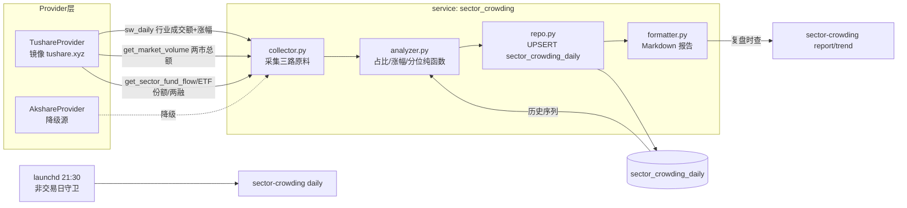

# 板块拥挤度每日采集（sector-crowding）设计

- 日期：2026-07-18
- 状态：已与用户确认（方案 A：独立盘后任务）
- 认知来源：卞老师"拥挤度三维度"框架（交易拥挤度 / 持仓拥挤度 / 斜率拥挤度）

## 方案结论

新建独立盘后任务 **`sector-crowding`**：每交易日 21:30 用申万行业成交额、行业指数涨幅、行业资金流/ETF 份额三路数据，计算「交易拥挤度 / 斜率拥挤度 / 持仓资金代理」三维度快照，落库 `sector_crowding_daily`（一天一行 JSON 快照，UPSERT 幂等），复盘时用 `sector-crowding report` 查当日全景与历史分位。公募季报真值（持仓拥挤度的锚点）作为 **v2 独立任务**，不与每日任务耦合。

## 背景与目标

- 视频框架给出三个拥挤度维度与历史极值基准：
  - 交易拥挤度：单行业成交额占全市场比重，历史极值约 40%（2020-21 白酒 ~42、2015 互联网 40+），本轮电子/TMT 到过 47%。
  - 持仓拥挤度：公募基金单行业配置比例，12-14% 即高位，本轮 TMT 到过 14-15%。
  - 斜率拥挤度：上涨速度（"一个月涨 70%"级别为极端）。
- 目标：每日自动采集三维度，复盘时一条命令看全景 + 历史分位，辅助判断市场情绪极值。**只做事实呈现与 `[判断]` 标注，不给买卖建议、不预测价位（业务红线）。**

## 范围与非目标

| 项 | 范围 |
|---|---|
| v1 | 交易拥挤度 + 斜率拥挤度（每日真值）+ 持仓资金代理（每日，标注 `[代理]`） |
| v2（另立任务，不在本 spec 实施范围） | 公募基金季报行业配置真值（需新增 `fund_portfolio` 类 provider capability） |
| 非目标 | 不写入计划层/关注池；不推送为默认行为；不做个股级拥挤度 |

## 用户已确认的关键决策

1. 持仓维度：季度真值 + 每日资金代理（ETF 份额 / 两融 / ths 行业资金流；北向已被用户裁定为无效维度，不用）。
2. 板块口径：申万一级全量 + 申万二级（采集落库全量，报告二级只展示 TOP10）。
3. 斜率口径：5/20/60 日多窗口累计涨幅 + 板块自身历史分位（不用主观"角度"）。
4. 消费方式：盘后定时采集落库，复盘时 CLI 查询；**默认不推送**，`--push` 显式开。
5. 回填起点：2019-01-01（覆盖白酒极值基准）。
6. v2 季报真值另立任务。

## 架构与数据流

**关键设计：历史分位从自己的表算。** 每日落库时把行业收盘价/成交额一并存进快照，分位计算只读自身历史序列（回填一次后自给自足），不依赖每次现拉数据源。

代码结构对齐 `sector_correlation` 四层模式：

- `scripts/cli/sector_crowding.py`：`register_subparser` + `handle_command`，在 `scripts/main.py` 挂载与分发。
- `scripts/services/sector_crowding/`：`service.py`（编排）/ `collector.py` / `analyzer.py` / `formatter.py` / `repo.py`。
- 非交易日守卫：`utils.trade_date.is_non_trading_day`。

## 三个维度的计算口径

| 维度 | 公式 | 数据源 | 输出 |
|---|---|---|---|
| 交易拥挤度 | `行业当日成交额 ÷ 全市场总成交额` | `sw_daily` amount + `get_market_volume` | 占比% + 行业自身历史分位 + 绝对参考线（≥30% 提示、≥40% 历史极值区） |
| 斜率拥挤度 | 5 / 20 / 60 日累计涨幅（"一个月涨 70%" ≈ 20 日口径） | `sw_daily` pct_change / 自身表内 close 序列 | 三窗口涨幅 + 各自历史分位；20 日分位 ≥90% 标记「高斜率」 |
| 持仓资金代理（v1） | 行业主力资金流连续 N 日净流入累计 + 重点行业 ETF 份额 5 日变化 + 全市场两融余额变化 | `get_sector_fund_flow` + `get_etf_flow` + `pro.margin` | 代理信号列表，显式标注 `[代理]`，不冒充真实持仓。重点 ETF 清单为 service 内常量（`ETF_SECTOR_MAP`，初版覆盖半导体/芯片/AI/券商/军工/医药/酒类，实施计划定稿） |
| 持仓真值（v2） | 公募季报行业配置比例（极值基准 13-15%） | 需新增 provider capability | 季度锚点，复盘时与每日代理并排展示 |

**综合信号（双高拥挤）**：交易拥挤度分位与 20 日斜率分位同时 ≥90% 的板块，报告顶部单列清单（买的人多 + 涨得快的最危险组合），属 `[判断]` 层。

**板块范围**：采集/落库 = 申万一级 31 个 + 申万二级全量（同一接口返回，无需维护清单）；报告展示 = 一级全量排序 + 二级按拥挤度 TOP10。

## 数据模型

表 `sector_crowding_daily`（对齐 `sector_correlation_daily` 的"一天一行 JSON 快照"风格；`schema.py` 表清单同步注册）：

| 字段名 | 类型 | 必填 | 默认值 | 说明 |
|--------|------|------|--------|------|
| `date` | TEXT | 是 | — | 主键，交易日 `YYYY-MM-DD` |
| `market_total_billion` | REAL | 是 | — | 两市总成交额（亿） |
| `sectors_json` | TEXT | 是 | — | 每行业：`code/name/level(L1|L2)/close/amount_billion/share_pct/share_pctile/gain_5d/gain_20d/gain_60d/gain_pctile_20d` 等 |
| `proxy_json` | TEXT | 否 | NULL | 资金代理：行业资金流 / ETF 份额变化 / 两融余额变化 |
| `signals_json` | TEXT | 否 | NULL | 双高拥挤等派生信号 |
| `meta_json` | TEXT | 否 | NULL | 数据源、降级记录、缺口标记 |
| `created_at` | TEXT | 是 | now | UPSERT 保留 |
| `updated_at` | TEXT | 是 | now | UPSERT 刷新 |

写入语义：`ON CONFLICT(date) DO UPDATE`，幂等可重跑；回填行仅含基础字段（close/amount），分位在读取时滚动计算。

## API 设计

本次不新增 API 路由（消费方式为 CLI 查询）。若后续复盘 HTML 固定结构要接入，仿 `crud.py` 加只读 `GET /market/crowding/{date}`，届时另行同步 skills。

## CLI 设计

| 命令 | 用途 |
|---|---|
| `sector-crowding daily [--date] [--dry-run] [--push]` | 盘后采集落库；默认不推送，`--push` 才推钉钉 |
| `sector-crowding report [--date]` | 复盘时查：三维度全景 + 分位 + 双高清单 |
| `sector-crowding trend [--sector] [--days]` | 单板块拥挤度时间序列 |
| `sector-crowding backfill --start 2019-01-01 [--end]` | 一次性历史回填 |

## 调度与部署

- `deploy/launchd/com.alyx.tradesystem.sector-crowding.plist`：工作日（Weekday 1-5 逐个 dict）21:30，错开 volume-watch(21:00) / sector-correlation(21:15)；`RunAtLoad=false`；日志 `/tmp/tradesystem-sector-crowding.log`。
- `sector-crowding-runner.sh`：按 launchd 五段规范（PATH / cd 仓库根 / source env / 时间戳 / 凭据 `${VAR:+set}` 诊断——推送默认关，钉钉凭据诊断仅在 `--push` 场景有意义，仍保留占位）。
- Sleep policy 注释：拥挤度为复盘辅助数据，错过可接受。
- 调度唯一入口：仅 launchd per-task，不进 `main.py schedule`（防双触发）。

## 历史回填

- 默认回填至 2019-01-01（约 7.5 年，覆盖 2020-21 白酒 42% 极值；2015 不追）。
- 按行业代码逐个拉 `sw_daily(ts_code, start, end)` 区间，**按 4 年窗口分片**——7.5 年 ≈ 1820 行/码，贴着镜像 2000 行静默截断上限，必须分片（`index_member_all` 已踩过此坑）。
- 全市场总额历史同步回填。
- 回填命令可断点重跑（UPSERT 幂等 + 按码推进）。

## 风险与待验证

1. **[待真机验证，落地第一步]** 镜像 `sw_daily` 是否含申万一级（801 开头 L1）——仓库现有代码只用了 L2（`_ensure_sw_l2_codes`）。若 L1 缺失，降级方案：用 `index_classify` 把 L2 成交额归并聚合成 L1。
2. 行业资金流（ths/dc）不可达时走 akshare 降级链，`meta_json` 记录降级来源；降级源数据须带 NaN/脏值校验（回退源提主源要同步搬健壮性守卫）。
3. 公募季报数据量/积分要求未查，明确排除在 v1 之外。
4. 非交易日陈旧数据：`is_non_trading_day` 守卫 + 采集结果与请求日期一致性校验。

## 回滚策略

- 新表新任务，零侵入存量流程；回滚 = 卸载 launchd plist + 不再调用 CLI，表可保留。
- schema 仅新增表，不动既有表结构。

## 测试与验证

- 分层（金字塔）：
  1. analyzer 纯函数：占比/分位/多窗口涨幅；边界：全市场总额为 0 或缺失、历史长度不足分位窗口、行业停牌缺样、涨幅跨窗口缺 close。
  2. repo：tmp_path SQLite，UPSERT 幂等、created_at 保留。
  3. collector：mock provider，含降级路径与非交易日守卫。
  4. formatter：断言 Markdown 关键片段（双高清单、参考线标注、`[代理]` 标签）。
  5. CLI smoke：`ARCHITECTURE_COMMANDS` 加 daily/report/trend/backfill 参数化（先加用例跑 RED，再注册 subparser）。
- 验收命令：`make check-scripts` 全绿 + 真实库 `sector-crowding daily --dry-run` 跑一次真实输出肉眼核对（内存库 ≠ 真实库原则）。
- 文档同步（skills-sync）：`INDEX.md` 依赖表 + `market-tasks/references/market-observability.md`（拥挤度归市场观察族）+ launchd README + 本 spec。

## 待确认问题

- 无（持仓维度处理、板块口径、斜率口径、消费方式、回填起点、推送默认值均已确认）。
