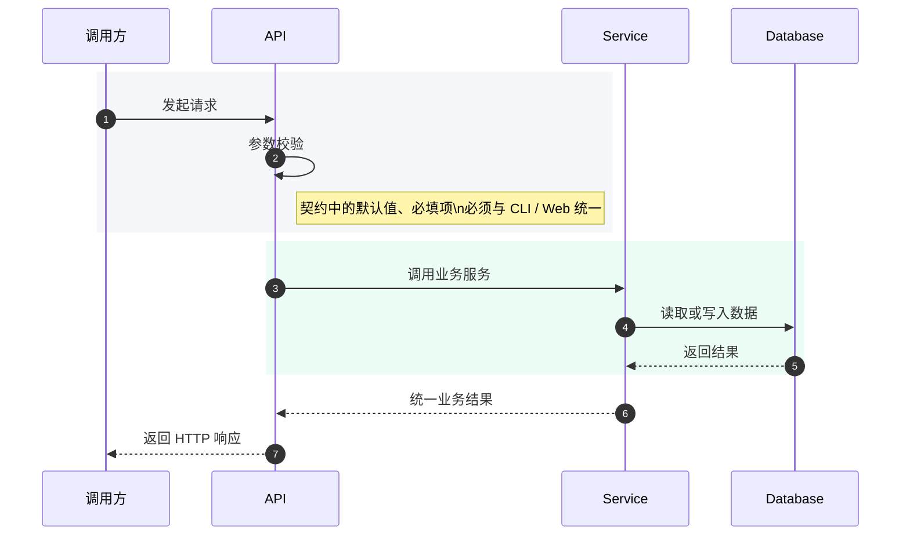
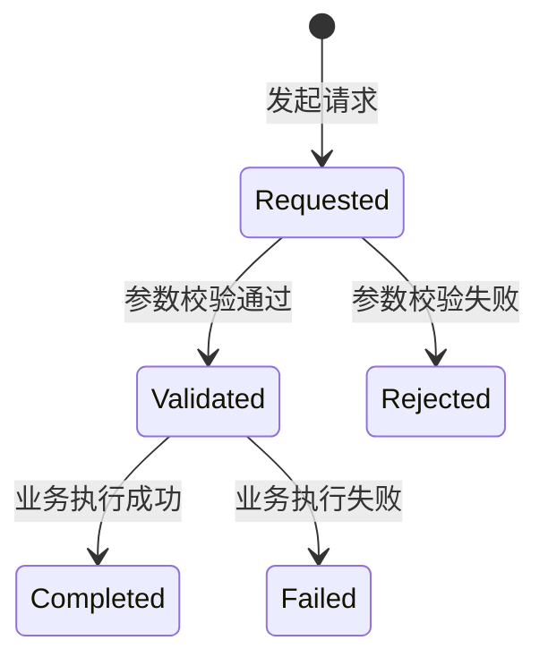

# API 契约模板

## 方案结论

> 用一句话说明该接口解决什么问题，以及为何采用当前契约。

## 背景与目标


| 项   | 内容            |
| --- | ------------- |
| 背景  | `<接口来源>`      |
| 目标  | `<服务的调用方与场景>` |
| 非目标 | `<不承诺的行为>`    |


## 接口概览


| 项      | 内容                           |
| ------ | ---------------------------- |
| Method | `POST`                       |
| URI    | `/api/...`                   |
| 鉴权     | `<无 / Token / Session>`      |
| 幂等性    | `<是否幂等>`                     |
| 调用方    | `<CLI / Web / Agent / 外部服务>` |


## 请求参数

### Query / Path / Body 字段


| 字段名       | 类型       | 必填      | 默认值         | 说明     |
| --------- | -------- | ------- | ----------- | ------ |
| `<field>` | `<type>` | `<是/否>` | `<default>` | `<说明>` |


### 请求示例

```json
{
  "example": "request"
}
```

## 成功响应结构


| 字段名       | 类型        | 必填  | 默认值    | 说明   |
| --------- | --------- | --- | ------ | ---- |
| `success` | `boolean` | 是   | `true` | 是否成功 |
| `data`    | `object`  | 是   | `{}`   | 业务数据 |
| `message` | `string`  | 否   | `""`   | 提示信息 |


### 成功响应示例

```json
{
  "success": true,
  "data": {
    "id": "example_id"
  },
  "message": ""
}
```

### 失败响应示例

```json
{
  "success": false,
  "error_code": "validation_error",
  "message": "invalid input"
}
```

## 失败响应结构


| 字段名          | 类型        | 必填    | 默认值     | 说明      |
| ------------ | --------- | ----- | ------- | ------- |
| `success`    | `boolean` | 是     | `false` | 是否成功    |
| `error_code` | `string`  | 是     | 无       | 机器可读错误码 |
| `message`    | `string`  | 是     | 无       | 错误说明    |
| `data`       | `object   | null` | 否       | `null`  |


## 错误码


| 错误码                | HTTP 状态码 | 含义     | 调用方处理建议      |
| ------------------ | -------- | ------ | ------------ |
| `validation_error` | `422`    | 请求参数非法 | `<提示用户修正输入>` |
| `not_found`        | `404`    | 资源不存在  | `<提示资源缺失>`   |


## 时序流程




## 状态流转




## 兼容性、迁移与回滚


| 项     | 策略                     |
| ----- | ---------------------- |
| 向后兼容  | `<是否兼容旧字段>`            |
| 数据迁移  | `<是否需要迁移脚本、回填或双写过渡>`   |
| 回滚策略  | `<回滚后如何恢复字段、默认值或调用路径>` |
| 字段废弃  | `<如何标记 deprecated>`    |
| 默认值变更 | `<对旧调用方的影响>`           |
| 版本策略  | `<是否需要 v2>`            |


## 测试与验证


| 类型   | 范围                  | 命令                   | 通过标准       |
| ---- | ------------------- | -------------------- | ---------- |
| 契约测试 | `<请求/响应 schema>`    | `pytest ...`         | `<全部通过>`   |
| 集成测试 | `<service + route>` | `pytest ...`         | `<关键路径通过>` |
| 冒烟测试 | `<本地调用>`            | `make check-scripts` | `<无失败>`    |


## 风险与待确认问题

### 风险


| 风险     | 影响     | 缓解措施   |
| ------ | ------ | ------ |
| `<风险>` | `<影响>` | `<缓解>` |


### 待确认问题

1. `<问题 1>`
2. `<问题 2>`

