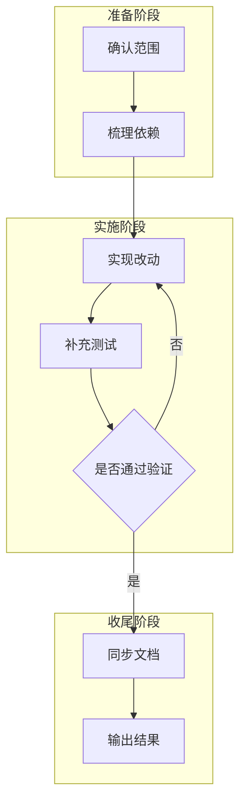

# 执行计划模板

## 方案结论

> 用一句话说明这次执行的主目标，以及默认采用的实施路径。

## 背景与目标

| 项    | 内容          |
| ---- | ----------- |
| 背景   | `<为什么现在要做>` |
| 目标   | `<交付结果>`    |
| 截止条件 | `<做到什么算完成>` |

## 范围与非目标

| 类别   | 内容           |
| ---- | ------------ |
| 本次范围 | `<本轮要完成的事项>` |
| 非目标  | `<明确不在本轮处理>` |

## 现状与依赖

| 项    | 内容           | 备注          |
| ---- | ------------ | ----------- |
| 依赖模块 | `<模块/文件>`    | `<是否已存在>`   |
| 外部前置 | `<数据/配置/服务>` | `<阻塞点>`     |
| 风险假设 | `<默认假设>`     | `<若不成立怎么办>` |

## 执行分解

### 独立改动项

每项写明主要文件位置、前置依赖与完成条件。

1. `<改动项 A>` —— 文件 `<./path/a.py>`，依赖 `<前置条件>`，完成条件 `<标准>`
2. `<改动项 B>` —— 文件 `<./path/b.py>`，依赖 `<前置条件>`，完成条件 `<标准>`
3. `<改动项 C>` —— 文件 `<./path/c.py>`，依赖 `<前置条件>`，完成条件 `<标准>`

### 依赖与边界

本节描述实现顺序和文件冲突，不指定固定角色或执行 Agent。

| 改动项 | 前置依赖 | 文件范围 | 冲突 / 注意事项 |
| ----- | ------- | ------- | --------------- |
| `<A>` | `<无 / B 完成后>` | `<files>` | `<共享契约、不得覆盖的区域>` |
| `<B>` | `<A 的接口>` | `<files>` | `<兼容性或迁移边界>` |

### 实施步骤

1. `<准备阶段>`
2. `<核心开发阶段>`
3. `<联调阶段>`
4. `<收尾与验证阶段>`

## 实施流程图

## 交付清单

- `<代码改动>`
- `<测试补齐>`
- `<文档更新>`
- `<索引/脚本同步>`

## 测试与验证

### 验证矩阵

| 类型   | 范围          | 命令                   | 通过标准       |
| ---- | ----------- | -------------------- | ---------- |
| 单元测试 | `<函数/模块>`   | `pytest ...`         | `<全部通过>`   |
| 集成测试 | `<CLI/API>` | `pytest ...`         | `<关键路径通过>` |
| 冒烟检查 | `<仓库级检查>`   | `make check-scripts` | `<无失败>`    |

### 验收步骤

1. 执行 `<命令 1>`，确认 `<输出>`
2. 执行 `<命令 2>`，确认 `<输出>`
3. 人工检查 `<页面 / 接口 / 文件>`，确认 `<现象>`

## 风险与回滚

| 风险     | 影响       | 预防措施   | 回滚方案   |
| ------ | -------- | ------ | ------ |
| `<风险>` | `<影响范围>` | `<预防>` | `<回滚>` |

## 待确认问题

1. `<问题 1>`
2. `<问题 2>`
