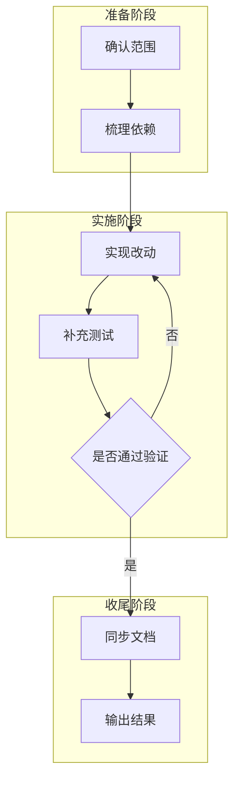

# 执行计划模板

## 方案结论

> 用一句话说明这次执行的主目标，以及默认采用的实施路径。

## 背景与目标

| 项    | 内容          |
| ---- | ----------- |
| 背景   | `<为什么现在要做>` |
| 目标   | `<交付结果>`    |
| 截止条件 | `<做到什么算完成>` |

## 范围与非目标

| 类别   | 内容           |
| ---- | ------------ |
| 本次范围 | `<本轮要完成的事项>` |
| 非目标  | `<明确不在本轮处理>` |

## 现状与依赖

| 项    | 内容           | 备注          |
| ---- | ------------ | ----------- |
| 依赖模块 | `<模块/文件>`    | `<是否已存在>`   |
| 外部前置 | `<数据/配置/服务>` | `<阻塞点>`     |
| 风险假设 | `<默认假设>`     | `<若不成立怎么办>` |

## 执行分解

### 独立改动项

每项**必须**标耗时数量级(短 <5min / 中 5-30min / 长 >30min)与主要文件位置,以便逃逸条款判定。

1. `<改动项 A>` —— `<短/中/长>`,文件 `<./path/a.py>`
2. `<改动项 B>` —— `<短/中/长>`,文件 `<./path/b.py>`
3. `<改动项 C>` —— `<短/中/长>`,文件 `<./path/c.py>`

### 并行分组（独立改动项 `N >= 3` 且不命中「逃逸条款」时填写,否则写"本次不适用"）

**逃逸条款**(满足任一即跳过 7 字段、降级为单 agent 串行;若跨 ≥2 职能仍走「轻量分支」):
- 总预估时长 < 20 分钟
- 改动集中在同一文件 / 紧邻代码块

字段顺序须与 [`.agents/rules/implementation-plan.md`](../../.agents/rules/implementation-plan.md) 中 7 字段一致:角色 / 执行 Agent / 专项关注 / 职责边界 / 文件范围 / 禁区 / 冲突标注。**执行 Agent** 按「执行 Agent 三轴决策」选(主线 × 打断频率 × 时长);**前端组禁止选 Codex 编写**。

| 分组        | 角色  | 执行 Agent | 负责范围   | 涉及文件      | 禁区 / 冲突说明     |
| --------- | --- | -------- | ------ | --------- | ------------- |
| `Group A` | `<前端 / 后端 / 测试 / ...>` | `Claude Code 主 agent` | `<职责>` | `<files>` | `<不要改哪些区域>`   |
| `Group B` | `<...>` | `Claude Code generalPurpose subagent` | `<职责>` | `<files>` | `<共享文件如何避冲突>` |
| `Group C` | `<测试>` | `Codex BG (codex-companion task --background, ScheduleWakeup 10min)` | `<职责>` | `<files>` | `<...>` |

### 实施步骤

1. `<准备阶段>`
2. `<核心开发阶段>`
3. `<联调阶段>`
4. `<收尾与验证阶段>`

## 实施流程图

## 交付清单

- `<代码改动>`
- `<测试补齐>`
- `<文档更新>`
- `<索引/脚本同步>`

## 测试与验证

### 验证矩阵

| 类型   | 范围          | 命令                   | 通过标准       |
| ---- | ----------- | -------------------- | ---------- |
| 单元测试 | `<函数/模块>`   | `pytest ...`         | `<全部通过>`   |
| 集成测试 | `<CLI/API>` | `pytest ...`         | `<关键路径通过>` |
| 冒烟检查 | `<仓库级检查>`   | `make check-scripts` | `<无失败>`    |

### 验收步骤

1. 执行 `<命令 1>`，确认 `<输出>`
2. 执行 `<命令 2>`，确认 `<输出>`
3. 人工检查 `<页面 / 接口 / 文件>`，确认 `<现象>`

## 风险与回滚

| 风险     | 影响       | 预防措施   | 回滚方案   |
| ------ | -------- | ------ | ------ |
| `<风险>` | `<影响范围>` | `<预防>` | `<回滚>` |

## 待确认问题

1. `<问题 1>`
2. `<问题 2>`

