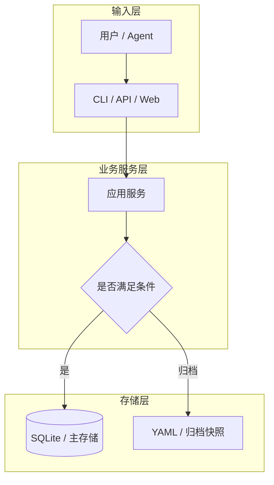
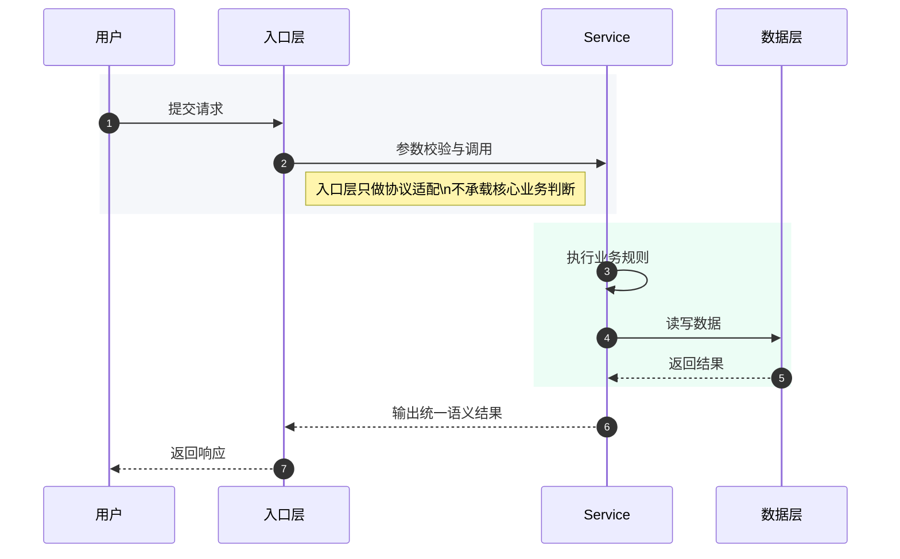
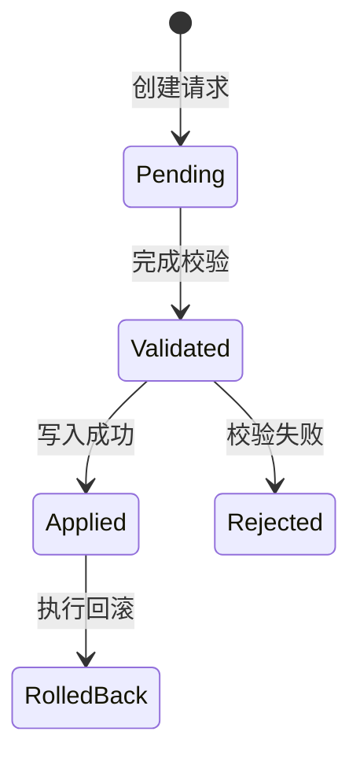

# 技术方案模板

## 方案结论

> 用 2 到 4 句直接写清推荐方案、放弃了什么、为什么现在做。

## 背景与目标

### 背景

- `<当前问题 / 触发原因>`
- `<已有系统现状>`

### 目标

1. `<目标 1>`
2. `<目标 2>`
3. `<目标 3>`

## 范围与非目标


| 类别   | 内容             |
| ---- | -------------- |
| 本次范围 | `<明确纳入的改动>`    |
| 非目标  | `<明确不做的内容>`    |
| 成功标准 | `<用户或系统侧验收口径>` |


## 现状与约束


| 约束项  | 当前情况                              | 影响       |
| ---- | --------------------------------- | -------- |
| 架构约束 | `<例如 CLI / API / Web 共用 service>` | `<设计边界>` |
| 数据约束 | `<例如 SQLite + YAML 双写>`           | `<迁移限制>` |
| 协作约束 | `<例如 Agent 只能通过 CLI 写入>`          | `<实现要求>` |


## 方案设计

### 架构设计




### 核心流程




### 状态流转




## 模块影响面


| 模块                    | 是否影响    | 变更内容     | 风险等级      |
| --------------------- | ------- | -------- | --------- |
| `scripts/`            | `<是/否>` | `<逻辑>`   | `<低/中/高>` |
| `scripts/api/routes/` | `<是/否>` | `<接口>`   | `<低/中/高>` |
| `web/src/`            | `<是/否>` | `<前端联动>` | `<低/中/高>` |
| `docs/`               | `<是/否>` | `<文档同步>` | `<低/中/高>` |


## 数据模型

### `<表名 / 结构名>`


| 字段名       | 类型       | 必填      | 默认值         | 说明     |
| --------- | -------- | ------- | ----------- | ------ |
| `id`      | `TEXT`   | 是       | 无           | 主键     |
| `<field>` | `<TYPE>` | `<是/否>` | `<default>` | `<说明>` |


## API 设计

### `<接口名称>`


| 项      | 内容         |
| ------ | ---------- |
| Method | `POST`     |
| URI    | `/api/...` |
| 说明     | `<接口职责>`   |


#### 请求示例

```json
{
  "example": "request"
}
```

#### 响应示例

```json
{
  "success": true,
  "data": {}
}
```

## 兼容性与迁移


| 项     | 策略              |
| ----- | --------------- |
| 兼容旧逻辑 | `<是否兼容、如何兼容>`   |
| 数据迁移  | `<是否需要迁移脚本或回填>` |
| 默认值处理 | `<新旧默认值差异>`     |
| 回滚方式  | `<回滚步骤>`        |


## 实施计划

1. `<步骤 1：准备与落库>`
2. `<步骤 2：核心逻辑实现>`
3. `<步骤 3：接口 / 前端联动>`
4. `<步骤 4：文档与索引同步>`

## 测试与验证

### 分层验证


| 层级   | 验证内容             | 命令                   |
| ---- | ---------------- | -------------------- |
| 单元测试 | `<函数 / service>` | `pytest ...`         |
| 集成测试 | `<CLI / API>`    | `pytest ...`         |
| 冒烟验证 | `<端到端关键路径>`      | `make check-scripts` |


### 完成标准

- 关键用例全部通过
- 无新增 lint / type / schema 错误
- 文档与索引已同步
- 风险项已有处理策略

## 风险与回滚


| 风险     | 触发条件     | 缓解方案     | 回滚动作     |
| ------ | -------- | -------- | -------- |
| `<风险>` | `<何时出现>` | `<如何规避>` | `<如何恢复>` |


## 待确认问题

1. `<待确认问题 1>`
2. `<待确认问题 2>`

